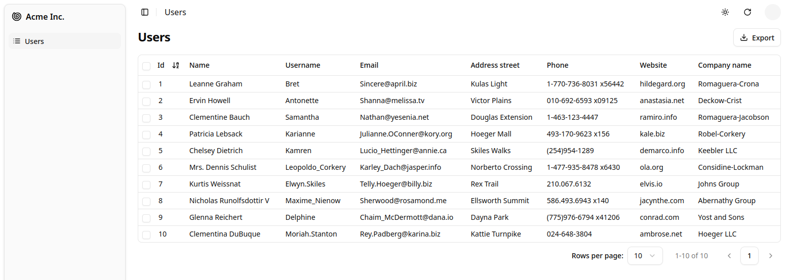

---

title: Quick Start Guide

---

In this tutorial, you will learn to create a web application with `shadcn-admin-kit` based on an existing REST API.

## Setting Up

Follow the [installation instructions](./1-Install.md) to install `shadcn-admin-kit` in your project with Next.js, Vite.js, Remix, or any other framework of your choice.

You should end up with a welcome screen like this:


## Using an API as the Data Source

`shadcn-admin-kit` apps are single-page applications (SPA) that run in the browser and fetch data from an API. Since there is no single standard for data exchanges between systems, `shadcn-admin-kit` uses an adapter to communicate with your API—this adapter is called a [Data Provider](https://marmelab.com/react-admin/DataProviders.html).

For this tutorial, we'll use [JSONPlaceholder](https://jsonplaceholder.typicode.com/), a fake REST API designed for prototyping and testing. Here is a sample response:

```shell
curl https://jsonplaceholder.typicode.com/users/2
```

```json
{
  "id": 2,
  "name": "Ervin Howell",
  "username": "Antonette",
  "email": "Shanna@melissa.tv",
  "address": {
    "street": "Victor Plains",
    "suite": "Suite 879",
    "city": "Wisokyburgh",
    "zipcode": "90566-7771",
    "geo": {
      "lat": "-43.9509",
      "lng": "-34.4618"
    }
  },
  "phone": "010-692-6593 x09125",
  "website": "anastasia.net",
  "company": {
    "name": "Deckow-Crist",
    "catchPhrase": "Proactive didactic contingency",
    "bs": "synergize scalable supply-chains"
  }
}
```

_JSONPlaceholder_ provides endpoints for users, posts, and comments. The admin app we'll build will allow you to Create, Retrieve, Update, and Delete (CRUD) these resources.

We'll use a third-party package, `ra-data-json-server` to map the JSONPlaceholder API to the `shadcn-admin-kit` CRUD API. There are [dozens of data provider packages](https://marmelab.com/react-admin/DataProviderList.html) for various APIs and databases. You can also create your own if necessary. For now, let's make sure the app connects to JSONPlaceholder.

```shell
npm install ra-data-json-server
# or
yarn add ra-data-json-server
```

Create `dataProvider.ts` next to `App.tsx`, where you can define your data provider using JSONPlaceholder.

```tsx
import jsonServerProvider from 'ra-data-json-server';

export const dataProvider = jsonServerProvider(
    import.meta.env.VITE_JSON_SERVER_URL
);
```

The `import.meta.env.VITE_JSON_SERVER_URL` expression is a [Vite environment variable](https://vitejs.dev/guide/env-and-mode.html), which must be set to `https://jsonplaceholder.typicode.com` in the `.env` file located at the project root.

```dotenv
VITE_JSON_SERVER_URL="https://jsonplaceholder.typicode.com"
```

Now, you can use this data provider in your admin app.

```tsx
import { Admin } from "@/components/admin";
import { dataProvider } from "@/dataProvider.ts";

function App() {
    return <Admin dataProvider={dataProvider}></Admin>;
}
```

## Mapping API Endpoints with Resources

Let's add a list of users.

The `<Admin>` component expects one or more [`<Resource>`](https://marmelab.com/react-admin/Resource.html) child components. Each resource maps a name to an API endpoint. To add a resource named `users`, edit the `App.tsx` file as follows:

```diff
+import { Resource } from "ra-core";
-import { Admin } from "@/components/admin";
+import { Admin, ListGuesser } from "@/components/admin";
import { dataProvider } from "@/dataProvider.ts";

function App() {
    return (
        <Admin dataProvider={dataProvider}>
+           <Resource name="users" list={ListGuesser} />
        </Admin>
    );
}

export default App;
```

The `<Resource name="users" />` line instructs `shadcn-admin-kit` to fetch "users" from the [https://jsonplaceholder.typicode.com/users](https://jsonplaceholder.typicode.com/users) URL. The `<Resource>` component also defines which React components to use for each CRUD operation (`list`, `create`, `edit`, and `show`).

`list={ListGuesser}` tells `shadcn-admin-kit` to use the [`<ListGuesser>`](https://marmelab.com/react-admin/ListGuesser.html) component to display the list of users. This component _guesses_ the configuration for the list, including column names and types, based on the data fetched from the API.

Now, your app can display a list of users:



The list is already functional: you can sort it by clicking on the column headers or navigate through pages using the pagination controls. If you open the network tab in your browser's developer tools, you'll see that every user action on the list triggers a corresponding HTTP request to `https://jsonplaceholder.typicode.com/users` with updated parameters. The data provider handles these requests, translating user actions into API calls that the backend understands.

## Writing a Page Component

The `<ListGuesser>` component isn't meant for production use—it's just there to help you quickly set up an admin interface. Eventually, you'll need to replace the `ListGuesser` in the `users` resource with a custom React component. Fortunately, `ListGuesser` provides the guessed list code right in the console:


Copy this code and create a new `UserList` component in a new file called `users.tsx`:

```tsx
import { DataTable, List } from "@/components/admin";

export const UserList = () => (
    <List>
        <DataTable>
            <DataTable.Col source="id" />
            <DataTable.Col source="name" />
            <DataTable.Col source="username" />
            <DataTable.Col source="email" />
            <DataTable.Col source="address.street" />
            <DataTable.Col source="phone" />
            <DataTable.Col source="website" />
            <DataTable.Col source="company.name" />
        </DataTable>
    </List>
);
```

Next, update `App.tsx` to use this new component instead of `ListGuesser`:

```diff
import { Resource } from "ra-core";
-import { Admin, ListGuesser } from "@/components/admin";
+import { Admin } from "@/components/admin";
import { dataProvider } from "@/dataProvider.ts";
+import { UserList } from "@/users.tsx";

function App() {
    return (
        <Admin dataProvider={dataProvider}>
-           <Resource name="users" list={ListGuesser} />
+           <Resource name="users" list={UserList} />
        </Admin>
    );
}

export default App;
```


Visually, nothing changes in the browser, but now the app uses a component that you can fully customize.

## Composing Components

Let's take a closer look at the `<UserList>` component:

```tsx
import { DataTable, List } from "@/components/admin";

export const UserList = () => (
    <List>
        <DataTable>
            <DataTable.Col source="id" />
            <DataTable.Col source="name" />
            <DataTable.Col source="username" />
            <DataTable.Col source="email" />
            <DataTable.Col source="address.street" />
            <DataTable.Col source="phone" />
            <DataTable.Col source="website" />
            <DataTable.Col source="company.name" />
        </DataTable>
    </List>
);
```

The root component, [`<List>`](https://marmelab.com/react-admin/List.html), reads the query parameters, fetches data from the API, and places the data in a React context. It also provides callbacks for filtering, pagination, and sorting, allowing child components to access and modify the list parameters. `<List>` performs many tasks, but its syntax remains straightforward:

```tsx
<List>
   {/* children */}
</List>
```

This demonstrates the goal of `shadcn-admin-kit`: helping developers build sophisticated applications with simple syntax.

In most frameworks, "simple" often implies limited capabilities, making it challenging to extend beyond basic features. `shadcn-admin-kit` addresses this through _composition_. `<List>` handles data fetching, while rendering is delegated to its child—in this case, [`<DataTable>`](https://marmelab.com/react-admin/DataTable.html). Essentially, the code composes the functionalities of `<List>` and `<DataTable>` functionalities.

## Selecting Columns

`<ListGuesser>` created one column for every field in the API response.
That's a bit too much for a usable grid, so let's remove a couple of `<DataTable.Col>` components from the DataTable and see the effect:

```diff
<DataTable>
    <DataTable.Col source="id" />
    <DataTable.Col source="name" />
-   <DataTable.Col source="username" />
    <DataTable.Col source="email" />
-   <DataTable.Col source="address.street" />
    <DataTable.Col source="phone" />
    <DataTable.Col source="website" />
    <DataTable.Col source="company.name" />
</DataTable>
```


In `shadcn-admin-kit`, most configuration is done through components. Instead of using a `columns` prop for configuration, `shadcn-admin-kit` leverages the `children` prop for flexibility, enabling you to add custom logic or change column types as needed.

## Writing A Custom Field

So far, you've used [`<DataTable.Col>`](https://marmelab.com/react-admin/DataTable.html#datatablecol) directly. You can directly specify a field in your `DataTable.Col` using [the `field` prop](https://marmelab.com/react-admin/DataTable.html#field), which is useful when no custom props are needed for that field, or directly as children.

In `shadcn-admin-kit`, fields are just React components.
When rendered, they grab the `record` fetched from the API (e.g. `{ "id": 2, "name": "Ervin Howell", "website": "anastasia.net", ... }`) using a custom hook, and use the `source` prop (e.g. `website`) to get the value they should display (e.g. "anastasia.net").

That means you can do the same to [write a custom field](https://marmelab.com/react-admin/Fields.html#writing-your-own-field-component). For instance, here is a simple `<UrlField>`:

```tsx
// components/url-field.tsx
import { useRecordContext } from "ra-core";

export function UrlField({ source }: { source: string }) {
    const record = useRecordContext();
    if (!record) return null;
    return (
        <a className="text-indigo-600" href={`https://${record[source]}`}>
            {record[source]}
        </a>
    );
}
```

For each row, `<DataTable>` creates a `RecordContext` and stores the current record in it.
[`useRecordContext`](https://marmelab.com/react-admin/useRecordContext.html) allows you to read that record.
It's one of the 50+ headless hooks that `shadcn-admin-kit` exposes to let you build your own components without forcing a particular UI.

You can then use the `<UrlField>` component in `<UserList>`.

```diff
import { DataTable, List } from "@/components/admin";
+import { UrlField } from "@/components/url-field";

export const UserList = () => (
    <List>
        <DataTable>
            <DataTable.Col source="id" />
            <DataTable.Col source="name" />
            <DataTable.Col source="email" />
            <DataTable.Col source="phone" />
-           <DataTable.Col source="website" />
+           <DataTable.Col source="website" field={UrlField} />
            <DataTable.Col source="company.name" />
        </DataTable>
    </List>
);
```


## Handling Relationships

In JSONPlaceholder, each `post` record includes a `userId` field, which points to a `user`:

```json
{
    "id": 1,
    "title": "sunt aut facere repellat provident occaecati excepturi optio reprehenderit",
    "body": "quia et suscipit\nsuscipit recusandae consequuntur expedita et cum\nreprehenderit molestiae ut ut quas totam\nnostrum rerum est autem sunt rem eveniet architecto",
    "userId": 1
}
```

`shadcn-admin-kit` knows how to take advantage of these foreign keys to fetch references. Let's see how the `ListGuesser` manages them by creating a new `<Resource>` for the `/posts` API endpoint:

```diff
import { Resource } from "ra-core";
-import { Admin } from "@/components/admin";
+import { Admin, ListGuesser } from "@/components/admin";
import { dataProvider } from "@/dataProvider.ts";
import { UserList } from "@/users.tsx";

function App() {
    return (
        <Admin dataProvider={dataProvider}>
+           <Resource name="posts" list={ListGuesser} />
            <Resource name="users" list={UserList} />
        </Admin>
    );
}

export default App;
```


The `ListGuesser` suggests using a [`<ReferenceField>`](https://marmelab.com/react-admin/ReferenceField.html) for the `userId` field.
Let's play with this new field by creating the `PostList` component based on the code dumped by the guesser:

```tsx
// posts.tsx
import {
    DataTable,
    List,
    ReferenceField,
} from "@/components/admin";

export const PostList = () => (
    <List>
        <DataTable>
            <DataTable.Col source="userId">
                <ReferenceField source="userId" reference="users" />
            </DataTable.Col>
            <DataTable.Col source="id" />
            <DataTable.Col source="title" />
            <DataTable.Col source="body" />
        </DataTable>
    </List>
);
```

```diff
import { Resource } from "ra-core";
-import { Admin, ListGuesser } from "@/components/admin";
+import { Admin } from "@/components/admin";
import { dataProvider } from "@/dataProvider.ts";
+import { PostList } from "@/posts.tsx";
import { UserList } from "@/users.tsx";

function App() {
    return (
        <Admin dataProvider={dataProvider}>
-           <Resource name="posts" list={ListGuesser} />
+           <Resource name="posts" list={PostList} />
            <Resource name="users" list={UserList} />
        </Admin>
    );
}

export default App;
```

When displaying the posts list, `shadcn-admin-kit` is smart enough to display the `name` of the post author:


**Tip**: To customize how to represent a record, set [the `recordRepresentation` prop of the `<Resource>`](https://marmelab.com/react-admin/Resource.html#recordrepresentation).

The `<ReferenceField>` component fetches the reference data, creates a `RecordContext` with the result, and renders the record representation (or its children).

**Tip**: Look at the network tab of your browser again: `shadcn-admin-kit` deduplicates requests for users and aggregates them in order to make only _one_ HTTP request to the `/users` endpoint for the whole DataTable. That's one of many optimizations that keep the UI fast and responsive.

To finish the post list, place the post `id` field as the first column, and remove the `body` field.

From a UX point of view, fields containing large chunks of text should not appear in a DataTable, only in detail views.

Also, to make the Edit action stand out, let's replace the default `rowClick` action with an explicit action button:

```diff
import {
    DataTable,
    List,
    ReferenceField,
+   EditButton,
} from "@/components/admin";

export const PostList = () => (
    <List>
+       <DataTable rowClick={false}>
+           <DataTable.Col source="id" />
            <DataTable.Col source="userId">
                <ReferenceField source="userId" reference="users" />
            </DataTable.Col>
-           <DataTable.Col source="id" />
            <DataTable.Col source="title" />
-           <DataTable.Col source="body" />
+           <DataTable.Col>
+               <EditButton />
+           </DataTable.Col>
        </DataTable>
    </List>
);
```


## Adding A Detail View

So far, the admin only has list pages. Additionally, the user list doesn't render all columns, so you need to add a detail view to see all the user fields. The `<Resource>` component accepts a `show` component prop to define a detail view. Let's use the [`<ShowGuesser>`](https://marmelab.com/react-admin/ShowGuesser.html) to help bootstrap it:

```diff
import { Resource } from "ra-core";
-import { Admin } from "@/components/admin";
+import { Admin, ShowGuesser } from "@/components/admin";
import { dataProvider } from "@/dataProvider.ts";
import { PostList } from "@/posts.tsx";
import { UserList } from "@/users.tsx";

function App() {
    return (
        <Admin dataProvider={dataProvider}>
            <Resource name="posts" list={PostList} />
-           <Resource name="users" list={UserList} />
+           <Resource name="users" list={UserList} show={ShowGuesser} />
        </Admin>
    );
}

export default App;
```

Now you can click on a user in the list to see their details:

<https://github.com/user-attachments/assets/26dd16e2-8da8-4ee4-9f0d-4353af8a2298>

Just like for other guessed components, you can customize the show view by copying the code dumped by the `<ShowGuesser>` and modifying it to suit your needs. This is out of scope for this tutorial, so we'll leave it as is.

Now that the `users` resource has a `show` view, you can also link to it from the post list view. To do this, edit the `<ReferenceField>` component to add `link="show"`, as follows:

```diff
import {
    DataTable,
    List,
    ReferenceField,
    EditButton,
} from "@/components/admin";

export const PostList = () => (
    <List>
        <DataTable>
            <DataTable.Col source="id" />
            <DataTable.Col source="userId">
-               <ReferenceField source="userId" reference="users" />
+               <ReferenceField source="userId" reference="users" link="show" />
            </DataTable.Col>
            <DataTable.Col source="title" />
            <DataTable.Col>
                <EditButton />
            </DataTable.Col>
        </DataTable>
    </List>
);
```

You can now click on the user name in posts list to open its detailed view. Reference components let users navigate from one resource to another naturally. They are a key feature of `shadcn-admin-kit`.

## Adding Editing Capabilities

An admin interface isn't just about displaying remote data; it should also allow editing records. `shadcn-admin-kit` provides an [`<Edit>`](https://marmelab.com/react-admin/Edit.html) component for this purpose. Let's use the [`<EditGuesser>`](https://marmelab.com/react-admin/EditGuesser.html) to help bootstrap it.

```diff
import { Resource } from "ra-core";
-import { Admin, ShowGuesser } from "@/components/admin";
+import { Admin, EditGuesser, ShowGuesser } from "@/components/admin";
import { dataProvider } from "@/dataProvider.ts";
import { PostList } from "@/posts.tsx";
import { UserList } from "@/users.tsx";

function App() {
    return (
        <Admin dataProvider={dataProvider}>
-           <Resource name="posts" list={PostList} />
+           <Resource name="posts" list={PostList} edit={EditGuesser} />
            <Resource name="users" list={UserList} show={ShowGuesser} />
        </Admin>
    );
}

export default App;
```

<https://github.com/user-attachments/assets/3642747a-9155-4e5d-8cdc-9dbb3c936e8b>

Users can display the edit page just by clicking on the Edit button. The form is already functional; it issues `PUT` requests to the REST API upon submission. The user is already editable and displayed thanks to the `recordRepresentation` of the "users" resource.

Copy the `<PostEdit>` code dumped by the guesser in the console to the `posts.tsx` file so that you can customize the view:

```tsx
import {
    DataTable,
    List,
    ReferenceField,
    AutocompleteInput,
    Edit,
    ReferenceInput,
    SimpleForm,
    TextInput,
    EditButton,
} from "@/components/admin";

export const PostList = () => (
    /* ... */
);

export const PostEdit = () => (
    <Edit>
        <SimpleForm>
            <ReferenceInput source="userId" reference="users">
                <AutocompleteInput />
            </ReferenceInput>
            <TextInput source="id" />
            <TextInput source="title" />
            <TextInput source="body" />
        </SimpleForm>
    </Edit>
);
```

Use that component as the `edit` prop of the "posts" resource instead of the guesser:

```diff
import { Resource } from "ra-core";
-import { Admin, EditGuesser, ShowGuesser } from "@/components/admin";
+import { Admin, ShowGuesser } from "@/components/admin";
import { dataProvider } from "@/dataProvider.ts";
-import { PostList } from "@/posts.tsx";
+import { PostEdit, PostList } from "@/posts.tsx";
import { UserList } from "@/users.tsx";

function App() {
    return (
        <Admin dataProvider={dataProvider}>
-           <Resource name="posts" list={PostList} edit={EditGuesser} />
+           <Resource name="posts" list={PostList} edit={PostEdit} />
            <Resource name="users" list={UserList} show={ShowGuesser} />
        </Admin>
    );
}

export default App;
```

You can now adjust the `<PostEdit>` component to disable editing of the primary key (`id`), place it first, as follows:

```diff
export const PostEdit = () => (
    <Edit>
        <SimpleForm>
+           <TextInput source="id" disabled />
            <ReferenceInput source="userId" reference="users">
                <AutocompleteInput />
            </ReferenceInput>
-           <TextInput source="id" />
            <TextInput source="title" />
            <TextInput source="body" />
        </SimpleForm>
    </Edit>
);
```

If you've understood the `<List>` component, the `<Edit>` component will be no surprise. It's responsible for fetching the record and displaying the page title. It passes the record down to the [`<SimpleForm>`](https://marmelab.com/react-admin/SimpleForm.html) component, which is responsible for the form layout, default values, and validation. Just like `<DataTable>`, `<SimpleForm>` uses its children to determine the form inputs to display. It expects [_input components_](https://marmelab.com/react-admin/Inputs.html) as children. `<TextInput>` and `<ReferenceInput>` are such inputs.

The `<ReferenceInput>` takes the same props as the `<ReferenceField>` (used earlier in the `<PostList>` page). `<ReferenceInput>` uses these props to fetch the API for possible references related to the current record (in this case, possible `users` for the current `post`). It then creates a context with the possible choices and renders an `<AutocompleteInput>`, which is responsible for displaying the choices and letting the user select one.

## Adding Creation Capabilities

Let's allow users to create posts, too. Copy the `<PostEdit>` component into a `<PostCreate>`, and replace `<Edit>` with [`<Create>`](https://marmelab.com/react-admin/Create.html):

```diff
import {
    Create,
    DataTable,
    List,
    ReferenceField,
    AutocompleteInput,
    Edit,
    ReferenceInput,
    SimpleForm,
    TextInput,
    EditButton,
} from "@/components/admin";

export const PostList = () => (
    /* ... */
);

export const PostEdit = () => (
    /* ... */
);

+export const PostCreate = () => (
+   <Create>
+       <SimpleForm>
+           <ReferenceInput source="userId" reference="users">
+               <AutocompleteInput />
+           </ReferenceInput>
+           <TextInput source="title" />
+           <TextInput source="body" />
+       </SimpleForm>
+   </Create>
+);

```

**Tip**: The `<PostEdit>` and the `<PostCreate>` components use almost the same child form, except for the additional `id` input in `<PostEdit>`. In most cases, the forms for creating and editing a record are a bit different, because most APIs create primary keys server-side. But if the forms are the same, you can share a common form component in `<PostEdit>` and `<PostCreate>`.

To use the new `<PostCreate>` component in the posts resource, just add it as the `create` attribute in the `<Resource name="posts">` component:

```diff
import { Resource } from "ra-core";
import { Admin, ShowGuesser } from "@/components/admin";
import { dataProvider } from "@/dataProvider.ts";
-import { PostEdit, PostList } from "@/posts.tsx";
+import { PostCreate, PostEdit, PostList } from "@/posts.tsx";
import { UserList } from "@/users.tsx";

function App() {
    return (
        <Admin dataProvider={dataProvider}>
-           <Resource name="posts" list={PostList} edit={PostEdit} />
+           <Resource
+               name="posts"
+               list={PostList}
+               edit={PostEdit}
+               create={PostCreate}
+           />
            <Resource name="users" list={UserList} show={ShowGuesser} />
        </Admin>
    );
}

export default App;
```

<https://github.com/user-attachments/assets/7a4cb133-9243-47bd-adb0-8e0e90a73193>

`shadcn-admin-kit` automatically adds a "create" button on top of the posts list to give access to the `create` component. And the creation form works; it issues a `POST` request to the REST API upon submission.

## Optimistic Rendering And Undo

Unfortunately, JSONPlaceholder is a read-only API; although it seems to accept `POST` and `PUT` requests, it doesn't take into account the creations and edits - that's why, in this particular case, you will see errors after creation, and you won't see your edits after you save them. It's just an artifact of JSONPlaceholder.

But then, how come the newly created post appears in the list just after creation in the screencast above?

That's because `shadcn-admin-kit` uses _optimistic updates_. When a user edits a record and hits the "Save" button, the UI shows a confirmation and displays the updated data _before sending the update query to the server_. The main benefit is that UI changes are immediate—no need to wait for the server response. It's a great comfort for users.

But there is an additional benefit: it also allows the "Undo" feature. Undo is already functional in the admin at this point. Try editing a record, then hit the "Undo" link in the black confirmation box before it slides out. You'll see that the app does not send the `UPDATE` query to the API and displays the non-modified data.

<https://github.com/user-attachments/assets/9e5fd3ad-b585-4ee6-af50-655ec5a01b5a>

Even though updates appear immediately due to optimistic rendering, `shadcn-admin-kit` only sends them to the server after a short delay (about 5 seconds). During this delay, the user can undo the action, and `shadcn-admin-kit` will never send the update.

Optimistic updates and undo require no specific code on the API side—`shadcn-admin-kit` handles them purely on the client side. That means you'll get them for free with your own API!

:::note
When you add the ability to edit an item, you also add the ability to delete it. The "Delete" button in the edit view is fully functional out of the box-and it is also "undoable".
:::

## Adding Search And Filters To The List

Let's get back to the post list for a minute. It offers sorting and pagination, but one feature is missing: the ability to search content.

`shadcn-admin-kit` can use input components to create a multi-criteria search engine in the list view. Pass an array of such input components to the List `filters` prop to enable filtering:

```tsx
const postFilters = [
    <TextInput source="q" label="Search" />,
    <ReferenceInput source="userId" reference="users">
        <AutocompleteInput label="User" />
    </ReferenceInput>,
];

export const PostList = () => (
    <List filters={postFilters}>
        /* ... */
    </List>
);
```

The first filter, 'q', takes advantage of a full-text functionality offered by JSONPlaceholder. There is a second filter with `userId`, and since it's a `<ReferenceInput>`, it's already populated with possible users.

<https://github.com/user-attachments/assets/d5786c07-d23f-4990-9e2a-62d07504e018>

Filters are "search-as-you-type", meaning that when the user enters new values in the filter form, the list refreshes (via an API request) immediately.

**Tip**: The `label` property can be used on any input to customize its label.

## Customizing the Menu Icons

The sidebar menu shows the same icon for both posts and users. Customizing the menu icon is just a matter of passing an `icon` attribute to each `<Resource>`:

```tsx
import { Resource } from "ra-core";
import { StickyNoteIcon, UsersIcon } from "lucide-react";
import { Admin, ShowGuesser } from "@/components/admin";
import { dataProvider } from "@/dataProvider.ts";
import { PostCreate, PostEdit, PostList } from "@/posts.tsx";
import { UserList } from "@/users.tsx";

function App() {
    return (
        <Admin dataProvider={dataProvider}>
            <Resource
                name="posts"
                icon={StickyNoteIcon}
                list={PostList}
                edit={PostEdit}
                create={PostCreate}
            />
            <Resource
                name="users"
                icon={UsersIcon}
                list={UserList}
                show={ShowGuesser}
            />
        </Admin>
    );
}

export default App;
```

<https://github.com/user-attachments/assets/26ec2d40-df9f-4a68-822c-c69cf008680e>

## Using a Custom Home Page

By default, `shadcn-admin-kit` displays the list page of the first `Resource` element as the home page. If you want to display a custom component instead, pass it in the `dashboard` prop of the `<Admin>` component.

```tsx
// dashboard.tsx
import {
    Card,
    CardContent,
    CardHeader,
    CardTitle,
} from "@/components/ui/card.tsx";

export function Dashboard() {
    return (
        <Card>
            <CardHeader>
                <CardTitle>Welcome to the administration</CardTitle>
            </CardHeader>
            <CardContent>Lorem ipsum dolor sit amet...</CardContent>
        </Card>
    );
}
```

```tsx
// App.tsx
import { Dashboard } from './dashboard';

export const App = () => (
    <Admin dataProvider={dataProvider} dashboard={Dashboard} >
        /* ... */
    </Admin>
);
```


## Adding Authentication

Most admin apps require authentication. `shadcn-admin-kit` can check user credentials before displaying a page and redirect to a login page when the REST API returns a 403 error code.

`shadcn-admin-kit` makes no assumption about your authentication strategy (basic auth, OAuth, custom route, etc.), but gives you the ability to add the auth logic at the right place - using [the `authProvider` object](https://marmelab.com/react-admin/Authentication.html).

For this tutorial, since there is no public authentication API, we can use a fake authentication provider that accepts every login request and stores the `username` in `localStorage`. Each page change will require that `localStorage` contains a `username` item.

The `authProvider` must expose 4 async methods:

```tsx
// authProvider.ts
import { AuthProvider } from "ra-core";

export const authProvider: AuthProvider = {
    // called when the user attempts to log in
    async login({ username, password }) {
        // accept all username/password combinations
        if (false) {
            throw new Error("Invalid credentials, please try again");
        }
        localStorage.setItem("username", username);
    },
    // called when the user clicks on the logout button
    async logout() {
        localStorage.removeItem("username");
    },
    // called when the API returns an error
    async checkError({ status }: { status: number }) {
        if (status === 401 || status === 403) {
            localStorage.removeItem("username");
            throw new Error("Session expired");
        }
    },
    // called when the user navigates to a new location, to check for authentication
    async checkAuth() {
        if (!localStorage.getItem("username")) {
            throw new Error("Authentication required");
        }
    },
};
```

To enable this authentication strategy, pass the `authProvider` to the `<Admin>` component:

```tsx
// App.tsx
import { authProvider } from "@/authProvider.ts";

function App() {
    return (
        <Admin
            authProvider={authProvider}
            dataProvider={dataProvider}
            dashboard={Dashboard}
        >
            /* ... */
        </Admin>
    );
}
```

Once the app reloads, it's now behind a login form that accepts everyone.

<video controls autoplay playsinline muted loop>
  <source src="images/authentication." type="video/" />
  Your browser does not support the video tag.
</video>

## Connecting To A Real API

Here is the elephant in the room of this tutorial. In real-world projects, the dialect of your API (REST? GraphQL? Something else?) won't match the JSONPlaceholder dialect. [Writing a Data Provider](https://marmelab.com/react-admin/DataProviderWriting.html) is probably the first thing you'll have to do to make `shadcn-admin-kit` work, unless your API backend is already supported ([see the list here](https://marmelab.com/react-admin/DataProviderList.html)). Depending on your API, this can require a few hours of additional work.

`shadcn-admin-kit` delegates every data query to a Data Provider object, which acts as an adapter to your API. This makes `shadcn-admin-kit` capable of mapping any API dialect, using endpoints from several domains, etc.

For instance, let's imagine you have to use the `my.api.url` REST API, which expects the following parameters:

| Action              | Expected API request                                                                    |
| ------------------- | --------------------------------------------------------------------------------------- |
| Get list            | `GET http://my.api.url/posts?sort=["title","ASC"]&range=[0, 24]&filter={"title":"bar"}` |
| Get one record      | `GET http://my.api.url/posts/123`                                                       |
| Get several records | `GET http://my.api.url/posts?filter={"id":[123,456,789]}`                               |
| Get related records | `GET http://my.api.url/posts?filter={"author_id":345}`                                  |
| Create a record     | `POST http://my.api.url/posts`                                                          |
| Update a record     | `PUT http://my.api.url/posts/123`                                                       |
| Update records      | `PUT http://my.api.url/posts?filter={"id":[123,124,125]}`                               |
| Delete a record     | `DELETE http://my.api.url/posts/123`                                                    |
| Delete records      | `DELETE http://my.api.url/posts?filter={"id":[123,124,125]}`                            |

`shadcn-admin-kit` calls the Data Provider with one method for each of the actions on this list and expects a Promise in return. These methods are called `getList`, `getOne`, `getMany`, `getManyReference`, `create`, `update`, `updateMany`, `delete`, and `deleteMany`. It's the Data Provider's job to emit HTTP requests and transform the response into the format expected by `shadcn-admin-kit`.

The code for a Data Provider for the `my.api.url` API is as follows:

```tsx
// dataProvider.ts
import { DataProvider, fetchUtils } from "ra-core";
import { stringify } from "query-string";

const apiUrl = 'https://my.api.url/';
const httpClient = fetchUtils.fetchJson;

export const dataProvider: DataProvider = {
    getList: (resource, params) => {
        const { page, perPage } = params.pagination;
        const { field, order } = params.sort;
        const query = {
            sort: JSON.stringify([field, order]),
            range: JSON.stringify([(page - 1) * perPage, page * perPage - 1]),
            filter: JSON.stringify(params.filter),
        };
        const url = `${apiUrl}/${resource}?${stringify(query)}`;

        return httpClient(url).then(({ headers, json }) => ({
            data: json,
            total: parseInt((headers.get('content-range') || "0").split('/').pop() || '0', 10),
        }));
    },

    getOne: (resource, params) =>
        httpClient(`${apiUrl}/${resource}/${params.id}`).then(({ json }) => ({
            data: json,
        })),

    getMany: (resource, params) => {
        const query = {
            filter: JSON.stringify({ id: params.ids }),
        };
        const url = `${apiUrl}/${resource}?${stringify(query)}`;
        return httpClient(url).then(({ json }) => ({ data: json }));
    },

    getManyReference: (resource, params) => {
        const { page, perPage } = params.pagination;
        const { field, order } = params.sort;
        const query = {
            sort: JSON.stringify([field, order]),
            range: JSON.stringify([(page - 1) * perPage, page * perPage - 1]),
            filter: JSON.stringify({
                ...params.filter,
                [params.target]: params.id,
            }),
        };
        const url = `${apiUrl}/${resource}?${stringify(query)}`;

        return httpClient(url).then(({ headers, json }) => ({
            data: json,
            total: parseInt((headers.get('content-range') || "0").split('/').pop() || '0', 10),
        }));
    },

    update: (resource, params) =>
        httpClient(`${apiUrl}/${resource}/${params.id}`, {
            method: 'PUT',
            body: JSON.stringify(params.data),
        }).then(({ json }) => ({ data: json })),

    updateMany: (resource, params) => {
        const query = {
            filter: JSON.stringify({ id: params.ids}),
        };
        return httpClient(`${apiUrl}/${resource}?${stringify(query)}`, {
            method: 'PUT',
            body: JSON.stringify(params.data),
        }).then(({ json }) => ({ data: json }));
    },

    create: (resource, params) =>
        httpClient(`${apiUrl}/${resource}`, {
            method: 'POST',
            body: JSON.stringify(params.data),
        }).then(({ json }) => ({
            data: { ...params.data, id: json.id } as any,
        })),

    delete: (resource, params) =>
        httpClient(`${apiUrl}/${resource}/${params.id}`, {
            method: 'DELETE',
        }).then(({ json }) => ({ data: json })),

    deleteMany: (resource, params) => {
        const query = {
            filter: JSON.stringify({ id: params.ids}),
        };
        return httpClient(`${apiUrl}/${resource}?${stringify(query)}`, {
            method: 'DELETE',
        }).then(({ json }) => ({ data: json }));
    }
};
```

**Tip**: `fetchUtils.fetchJson()` is just a shortcut for `fetch().then(r => r.json())`, plus control of the HTTP response code to throw an `HTTPError` in case of a 4xx or 5xx response. Feel free to use `fetch()` directly if it doesn't suit your needs.

Using this provider instead of the previous `jsonServerProvider` is just a matter of switching a function:

```tsx
// App.tsx
import { dataProvider } from './dataProvider';

const App = () => (
  <Admin dataProvider={dataProvider}>
    // ...
  </Admin>
);
```

## Conclusion

`shadcn-admin-kit` was built with customization in mind. You can replace any `shadcn-admin-kit` component with a component of your own, for instance, to display a custom list layout or a different edit form for a given resource.

Now that you've completed the tutorial, continue your journey with the [Guides and Concepts](https://marmelab.com/react-admin/Architecture.html) section.
