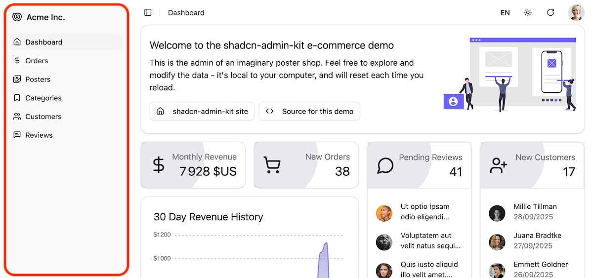

Navigation sidebar displaying menu items, allowing users to navigate between different sections of the application. They can collapse it to an icon-only sidebar by clicking on the sidebar icon in the breadcrumb. On mobile, it renders as a collapsible drawer. `<AppSidebar>` leverages shadcn/ui's [Sidebar](https://ui.shadcn.com/docs/components/sidebar) component.



## Usage

`<AppSidebar>` is included in the default [`<Layout>`](./Layout.md) component. It includes:

- the application name and logo, whicj is a link to the home page (`/`),
- a link to the dashboard (if defined in [`<Admin dashboard>`](./Admin.md)), and
- links to all the list views defined in [`<Resource list>`](./Resource.md) components.

To customize all these elements, edit the `@/components/admin/app-sidebar.tsx` file.

For example, to customize the app name and logo, edit the `SidebarHeader` section:

```tsx {2,22-25}
// in @/components/admin/app-sidebar.tsx
import { Armchair } from "lucide-react";

export function AppSidebar() {
  const hasDashboard = useHasDashboard();
  const resources = useResourceDefinitions();
  const { openMobile, setOpenMobile } = useSidebar();
  const handleClick = () => {
    if (openMobile) {
      setOpenMobile(false);
    }
  };
  return (
    <Sidebar variant="floating" collapsible="icon">
      <SidebarHeader>
        <SidebarMenu>
          <SidebarMenuItem>
            <SidebarMenuButton
              asChild
              className="data-[slot=sidebar-menu-button]:!p-1.5"
            >
              <Link to="/">
                <Armchair className="!size-5"/>
                <span className="text-base font-semibold">My Company</span>
              </Link>
            </SidebarMenuButton>
          </SidebarMenuItem>
        </SidebarMenu>
      </SidebarHeader>
      <SidebarContent>
        {/* Menu items */}
      </SidebarContent>
      <SidebarFooter />
    </Sidebar>
  );
}
```

To reorder the Resource menu items, reorder the `<Resource>` components in the [`<Admin>`](./Admin.md) component.

If you want to hide some resources from the sidebar, edit the `SidebarMenu` section and filter out the resources you don't want to display. For example, to hide the `categories` resource:

```tsx {25}
// in @/components/admin/app-sidebar.tsx
export function AppSidebar() {
  const hasDashboard = useHasDashboard();
  const resources = useResourceDefinitions();
  const { openMobile, setOpenMobile } = useSidebar();
  const handleClick = () => {
    if (openMobile) {
      setOpenMobile(false);
    }
  };
  return (
    <Sidebar variant="floating" collapsible="icon">
      <SidebarHeader>
        {/* App name and logo */}
      </SidebarHeader>
      <SidebarContent>
        <SidebarGroup>
          <SidebarGroupContent>
            <SidebarMenu>
              {hasDashboard ? (
                <DashboardMenuItem onClick={handleClick} />
              ) : null}
              {Object.keys(resources)
                .filter((name) => resources[name].hasList)
                .filter((name) => name !== "categories") // Hide categories resource
                .map((name) => (
                  <ResourceMenuItem
                    key={name}
                    name={name}
                    onClick={handleClick}
                  />
                ))}
            </SidebarMenu>
          </SidebarGroupContent>
        </SidebarGroup>
      </SidebarContent>
      <SidebarFooter />
    </Sidebar>
  );
}
```

To customize the menu items, edit the `SidebarContent` section. For example, if you added a `settings` [`CustomRoute`](./CustomRoutes.md), here is how to add a link to it in the sidebar:

```tsx {2-3,35-42}
// in @/components/admin/app-sidebar.tsx
import { Settings } from "lucide-react";
import { Link } from "react-route";

export function AppSidebar() {
  const hasDashboard = useHasDashboard();
  const resources = useResourceDefinitions();
  const { openMobile, setOpenMobile } = useSidebar();
  const handleClick = () => {
    if (openMobile) {
      setOpenMobile(false);
    }
  };
  return (
    <Sidebar variant="floating" collapsible="icon">
      <SidebarHeader>
        {/* App name and logo */}
      </SidebarHeader>
      <SidebarContent>
        <SidebarGroup>
          <SidebarGroupContent>
            <SidebarMenu>
              {hasDashboard ? (
                <DashboardMenuItem onClick={handleClick} />
              ) : null}
              {Object.keys(resources)
                .filter((name) => resources[name].hasList)
                .map((name) => (
                  <ResourceMenuItem
                    key={name}
                    name={name}
                    onClick={handleClick}
                  />
                ))}
                <SidebarMenuItem>
                  <SidebarMenuButton asChild>
                    <Link to="/settings">
                      <Settings />
                      <span>Settings</span>
                    </Link>
                  </SidebarMenuButton>
                </SidebarMenuItem>
            </SidebarMenu>
          </SidebarGroupContent>
        </SidebarGroup>
      </SidebarContent>
      <SidebarFooter />
    </Sidebar>
  );
}
```

For more customization options, refer to the [shadcn/ui Sidebar documentation](https://ui.shadcn.com/docs/components/sidebar).
