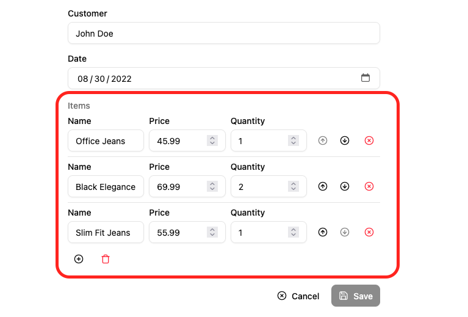

To edit arrays of data embedded inside a record, `<ArrayInput>` creates a list of sub-forms.



## Usage

`<ArrayInput>` allows editing of embedded arrays, like the `items` field in the following `order` record:

```js
{
    "id": 1,
    "date": "2022-08-30",
    "customer": "John Doe",
    "items": [
        {
            "name": "Office Jeans",
            "price": 45.99,
            "quantity": 1,
        },
        {
            "name": "Black Elegance Jeans",
            "price": 69.99,
            "quantity": 2,
        },
        {
            "name": "Slim Fit Jeans",
            "price": 55.99,
            "quantity": 1,
        },
    ],
}
```

`<ArrayInput>` expects a single child, which must be a *form iterator* component. A form iterator is a component rendering a field array (the object returned by react-hook-form's [`useFieldArray`](https://react-hook-form.com/docs/usefieldarray)). For instance, [the `<SimpleFormIterator>` component](#simpleformiterator) displays an array of Inputs in an unordered list (`<ul>`), one sub-form by list item (`<li>`). It also provides controls for adding and removing a sub-record.

```jsx
import { 
    Edit,
    SimpleForm,
    TextInput,
    ArrayInput,
    NumberInput,
    SimpleFormIterator
} from '@/components/admin';

const OrderEdit = () => (
    <Edit>
        <SimpleForm>
            <TextInput source="customer" />
            <TextInput source="date" type="date" />
            <ArrayInput source="items">
                <SimpleFormIterator inline>
                    <TextInput source="name" />
                    <NumberInput source="price" />
                    <NumberInput source="quantity" />
                </SimpleFormIterator>
            </ArrayInput>
        </SimpleForm>
    </Edit>
);
```

`<SimpleFormIterator>` will transform the source of its child Input components into nested inputs (`items.0.name`). Check [the `<SimpleFormIterator>` documentation](#simpleformiterator) below for details about how to customize the sub form layout.

:::note
Using [`shouldUnregister`](https://react-hook-form.com/docs/useform#shouldUnregister) should be avoided when using `<ArrayInput>` (which internally uses `useFieldArray`) as the unregister function gets called after input unmount/remount and reorder. This limitation is mentioned in the react-hook-form [documentation](https://react-hook-form.com/docs/usecontroller#props). If you are in such a situation, you can use [the `<Edit transform>` prop](./Edit.md) prop to manually clean the submitted values.
:::

## Props

| Prop | Required | Type | Default | Description |
|------|----------|------|---------|-------------|
| `source` | Required | `string` | - | Array field name |
| `children` | Required | `ReactNode` | - | Iterator component(s) |
| `className` | Optional | `string` | - | Classes |
| `defaultValue` | Optional | `any[]` | `[]` | Initial array |
| `helperText` | Optional | `ReactNode` | - | Help text |
| `isPending` | Optional | `boolean` | - | Show skeleton |
| `label` | Optional | `string` | Inferred | Label text |
| `validate` | Optional | `Validator \| Validator[]` | - | Array-level validation |

## `<SimpleFormIterator>`

Iterator for repeating groups inside `<ArrayInput>`. Renders each item with reorder, remove, and add controls.

| Prop | Required | Type | Default | Description |
|------|----------|------|---------|-------------|
| `addButton` | Optional | `ReactElement` | Default | Custom add button |
| `className` | Optional | `string` | - | Wrapper classes |
| `disableAdd` | Optional | `boolean` | `false` | Hide add button |
| `disableClear` | Optional | `boolean` | `false` | Hide clear-all button |
| `disableRemove` | Optional | `boolean \| (record)=>boolean` | `false` | Disable remove globally or per record |
| `disableReordering` | Optional | `boolean` | `false` | Hide move up/down |
| `getItemLabel` | Optional | `boolean \| (index)=>string\|ReactElement` | `false` | Add per-item label |
| `inline` | Optional | `boolean` | `false` | Arrange child inputs horizontally (responsive) |
| `removeButton` | Optional | `ReactElement` | Default | Custom remove button |
| `reOrderButtons` | Optional | `ReactElement` | Default | Custom reorder buttons |

## Global validation

If you are using an `<ArrayInput>` inside a form with global validation, you need to shape the errors object returned by the `validate` function like an array too.

```js
{
    authors: [
        {},
        {
            name: 'A name is required', 
            role: 'ra.validation.required' // translation keys are supported too
        },
    ],
}
```

## Disabling The Input

`<ArrayInput>` does not support the `disabled` and `readOnly` props.

If you need to disable the input, set the `<SimpleFormIterator disabled>` prop, and make the child inputs `readOnly`:

```jsx
const OrderEdit = () => (
    <Edit>
        <SimpleForm>
            <TextInput source="customer" />
            <DateInput source="date" />
            <ArrayInput source="items">
                <SimpleFormIterator inline disabled>
                    <TextInput source="name" readOnly/>
                    <NumberInput source="price" readOnly />
                    <NumberInput source="quantity" readOnly />
                </SimpleFormIterator>
            </ArrayInput>
        </SimpleForm>
    </Edit>
);
```

## Changing An Item's Value Programmatically

You can leverage `react-hook-form`'s [`setValue`](https://react-hook-form.com/docs/useform/setvalue) method to change an item's value programmatically.

However you need to know the `name` under which the input was registered in the form, and this name is dynamically generated depending on the index of the item in the array.

To get the name of the input for a given index, you can leverage the `SourceContext` created by ra-core, which can be accessed using the `useSourceContext` hook.

This context provides a `getSource` function that returns the effective `source` for an input in the current context, which you can use as input name for `setValue`.

Here is an example where we leverage `getSource` and `setValue` to change the role of an user to 'admin' when the 'Make Admin' button is clicked:

```tsx
import { ArrayInput, SimpleFormIterator, TextInput } from '@/components/admin';
import { Button } from '@/components/ui/button';
import { useSourceContext } from 'ra-core';
import { useFormContext } from 'react-hook-form';

const ChangeRoleButton = () => {
    const sourceContext = useSourceContext();
    const { setValue } = useFormContext();

    const onClick = () => {
        // sourceContext.getSource('role') will for instance return
        // 'users.0.role'
        setValue(sourceContext.getSource('role'), 'admin');
    };

    return (
        <Button onClick={onClick} size="small" sx={{ minWidth: 120 }}>
            Make admin
        </Button>
    );
};

const UserArray = () => (
    <ArrayInput source="users">
        <SimpleFormIterator inline>
            <TextInput source="name" helperText={false} />
            <TextInput source="role" helperText={false} />
            <ChangeRoleButton />
        </SimpleFormIterator>
    </ArrayInput>
);
```

:::tip
If you only need the item's index, you can leverage the `useSimpleFormIteratorItem` instead.
:::
