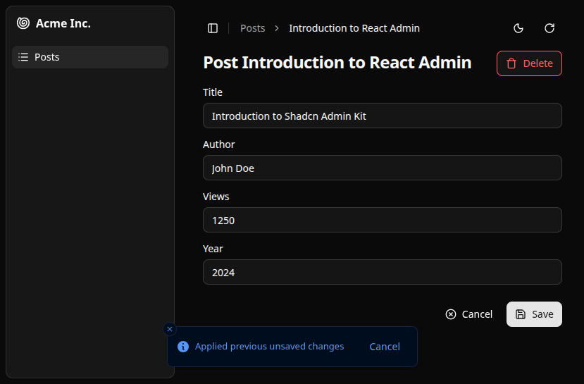

A component that saves a form data in the store on change and reapplies it on mount.
It's ideal to ensure users don't lose their already filled data in an edit or a create form when they navigate to another page.

This component prevents data loss in forms by automatically saving the form data in the store when users update it. When users return to the page, it reapplies the saved data to the form.



The temporary form data is saved as soon as the user makes a change, and it is removed when the user submits the form. Users can opt out of the prefilling by clicking the "Cancel" button in the notification.

Saved data is not sent to the server. It is only persisted using the [store](https://marmelab.com/ra-core/store/) and is removed when the user logs out.

This feature requires a valid [Enterprise Edition](https://marmelab.com/ra-enterprise/) subscription.

### Usage

Create an `<AutoPersistInStore>` component that leverages `<AutoPersistInStoreBase>` and provides a notification component to render when saved changes are applied:

```tsx
import {
  AutoPersistInStoreBase,
  useAutoPersistInStoreContext,
  type UseAutoPersistInStoreParams,
} from "@react-admin/ra-core-ee";
import { useCloseNotification, useEvent, Translate } from "ra-core";
import { Button } from "@/components/ui/button";

export function AutoPersistInStore(
  props: Omit<UseAutoPersistInStoreParams, "notification">,
) {
  return (
    <AutoPersistInStoreBase
      {...props}
      notification={<AutoPersistNotification />}
    />
  );
}

function AutoPersistNotification() {
  const closeNotification = useCloseNotification();
  const { reset } = useAutoPersistInStoreContext();

  const cancel = useEvent((event: React.MouseEvent) => {
    event.preventDefault();
    reset();
    closeNotification();
  });

  return (
    <div className="inline-flex items-center h-6 gap-2">
      <span>
        <Translate i18nKey="ra-form-layout.auto_persist_in_store.applied_changes">
          Applied previous unsaved changes
        </Translate>
      </span>
      <Button
        onClick={cancel}
        variant="ghost"
        size="sm"
        className="h-6 px-2 absolute right-4"
      >
        <Translate i18nKey="ra.action.cancel">Cancel</Translate>
      </Button>
    </div>
  );
}
```

:::tip
This notification component lets the user know that their previous unsaved changes have been applied to the form and gives them the option to discard those changes by clicking the "Cancel" button, which resets the form to its default values.
:::

Then, use the `<AutoPersistInStore>` component in your forms:

```tsx {8}
import { Edit, SimpleForm, TextInput } from '@/components/admin';

const PostEdit = () => (
    <Edit>
        <SimpleForm>
            <TextInput source="title" />
            <TextInput source="teaser" />
            <AutoPersistInStore />
        </SimpleForm>
    </Edit>
);
```

The component will automatically save the form data in the store on change and reapply it when the form is mounted again.

It works both on create and edit forms.

### Props

| Prop           | Required | Type        | Default | Description                                                        |
| -------------- | -------- | ----------- | ------- | ------------------------------------------------------------------ |
| `notification` | Required | `ReactNode` | -       | A Notification element.                                            |
| `getStoreKey`  | -        | `function`  | -       | Function to use your own store key.                                |
| `maxAge`       | -        | `number`    | -       | The age in seconds before a stored value is removed from the store |

### `getStoreKey`

To save the current form data in the [store](https://marmelab.com/ra-core/usestorecontext/), `<AutoPersistInStoreBase>` uses the following store key:

`ra-persist-[RESOURCE_NAME]-[RECORD_ID]`

For example, if you are editing a `posts` resource with the ID `123`, the store key will be: `ra-persist-posts-123`. In case of a create form, the record ID is replaced by `"create"`

You can override this key by passing a custom function as the `getStoreKey` prop. It expects two parameters:

- `resource`: The current resource.
- `record`: The current record if you are in an [edit context](https://marmelab.com/ra-core/useeditcontext/).  

```tsx
<AutoPersistInStoreBase 
    getStoreKey={
        (resource: ResourceContextValue, record: RaRecord<Identifier> | undefined) =>
            `my-custom-persist-key-${resource}-${record && record.hasOwnProperty('id') ? record.id : 'create'}`
    }
    notification={<AutoPersistNotification />}
/>
```

### `maxAge`

Storing many values in the `store` (especially with `localStorage`) may consume all the allowed space depending on the browser. You can provide a number of seconds to the `maxAge` prop so that older values are automatically removed whenever new values are stored.

**Note**: This feature requires a [Store](https://marmelab.com/ra-core/store/) that implements the `listItems` function (both `localStorageStore` and `memoryStore` do).

**Note**: This feature is disabled when providing the `getStoreKey` prop.

```tsx
<AutoPersistInStoreBase 
    maxAge={10 * 60} // 10 minutes
    notification={<AutoPersistNotification />}
/>
```

### `notification`

When `<AutoPersistInStoreBase>` component applies the changes from the store to a form, react-admin informs users with a notification. 
The notification element provided will be passed to the `notify` function of the [`useNotify` hook](https://marmelab.com/ra-core/usenotify/).

```tsx
import {
  AutoPersistInStoreBase,
  useAutoPersistInStoreContext,
  type UseAutoPersistInStoreParams,
} from "@react-admin/ra-core-ee";
import { useCloseNotification, useEvent, Translate } from "ra-core";
import { Button } from "@/components/ui/button";

export function AutoPersistInStore(
  props: Omit<UseAutoPersistInStoreParams, "notification">,
) {
  return (
    <AutoPersistInStoreBase
      {...props}
      notification={<AutoPersistNotification />}
    />
  );
}

function AutoPersistNotification() {
  const closeNotification = useCloseNotification();
  const { reset } = useAutoPersistInStoreContext();

  const cancel = useEvent((event: React.MouseEvent) => {
    event.preventDefault();
    reset();
    closeNotification();
  });

  return (
    <div className="inline-flex items-center h-6 gap-2">
      <span>
        <Translate i18nKey="ra-form-layout.auto_persist_in_store.applied_changes">
          Applied previous unsaved changes
        </Translate>
      </span>
      <Button
        onClick={cancel}
        variant="ghost"
        size="sm"
        className="h-6 px-2 absolute right-4"
      >
        <Translate i18nKey="ra.action.cancel">Cancel</Translate>
      </Button>
    </div>
  );
}
```
