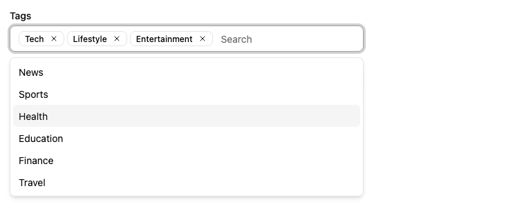

Lets users choose multiple values in a list using a dropdown with autocompletion.



This input allows editing values that are arrays of scalar values, e.g. `[123, 456]`.

## Usage

In addition to the `source`, `<AutocompleteArrayInput>` requires one prop: the `choices` listing the possible values.

```jsx
import { AutocompleteArrayInput } from '@/components/admin';

<AutocompleteArrayInput source="tags" choices={[
  { id: "u001", name: "Tech" },
  { id: "u002", name: "News" },
  { id: "u003", name: "Lifestyle" },
  { id: "u004", name: "Entertainment" },
  { id: "u005", name: "Sports" },
  { id: "u006", name: "Health" },
  { id: "u007", name: "Education" },
  { id: "u008", name: "Finance" },
  { id: "u009", name: "Travel" },
]} />
```

By default, the possible choices are built from the `choices` prop, using:

- the `id` field as the option value,
- the `name` field as the option text

The form value for the source must be an array of the selected values, e.g.

```jsx
{
    id: 123,
    title: 'Lorem Ipsum',
    roles: ['u001', 'u003', 'u004'],
}
```

:::tip
`<AutocompleteArrayInput>` is a stateless component, so it only allows to *filter* the list of choices, not to *extend* it. If you need to populate the list of choices based on the result from a `fetch` call (and if [`<ReferenceArrayInput>`](./ReferenceArrayInput.md) doesn't cover your need), you'll have to write your own Input component.
:::

## Props

| Prop | Required | Type | Default | Description |
|------|----------|------|---------|-------------|
| `source` | Required* | `string` | - | Field name (inferred in ReferenceArrayInput) |
| `choices` | Required* | `any[]` | - | List of choices |
| `className` | Optional | `string` | - | CSS Classes |
| `disableValue` | Optional | `string` | `disabled` | The value to use for the disabled state |
| `filterToQuery` | Optional | `(text:string)=>object` | `{ q: text }` | Server filter mapping |
| `format` | Optional | `function` | - | Function to convert the value sent by the API to the value used by the form |
| `helperText` | Optional | `ReactNode` | - | Help text |
| `inputText` | Optional | `ReactNode \| (choice) =>string` | Choice text | Required if `optionText` is a custom Component, this function must return the text displayed for the current selection.   |
| `optionText` | Optional | `string \| function` | `name` or record repr | Field name of record to display in the suggestion item or function which accepts the correct record as argument (`(record)=> {string}`)  |
| `optionValue` | Optional | `string` | `id` | Field name of record containing the value to use as input value |
| `parse` | Optional | `function` | - | Function to convert the value from the form to the value sent to the API |
| `placeholder` | Optional | `string` | 'Search…' | Input placeholder |
| `translateChoice` | Optional | `boolean` | `!isFromReference` | Translate labels |
| `validate` | Optional | `Validator \| Validator[]` | - | Validation |

`*` `source` and `choices` are optional inside `<ReferenceArrayInput>`.

## Defining Choices

The list of choices must be an array of objects - one object for each possible choice. In each object, `id` is the value, and the `name` is the label displayed to the user.

```jsx
<AutocompleteArrayInput source="roles" choices={[
    { id: 'admin', name: 'Admin' },
    { id: 'u001', name: 'Editor' },
    { id: 'u002', name: 'Moderator' },
    { id: 'u003', name: 'Reviewer' },
]} />
```

You can also use an array of objects with different properties for the label and value, given you specify the `optionText` and `optionValue` props:

```jsx
<AutocompleteArrayInput source="roles" choices={[
    { _id: 'admin', label: 'Admin' },
    { _id: 'u001', label: 'Editor' },
    { _id: 'u002', label: 'Moderator' },
    { _id: 'u003', label: 'Reviewer' },
]} optionValue="_id" optionText="label" />
```

The choices are translated by default, so you can use translation identifiers as choices:

```jsx
const choices = [
    { id: 'admin', name: 'myroot.roles.admin' },
    { id: 'u001', name: 'myroot.roles.u001' },
    { id: 'u002', name: 'myroot.roles.u002' },
    { id: 'u003', name: 'myroot.roles.u003' },
];
```

You can opt-out of this translation by setting the `translateChoice` prop to `false`.

If you need to *fetch* the options from another resource, you're actually editing a one-to-many or a many-to-many relationship. In this case, wrap the `<AutocompleteArrayInput>` in a [`<ReferenceArrayInput>`](./ReferenceArrayInput.md) component. You don't need to specify the `choices` prop - the parent component injects it based on the possible values of the related resource.

```jsx
<ReferenceArrayInput source="tag_ids" reference="tags">
    <AutocompleteArrayInput />
</ReferenceArrayInput>
```

You can also pass an *array of strings* for the choices:

```jsx
const roles = ['Admin', 'Editor', 'Moderator', 'Reviewer'];  
<AutocompleteArrayInput source="roles" choices={roles} />
// is equivalent to
const choices = roles.map(value => ({ id: value, name: value }));
<AutocompleteArrayInput source="roles" choices={choices} />
```

## Using Inside `<ReferenceArrayInput>`

When used inside a [`<ReferenceArrayInput>`](./ReferenceArrayInput.md), whenever users type a string in the autocomplete input, `<AutocompleteArrayInput>` calls `dataProvider.getList()` using the string as filter, to return a filtered list of possible options from the reference resource. This filter is built using the `filterToQuery` prop.

By default, the filter is built using the `q` parameter. This means that if the user types the string 'lorem', the filter will be `{ q: 'lorem' }`.

You can customize the filter by setting the `filterToQuery` prop. It should be a function that returns a filter object.

```jsx
const filterToQuery = searchText => ({ name_ilike: `%${searchText}%` });

<ReferenceArrayInput source="tag_ids" reference="tags">
    <AutocompleteArrayInput filterToQuery={filterToQuery} />
</ReferenceArrayInput>
```

## Working With Object Values

When working with a field that contains an array of *objects*, use `parse` and `format` to turn the value into an array of scalar values.

So for instance, for editing the `tags` field of records looking like the following:

```json
{
  "id": 123,
  "tags": [
      { "id": "lifestyle" },
      { "id": "photography" }
   ] 
}
```

You should use the following syntax:

```jsx
<AutocompleteArrayInput 
    source="tags"
    parse={value => value && value.map(v => ({ id: v }))}
    format={value => value && value.map(v => v.id)}
    choices={[
        { id: 'programming', name: 'Programming' },
        { id: 'lifestyle', name: 'Lifestyle' },
        { id: 'photography', name: 'Photography' },
    ]}
/>
