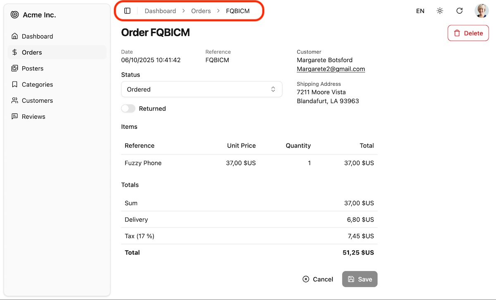

Responsive breadcrumb that helps users navigate the app. On mobile, it collapses into a button listing intermediate links. It leverages shadcn/ui's [Breadcrumb](https://ui.shadcn.com/docs/components/breadcrumb) component.



## Usage

`<Breadcrumb>` defines a breadcrumb path and renders it in the `<div id="breadcrumb">` portal, located in the header of the default [`<Layout>`](./Layout.md) component.

Default page components ([`<List>`](./List.md), [`<Show>`](./Show.md), [`<Edit>`](./Edit.md), [`<Create>`](./Create.md)) automatically set the breadcrumb based on the current resource and action. For detail pages, it uses the [`<Resource recordRepresentation>`](./Resource.md) to display the current record.

So for the CRUD pages of a `posts` resource with `recordRepresentation="title"`, the default breadcrumb paths are:

- `list`: [Home]() > Posts
- `edit`: [Home]() > [Posts]() > Hello World
- `show`: [Home]() > [Posts]() > Hello World
- `create`: [Home]() > [Posts]() > Create

To customize the breadcrumb for these pages, disable the default breadcrumb by using the `disableBreadcrumb` prop on the page component, then use the `<Breadcrumb>` component as a descendent. For example, to customize the breadcrumb for the Edit page of the `posts` resource:

```tsx
import { Edit, Breadcrumb, SimpleForm } from "@/components/admin";
import { RecordRepresentation } from 'ra-core';
import { Link } from "react-router";

const PostEdit = () => (
    <Edit disableBreadcrumb>
        <Breadcrumb>
            <Breadcrumb.Item><Link to="/">Home</Link></Breadcrumb.Item>
            <Breadcrumb.Item><Link to="/posts">Articles</Link></Breadcrumb.Item>
            <Breadcrumb.PageItem>
                Edit Article "<RecordRepresentation />"
            </Breadcrumb.Item>
        </Breadcrumb>
        <SimpleForm>
            ...
        </SimpleForm>
    </Edit>
)
```

This example shows that you can use `<Breacrumb.Item>` for intermediate links and `<Breadcrumb.PageItem>` for the current page. You can also use the `<RecordRepresentation>` component to display the current record.

## Custom Pages

To add a breadcrumb to a custom page component, simply use the `<Breadcrumb>` component as a descendent of your page component. For example:

```tsx
import { Breadcrumb } from "@/components/admin";

const SettingsPage = () => (
    <>
        <Breadcrumb>
            <Breadcrumb.Item><Link to="/">Home</Link></Breadcrumb.Item>
            <Breadcrumb.PageItem>Settings</Breadcrumb.PageItem>
        </Breadcrumb>
        <h1>Settings</h1>
        ...
    </>
)
```

## Custom Layout

If your application defines a custom [`<Admin layout>`](./Admin.md) component, make sure to include a `<div id="breadcrumb">` element where you want the breadcrumb to be rendered.

```tsx
const MyLayout = ({ children }: { children: ReactNode }) => (
    <div>
        <header>
            <div id="breadcrumb" />
            ...
        </header>
        <main>{children}</main>
        <footer>...</footer>
    </div>
);
```
