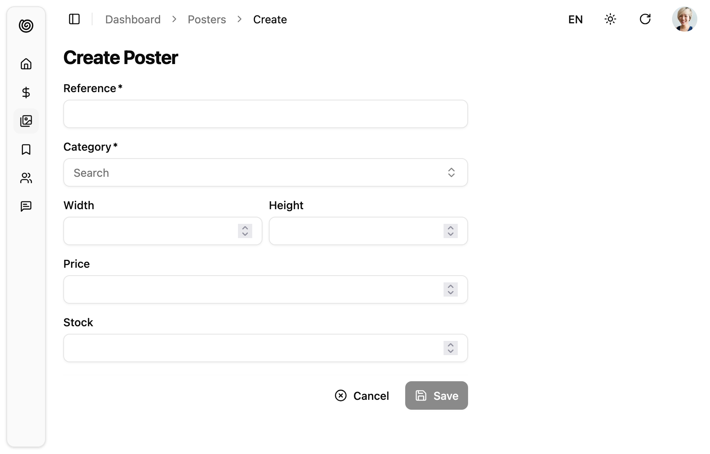

The `<Create>` component is the main component for creation pages. It prepares a form submit handler, and renders the page title and actions. It is not responsible for rendering the actual form - that's the job of its child component (usually a form component, like [`<SimpleForm>`](./SimpleForm.html)). This form component uses its children ([`<Input>`](./DataEdition.mdx#inputs) components) to render each form input.



The `<Create>` component creates a `RecordContext` with an empty object `{}` by default. It also creates a [`SaveContext`](https://marmelab.com/ra-core/usesavecontext/) containing a `save` callback, which calls `dataProvider.create()`, and [a `CreateContext`](https://marmelab.com/ra-core/usecreatecontext/l) containing both the record and the callback.

## Usage

Wrap the `<Create>` component around the form you want to create, then pass it as `create` prop of a given `<Resource>`. `<Create>` requires no prop by default - it deduces the resource from the current URL.

For instance, the following component will render a creation form with 6 inputs when users browse to `/products/create`:

```jsx
// in src/products.js
import {
  Create,
  SimpleForm,
  TextInput,
  ReferenceInput,
  AutocompleteInput,
} from "@/components/admin";
import { required } from "ra-core";

export const ProductCreate = () => (
  <Create>
    <SimpleForm>
      <TextInput source="reference" label="Reference" validate={required()} />
      <ReferenceInput source="category_id" reference="categories">
        <AutocompleteInput label="Category" validate={required()} />
      </ReferenceInput>
      <div className="grid grid-cols-2 gap-2">
        <TextInput source="width" type="number" />
        <TextInput source="height" type="number" />
      </div>
      <TextInput source="price" type="number" />
      <TextInput source="stock" label="Stock" type="number" />
    </SimpleForm>
  </Create>
);

// in src/App.js
import { Admin } from '@/copmponents/admin';
import { Resource } from 'ra-core';

import { dataProvider } from './dataProvider';
import { PostCreate } from './posts';

const App = () => (
    <Admin dataProvider={dataProvider}>
        <Resource name="products" create={ProductCreate} />
    </Admin>
);

export default App;
```

## Props

You can customize the `<Create>` component using the following props:

| Prop                | Required | Type                | Default        | Description                                                                                      |
|---------------------|----------|---------------------|----------------|--------------------------------------------------------------------------------------------------|
| `children`          | Optional&nbsp;* | `ReactNode`         | -              | The components that render the form                                                              |
| `render`            | Optional&nbsp;* | `function`          | -              | Alternative to children. Function that renders the form, receives the create context as argument |
| `actions`           | Optional | `ReactNode`         | Default toolbar| Override the actions toolbar with a custom component                                             |
| `className`         | Optional | `string`            | -              | Passed to the root component                                                                     |
| `disableAuthentication` | Optional | `boolean`      | `false`         | Disable the authentication check                                                                 |
| `mutationMode`      | Optional | `string`            | `pessimistic`  | Switch to optimistic or undoable mutations                                                       |
| `mutationOptions`   | Optional | `object`            | -              | Options for the `dataProvider.create()` call                                                     |
| `record`            | Optional | `object`            | `{}`           | Initialize the form with a record                                                                |
| `redirect`          | Optional | `string`/`function` | `'edit'`       | Change the redirect location after successful creation                                           |
| `resource`          | Optional | `string`            | From URL       | Override the name of the resource to create                                                      |
| `title`             | Optional | `string`/`ReactNode`| Translation    | Override the page title                                                                          |
| `transform`         | Optional | `function`          | -              | Transform the form data before calling `dataProvider.create()`                                   |

`*` You must provide either `children` or `render`.
