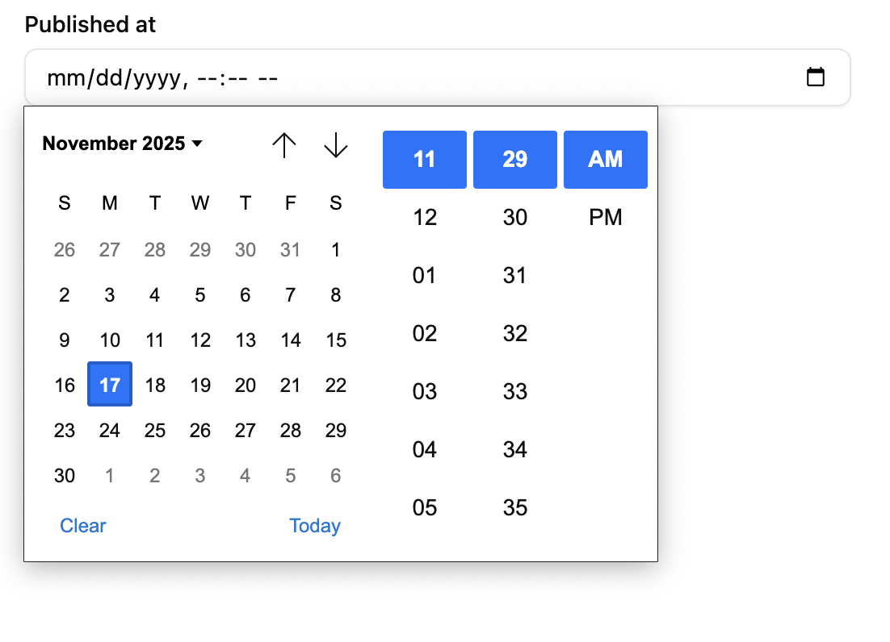

`<DateTimeInput>` renders an HTML `<input type="datetime-local">` element, allowing users to enter a date and a time using a [date picker](https://developer.mozilla.org/en-US/docs/Web/HTML/Reference/Elements/input/datetime-local).



The appearance of `<DateTimeInput>` depends on the browser, and falls back to a text input on browsers that do not support `<input type="datetime-local">`. The date formatting in this input depends on the user's locale.

## Usage

```jsx
import { DateTimeInput } from '@/components/admin/date-time-input';

<DateTimeInput source="published_at" />;
```

The field value should be an ISO date and time string with timezone using the pattern `YYYY-MM-DDTHH:mm:ss.sssZ` ([ISO 8601 Extended Format](https://en.wikipedia.org/wiki/ISO_8601)), e.g. `'2025-11-17T10:10:32.390Z'`. The returned input value will also be in this format, regardless of the browser locale.

`<DateTimeInput>` also accepts values that can be converted to a `Date` object, such as:

- a `datetime-local` value string (e.g. `'2022-04-30T14:30'`),
- a localized date string (e.g. `'30/04/2022'`),
- a `Date` object, or
- a Linux timestamp (e.g. `1648694400000`).

In these cases, `<DateTimeInput>` will automatically convert the value to the ISO 8601 Extended Format, and will return a `string`, or `null` if the date is invalid.

## Props

| Prop           | Required | Type                               | Default  | Description                                                                                       |
| -------------- | -------- | ---------------------------------- | -------- | ------------------------------------------------------------------------------------------------- |
| `source`       | Required | `string`                           | -        | Field name                                                                                        |
| `className`    | Optional | `string`                           | -        | CSS classes                                                                                       |
| `defaultValue` | Optional | `string` or `Date`                 | -        | Default value                                                                                     |
| `disabled`     | Optional | `boolean`                          | -        | Disable input                                                                                     |
| `format`       | Optional | `function`                         | -        | Callback taking the value from the form state, and returning the input value.                     |
| `helperText`   | Optional | `ReactNode`                        | -        | Help text                                                                                         |
| `label`        | Optional | `string \| false`                  | Inferred | Custom / hide label                                                                               |
| `parse`        | Optional | `(value:string) => string or Date` | -        | Callback taking the value from the input, and returning the value to be stored in the form state. |
| `placeholder`  | Optional | `string`                           | -        | Placeholder text                                                                                  |
| `validate`     | Optional | `Validator \| Validator[]`         | -        | Validation                                                                                        |

## `defaultValue`

The `defaultValue` prop can be used to set the initial value of the input. It can be a ISO date and time string, a `Date` object, or a timestamp.

For instance, to set the default value to the current date and time:

```tsx
<DateTimeInput source="publishedAt" defaultValue={new Date()} />
```

## `format`

The `format` prop accepts a callback taking the value from the form state, and returning the input value (which should be a string).

```
form state value --> format --> form input value (string)
```

```tsx
<DateTimeInput
    source="publishedAt"
    format={(value) => new Date(value).toISOString()}
    parse={(value) => new Date(value)}
/>
```

`format` often comes in pair with [`parse`](#parse) to transform the input value before storing it in the form state.

:::tip
By default, Shadcn Admin Kit inputs have a `format` that turns any `null` or `undefined` value into an empty string. This is to avoid warnings about controlled/uncontrolled input components.
:::

## `parse`

The `parse` prop accepts a callback taking the value from the input (which is a string), and returning the value to put in the form state.

```
form input value (string) ---> parse ---> form state value
```

```tsx
<DateTimeInput
    source="publishedAt"
    format={(value) => new Date(value).toISOString()}
    parse={(value) => new Date(value)}
/>
```

`parse` often comes in pair with [`format`](#format) to transform the form value before passing it to the input.

## `validate`

To validate that a date is before or after a given date, use the `maxValue` and `minValue` validators with a date string.

```jsx
import { minValue } from 'ra-core';
import { DateTimeInput } from '@/components/admin/date-input';

// requires dates after October 10th, 2022
<DateTimeInput source="published" validate={minValue('2022-10-26')} />;
```

## Internationalization

It is not possible to customize the date format. Browsers use the user locale to display the date in the correct format.
