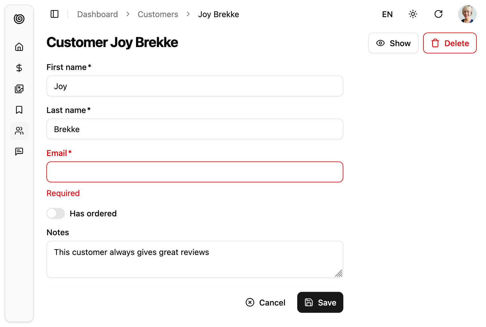
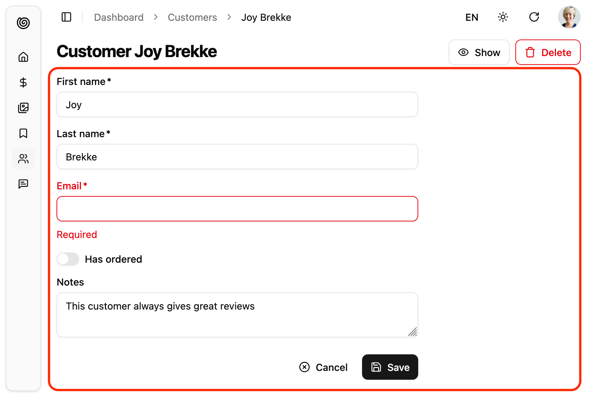
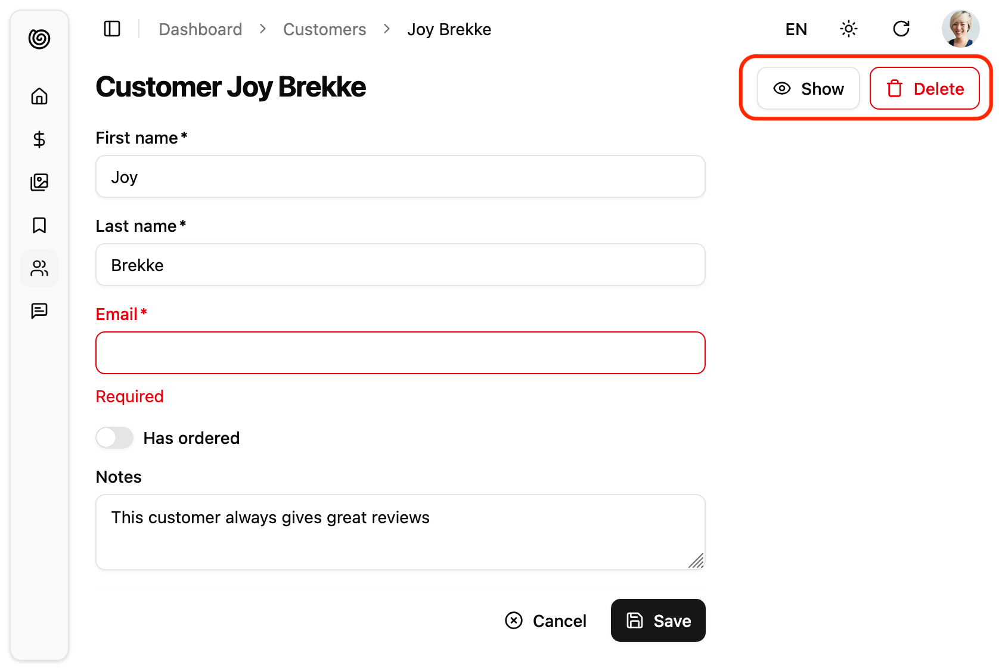
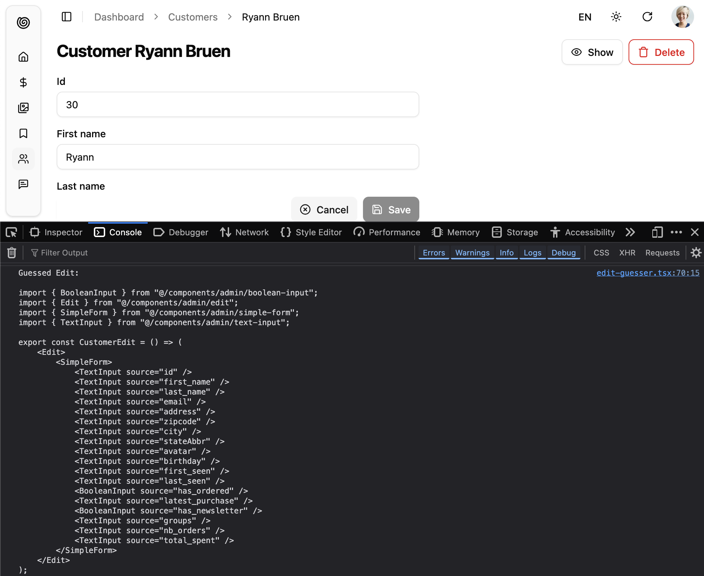
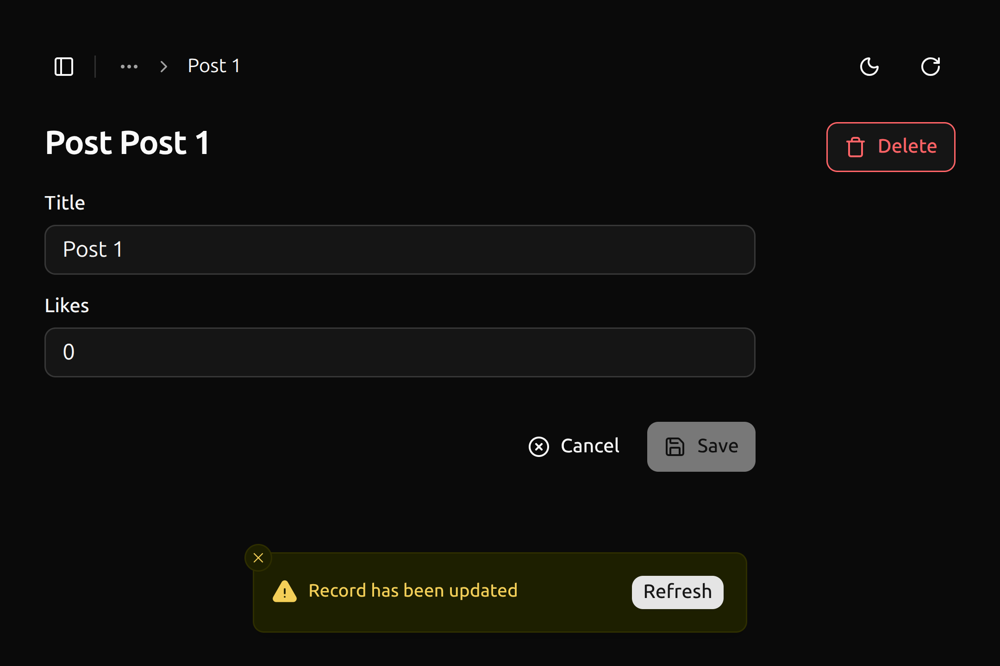

The `<Edit>` component is the main component for edition pages. It fetches a record based on the URL, prepares a form submit handler, and renders the page title and actions. It is not responsible for rendering the actual form - that's the job of its child component (usually a form component, like [`<SimpleForm>`](./SimpleForm.html)). This form component uses its children ([`<Input>`](./DataEdition.mdx#inputs) components) to render each form input.



The `<Edit>` component calls `dataProvider.getOne()`, using the `id` from the URL. It creates a `RecordContext` with the result. It also creates a [`SaveContext`](https://marmelab.com/ra-core/usesavecontext/) containing a `save` callback, which calls `dataProvider.update()` when executed, and [an `EditContext`](https://marmelab.com/ra-core/useeditcontext/) containing both the record and the callback.

## Usage

Wrap the `<Edit>` component around the form you want to create, then pass it as `edit` prop of a given `<Resource>`. `<Edit>` requires no prop by default - it deduces the `resource` and the `id` from the current URL.

For instance, the following component will render an edition form for posts when users browse to `/posts/edit/1234`:

```jsx
// in src/customers.js
import { Edit, SimpleForm, BooleanInput, TextInput } from "@/components/admin";
import { required } from 'ra-core';

export const CustomerEdit = () => (
  <Edit>
    <SimpleForm>
      <TextInput source="first_name" validate={required()} />
      <TextInput source="last_name" validate={required()} />
      <TextInput source="email" validate={required()} />
      <BooleanInput source="has_ordered" />
      <TextInput multiline source="notes" />
    </SimpleForm>
  </Edit>
);

// in src/App.js
import { Admin } from '@/components/admin';
import { Resource } from 'ra-core';

import { dataProvider } from './dataProvider';
import { CustomerEdit } from './customers';

const App = () => (
    <Admin dataProvider={dataProvider}>
        <Resource name="customers" edit={CustomerEdit} />
    </Admin>
);

export default App;
```

## Props

You can customize the `<Edit>` component using the following props:

| Prop                  | Required  | Type                | Default      | Description                                                                                   |
|-----------------------|-----------|---------------------|--------------|-----------------------------------------------------------------------------------------------|
| `children`            | Optional&nbsp;*  | `ReactNode`         | -            | The components that render the form                                                            |
| `render`              | Optional&nbsp;* | `function`          | -            | Function to render the form, receives the editContext as argument                              |
| `actions`             | Optional  | `ReactNode`         | -            | Override the actions toolbar with a custom component                                           |
| `className`           | Optional  | `string`            | -            | Passed to the root component                                                                  |
| `disableAuthentication`| Optional | `boolean`           | `false`      | Disable the authentication check                                                              |
| `disableBreadcrumb`  | Optional  | `boolean`           | `false`      | Set to `true` to define a custom breadcrumb for the page, instead of the default one |
| `emptyWhileLoading`   | Optional  | `boolean`           | `false`      | Set to `true` to return `null` while the edit is loading                                      |
| `id`                  | Optional  | `string`/`number`   | -            | The id of the record to edit                                                                  |
| `mutationMode`        | Optional  | `'undoable' \| 'optimistic' \| 'pessimistic'` | `'undoable'` | Switch to optimistic or pessimistic mutations                                                 |
| `mutationOptions`     | Optional  | `object`            | -            | Options for the `dataProvider.update()` call                                                  |
| `queryOptions`        | Optional  | `object`            | -            | Options for the `dataProvider.getOne()` call                                                  |
| `redirect`            | Optional  | `'list' \| 'show' \| false \| function` | `'list'` | Change the redirect location after successful update                                           |
| `resource`            | Optional  | `string`            | -            | Override the name of the resource to edit                                                     |
| `title`               | Optional  | `string`/`ReactNode`/`false` | -      | Override the page title                                                                       |
| `transform`           | Optional  | `function`          | -            | Transform the form data before calling `dataProvider.update()`                                |

`*` You must provide either `children` or `render`.

## Main Content Area

The `<Edit>` component will render its children inside a `EditContext` provider, which the `save` function. Children can be any React node, but are usually a form component like [`<SimpleForm>`](./SimpleForm.md), or the headless [`<Form>`](https://marmelab.com/ra-core/form/) component.



```tsx
import {
    Edit,
    SimpleForm,
    TextInput,
    BooleanInput,
} from "@/components/admin";
import { required } from 'ra-core';

export const CustomerEdit = () => (
  <Edit>
    <SimpleForm>
      <TextInput source="first_name" validate={required()} />
      <TextInput source="last_name" validate={required()} />
      <TextInput source="email" validate={required()} />
      <BooleanInput source="has_ordered" />
      <TextInput multiline source="notes" />
    </SimpleForm>
  </Edit>
);
```

Alternatively to `children`, you can use a `render` prop. It will receive the [`EditContext`](./useEditContext.md#return-value) as its argument, and should return a React node.

This allows to inline the render logic for the edition page.

```tsx
export const PostEdit = () => (
    <Edit
        render={({ isPending, record, save, saving }) => (
            <div>
                <h1>Edit Post</h1>
                {!isPending && (
                    <form onSubmit={save}>
                        <input type="text" name="title" defaultValue={record.title} required />
                        <textarea name="teaser" defaultValue={record.teaser} rows={3} />
                        <textarea name="body" defaultValue={record.body} rows={5} />
                        <input type="date" name="published_at" defaultValue={redord.published_at} />
                        <button type="submit" disabled={saving}>
                            {saving ? 'Saving...' : 'Save'}
                        </button>
                    </form>
                )}
            </div>
        )}
    />
);
```

**Tip**: When receiving a `render` prop, the `<Edit>` component will ignore the `children` prop.

## Actions Toolbar

By default, the Edit component includes a toolbar with a button to navigate to the show view (if present) and a button to delete the current record.



You can replace these actions by your own elements using the `actions` prop:

```jsx
import { Edit, ShowButton, CreateButton, DeleteButton } from '@/components/admin';

const PostEditActions = () => (
    <div className="flex items-center gap-2">
        <ShowButton />
        <CreateButton />
        <DeleteButton />
    </div>
);

export const PostEdit = () => (
    <Edit actions={<PostEditActions />}>
        ...
    </Edit>
);
```

Common buttons used as Edit actions are:

* [`<CreateButton>`](./CreateButton.md) to create a new record
* [`<ListButton>`](./ListButton.md) to go back to the list
* [`<ShowButton>`](./ShowButton.md) to go to the show page
* [`<DeleteButton>`](./DeleteButton.md) to delete the current record

And you can add your own button, leveraging the `useRecordContext()` hook:

```jsx
import { useRecordContext, useUpdate, useNotify } from 'ra-core';
import { Button } from '@a/components/ui';

const ResetViewsButton = () => {
    const record = useRecordContext();
    const [update, { isPending }] = useUpdate();
    const notify  = useNotify();
    const handleClick = () => {
        update(
            'posts',
            { id: record.id, data: { views: 0 }, previousData: record },
            {
                onSuccess: () => {
                    notify('Views reset');
                },
                onFailure: error => notify(`Error: ${error.message}`, 'warning'),
            }
        );
    };
    return (
        <Button onClick={handleClick} disabled={isPending}>
            Reset views
        </Button>
    );
};
```

## Page Title

By default, the title for the Edit view is the translation key `ra.page.edit` that translates to “Edit [resource_name] [record representation]”. Check the [`<Resource recordRepresentation>`](https://marmelab.com/ra-core/resource/#recordrepresentation) prop for more details.

You can customize this title by providing a resource specific translation with the key `resources.RESOURCE.page.edit` (e.g. `resources.posts.page.edit`):

```js
// in src/i18n/en.js
import englishMessages from 'ra-language-english';

export const en = {
    ...englishMessages,
    resources: {
        posts: {
            name: 'Post |||| Posts',
            page: {
                edit: 'Update post "%{recordRepresentation}"'
            }
        },
    },
    ...
};
```

You can also customize this title by specifying a custom `title` string:

```jsx
export const PostEdit = () => (
    <Edit title="Edit post">
        ...
    </Edit>
);
```

More interestingly, you can pass an element as `title`. This element can access the current record via `useRecordContext`. This allows to customize the title according to the current record:

```jsx
const PostTitle = () => {
    const record = useRecordContext();
    return <span>Post {record ? `"${record.title}"` : ''}</span>;
};

export const PostEdit = () => (
    <Edit title={<PostTitle />}>
        ...
    </Edit>
);
```

Finally, you can also pass `false` to disable the title:

```jsx
export const PostEdit = () => (
    <Edit title={false}>
        ...
    </Edit>
);
```

## Data Fetching Options

`<Edit>` calls `dataProvider.getOne()` on mount via react-query's `useQuery` hook. You can customize the options you pass to this hook by setting the `queryOptions` prop.

This can be useful e.g. to pass [a custom `meta`](./Actions.md#meta-parameter) to the `dataProvider.getOne()` call.

```jsx
import { Edit, SimpleForm } from '@/components/admin';

export const PostEdit = () => (
    <Edit queryOptions={{ meta: { foo: 'bar' } }}>
        <SimpleForm>
            ...
        </SimpleForm>
    </Edit>
);
```

You can also use `queryOptions` to force a refetch on reconnect:

```jsx
const PostEdit = () => (
    <Edit queryOptions={{ refetchOnReconnect: true }}>
        ...
    </Edit>
);
```

Refer to the [useQuery documentation](https://tanstack.com/query/v5/docs/react/reference/useQuery) in the react-query website for a list of the possible options.

## Mutation Options

`<Edit>` calls `dataProvider.update()` via react-query's `useMutation` hook. You can customize the options you pass to this hook, e.g. to pass [a custom `meta`](./Actions.md#meta-parameter) to the `dataProvider.update()` call.

```jsx
import { Edit, SimpleForm } from '@/components/admin';

const PostEdit = () => (
    <Edit mutationOptions={{ meta: { foo: 'bar' } }}>
        <SimpleForm>
            ...
        </SimpleForm>
    </Edit>
);
```

Refer to the [useMutation documentation](https://tanstack.com/query/v5/docs/react/reference/useMutation) in the react-query website for a list of the possible options.

You can also use `mutationOptions` to override success or error side effects.

## Success and Error Side Effects

By default, when the save action succeeds, Shadcn Admin Kit shows a notification, and redirects to the list page.

You can override this behavior and pass custom success side effects by providing a `mutationOptions` prop with an `onSuccess` key:

```jsx
import { Edit, SimpleForm } from '@/components/admin';
import { useNotify, useRefresh, useRedirect } from 'ra-core';

const PostEdit = () => {
    const notify = useNotify();
    const refresh = useRefresh();
    const redirect = useRedirect();

    const onSuccess = () => {
        notify(`Changes saved`);
        redirect('/posts');
        refresh();
    };

    return (
        <Edit mutationOptions={{ onSuccess }}>
            <SimpleForm>
                ...
            </SimpleForm>
        </Edit>
    );
}
```

The default `onSuccess` function is:

```js
() => {
    notify('ra.notification.updated', {
        messageArgs: { smart_count: 1 },
        undoable: mutationMode === 'undoable'
    });
    redirect('list', resource, data.id, data);
}
```

:::tip
If you just want to customize the redirect behavior, you can use [the `redirect` prop](#redirect) instead.
:::

:::tip
When you use `mutationMode="pessimistic"`, the `onSuccess` function receives the response from the `dataProvider.update()` call, which is the created/edited record (see [the dataProvider documentation for details](./DataProviderWriting.md#update)). You can use that response in the success side effects:

```jsx
import { Edit, SimpleForm } from '@/components/admin';
import { useNotify, useRefresh, useRedirect } from 'ra-core';

const PostEdit = () => {
    const notify = useNotify();
    const refresh = useRefresh();
    const redirect = useRedirect();

  const onSuccess = (data) => {
        notify(`Changes to post "${data.title}" saved`);
        redirect('/posts');
        refresh();
    };

    return (
        <Edit mutationOptions={{ onSuccess }} mutationMode="pessimistic">
            <SimpleForm>
                ...
            </SimpleForm>
        </Edit>
    );
}
```

:::

:::tip
If you want to have different success side effects based on the button clicked by the user (e.g. if the creation form displays two submit buttons, one to "save and redirect to the list", and another to "save and display an empty form"), you can set the `mutationOptions` prop on [the `<SaveButton>` component](./SaveButton.md), too.
:::

Similarly, you can override the failure side effects with an `onError` option. By default, when the save action fails at the dataProvider level, Shadcn Admin Kit shows a notification error.

```jsx
import { Edit, SimpleForm } from '@/components/admin';
import { useNotify, useRefresh, useRedirect } from 'ra-core';

const PostEdit = () => {
    const notify = useNotify();
    const refresh = useRefresh();
    const redirect = useRedirect();

    const onError = (error) => {
        notify(`Could not edit post: ${error.message}`);
        redirect('/posts');
        refresh();
    };

    return (
        <Edit mutationOptions={{ onError }}>
            <SimpleForm>
                ...
            </SimpleForm>
        </Edit>
    );
}
```

The `onError` function receives the error from the `dataProvider.update()` call. It is a JavaScript Error object (see [the dataProvider documentation for details](./DataProviders.md/#writing-a-data-provider)).

The default `onError` function is:

```jsx
(error) => {
    notify(typeof error === 'string' ? error : error.message || 'ra.notification.http_error', { type: 'error' });
    if (mutationMode === 'undoable' || mutationMode === 'pessimistic') {
        refresh();
    }
}
```

:::tip
If you want to have different failure side effects based on the button clicked by the user, you can set the `mutationOptions` prop on the `<SaveButton>` component, too.
:::

## Changing The Notification Message

Once the `dataProvider.update()` request returns successfully, users see a success notification.


`<Edit>` uses two successive translation keys to build the success message:

* `resources.{resource}.notifications.updated` as a first choice
* `ra.notification.updated` as a fallback

To customize the notification message, you can set custom translation for these keys in your i18nProvider.

**Tip**: If you choose to use a custom translation, be aware that Shadcn Admin Kit uses the same translation message for the `<BulkUpdateButton>`, so the message must support [pluralization](https://marmelab.com/ra-core/translationtranslating/#interpolation-pluralization-and-default-translation):

```jsx
const englishMessages = {
    resources: {
        orders: {
            notifications: {
                updated: 'Order updated |||| %{smart_count} orders updated',
                // ...
            },
        },
    },
};
```

Alternately, you can customize this message by passing a custom success side effect function in [the `mutationOptions` prop](#mutationoptions):

```jsx
import { Edit, SimpleForm } from '@/components/admin';
import { useNotify, useRedirect } from 'ra-core';

const OrderEdit = () => {
    const notify = useNotify();
    const redirect = useRedirect();

    const onSuccess = () => {
        notify(`Order updated successfully`);
        redirect('list', 'orders');
    };

    return (
        <Edit mutationOptions={{ onSuccess }}>
            <SimpleForm>
                ...
            </SimpleForm>
        </Edit>
    );
}
```

:::tip
In `optimistic` and `undoable` mutation modes, Shadcn Admin Kit calls the `onSuccess` callback method with no argument. In `pessimistic` mode, it calls it with the response returned by the dataProvider as argument.
:::

You can do the same for error notifications, by passing a custom `onError`  callback.

:::tip
When calling `notify()`, the notification message will be translated.
:::

## Redirection After Submission

By default, submitting the form in the `<Edit>` view redirects to the `<List>` view.

You can customize the redirection by setting the `redirect` prop to one of the following values:

* `'list'`: redirect to the List view (the default)
* `'show'`: redirect to the Show view
* `false`: do not redirect
* A function `(resource, id, data) => string` to redirect to different targets depending on the record

```jsx
const PostEdit = () => (
    <Edit redirect="show">
        ...
    </Edit>
);
```

:::note
The `redirect` prop is ignored if you set [the `mutationOptions` prop](#mutationoptions). See that prop for how to set a different redirection path in that case.
:::

## Mutation Mode

The `<Edit>` view exposes two buttons, Save and Delete, which perform "mutations" (i.e. they alter the data). Shadcn Admin Kit offers three modes for mutations. The mode determines when the side effects (redirection, notifications, etc.) are executed:

* `pessimistic`: The mutation is passed to the dataProvider first. When the dataProvider returns successfully, the mutation is applied locally, and the side effects are executed.
* `optimistic`: The mutation is applied locally and the side effects are executed immediately. Then the mutation is passed to the dataProvider. If the dataProvider returns successfully, nothing happens (as the mutation was already applied locally). If the dataProvider returns in error, the page is refreshed and an error notification is shown.
* `undoable` (default): The mutation is applied locally and the side effects are executed immediately. Then a notification is shown with an undo button. If the user clicks on undo, the mutation is never sent to the dataProvider, and the page is refreshed. Otherwise, after a 5 seconds delay, the mutation is passed to the dataProvider. If the dataProvider returns successfully, nothing happens (as the mutation was already applied locally). If the dataProvider returns in error, the page is refreshed and an error notification is shown.

By default, pages using `<Edit>` use the `undoable` mutation mode. This is part of the "optimistic rendering" strategy of Shadcn Admin Kit; it makes user interactions more reactive.

You can change this default by setting the `mutationMode` prop - and this affects both the Save and Delete buttons. For instance, to remove the ability to undo the changes, use the `optimistic` mode:

```jsx
const PostEdit = () => (
    <Edit mutationMode="optimistic">
        // ...
    </Edit>
);
```

And to make both the Save and Delete actions blocking, and wait for the dataProvider response to continue, use the `pessimistic` mode:

```jsx
const PostEdit = () => (
    <Edit mutationMode="pessimistic">
        // ...
    </Edit>
);
```

## Transforming Data

To transform a record after the user has submitted the form but before the record is passed to `dataProvider.update()`, use the `transform` prop. It expects a function taking a record as argument, and returning a modified record. For instance, to add a computed field upon edition:

```jsx
export const UserEdit = () => {
    const transform = data => ({
        ...data,
        fullName: `${data.firstName} ${data.lastName}`
    });
    return (
        <Edit transform={transform}>
            ...
        </Edit>
    );
}
```

The `transform` function can also return a `Promise`, which allows you to do all sorts of asynchronous calls (e.g. to the `dataProvider`) during the transformation.

:::tip
If you want to have different transformations based on the button clicked by the user (e.g. if the creation form displays two submit buttons, one to "save", and another to "save and notify other admins"), you can set the `transform` prop on [the `<SaveButton>` component](./SaveButton.md), too.
:::

:::tip
The `transform` function also get the `previousData` in its second argument:

```jsx
export const UserEdit = () => {
    const transform = (data, { previousData }) => ({
        ...data,
        avoidChangeField: previousData.avoidChangeField
    });
    return (
        <Edit transform={transform}>
            ...
        </Edit>
    );
}
```

:::

## Scaffolding An Edit Page

You can use [`<EditGuesser>`](./EditGuesser.md) to quickly bootstrap an Edit view on top of an existing API, without adding the inputs one by one.

```tsx
// in src/App.js
import { Admin, EditGuesser } from '@/components/admin';
import { Resource } from 'ra-core';
import dataProvider from './dataProvider';

const App = () => (
    <Admin dataProvider={dataProvider}>
        {/* ... */}
        <Resource name="customers" edit={EditGuesser} />
    </Admin>
);
```

Just like `<Edit>`, `<EditGuesser>` fetches the data. It then analyzes the response, and guesses the inputs it should use to display a basic `<SimpleForm>` with the data. It also dumps the components it has guessed in the console, so you can copy it into your own code.

When the data provider returns no record, `<EditGuesser>` renders an empty state by default. You can override it using the `empty` prop (including `empty={false}` to render nothing).



## Cleaning Up Empty Strings

As a reminder, HTML form inputs always return strings, even for numbers and booleans. So the empty value for a text input is the empty string, not `null` or `undefined`. This means that the data sent to `dataProvider.update()` will contain empty strings:

```js
{
    title: '',
    average_note: '',
    body: '',
    // etc.
}
```

If you prefer to have `null` values, or to omit the key for empty values, use [the `transform` prop](#transform) to sanitize the form data before submission:

```jsx
export const UserEdit = () => {
    const transform = (data) => {
        const sanitizedData = {};
        for (const key in data) {
            if (typeof data[key] === "string" && data[key].trim().length === 0) continue;
            sanitizedData[key] = data[key]; 
        }
        return sanitizedData;
    };
    return (
        <Edit transform={transform}>
            ...
        </Edit>
    );
}
```

As an alternative, you can clean up empty values at the input level, using [the `parse` prop](https://marmelab.com/ra-core/useinput/#parse).

## Prefilling the Form

You sometimes need to pre-populate the form changes to a record. For instance, to revert a record to a previous version, or to make some changes while letting users modify others fields as well.

By default, the `<Edit>` view starts with the current `record`. However, if the `location` object (injected by [react-router-dom](https://reactrouter.com/6.28.0/start/concepts#locations)) contains a `record` in its `state`, the `<Edit>` view uses that `record` to prefill the form.

That means that if you want to create a link to an edition view, modifying immediately *some* values, all you have to do is to set the `state` prop of the `<EditButton>`:

```jsx
import * as React from 'react';
import { EditButton, DataTable, List } from '@/components/admin';

const ApproveButton = () => (
    <EditButton state={{ record: { status: 'approved' } }} />
);

export default PostList = () => (
    <List>
        <DataTable>
            ...
            <DataTable.Col>
                <ApproveButton />
            </DataTable.Col>
        </DataTable>
    </List>
)
```

:::tip
The `<Edit>` component also watches the "source" parameter of `location.search` (the query string in the URL) in addition to `location.state` (a cross-page message hidden in the router memory). So the `ApproveButton` could also be written as:

```jsx
import { EditButton } from '@/components/admin';

const ApproveButton = () => (
    <EditButton
        to={{
            search: `?source=${JSON.stringify({ status: 'approved' })}`,
        }}
    />
);
```

:::

Should you use the location `state` or the location `search`? The latter modifies the URL, so it's only necessary if you want to build cross-application links (e.g. from one admin to the other). In general, using the location `state` is a safe bet.

## Linking Two Inputs

Edition forms often contain linked inputs, e.g. country and city (the choices of the latter depending on the value of the former).

Shadcn Admin Kit relies on [react-hook-form](https://react-hook-form.com/) for form handling. You can grab the current form values using react-hook-form's [useWatch](https://react-hook-form.com/docs/usewatch) hook.

```jsx
import { Edit, SimpleForm, SelectInput } from '@/components/admin';
import { useWatch } from 'react-hook-form';

const countries = ['USA', 'UK', 'France'];
const cities = {
    USA: ['New York', 'Los Angeles', 'Chicago', 'Houston', 'Phoenix'],
    UK: ['London', 'Birmingham', 'Glasgow', 'Liverpool', 'Bristol'],
    France: ['Paris', 'Marseille', 'Lyon', 'Toulouse', 'Nice'],
};
const toChoices = items => items.map(item => ({ id: item, name: item }));

const CityInput = () => {
    const country = useWatch({ name: 'country' });
    return (
        <SelectInput
            choices={country ? toChoices(cities[country]) : []}
            source="cities"
        />
    );
};

const OrderEdit = () => (
    <Edit>
        <SimpleForm>
            <SelectInput source="country" choices={toChoices(countries)} />
            <CityInput />
        </SimpleForm>
    </Edit>
);

export default OrderEdit;
```

:::tip
If you'd like to avoid creating an intermediate component like `<CityInput>`, or are using an `<ArrayInput>`, you can use the [`<FormDataConsumer>`](https://marmelab.com/react-admin/Inputs.html#linking-two-inputs) component as an alternative.
:::

## Controlled Mode

`<Edit>` deduces the resource and the record id from the URL. This is fine for an edition page, but if you need to let users edit records from another page, you probably want to define the edit parameters yourself.

In that case, use the `resource` and `id` props to set the edit parameters regardless of the URL.

```jsx
import { Edit, SimpleForm, TextInput, SelectInput } from "@/components/admin";

export const BookEdit = ({ id }) => (
    <Edit resource="books" id={id} redirect={false}>
        <SimpleForm>
            <TextInput source="title" />
            <TextInput source="author" />
            <SelectInput source="availability" choices={[
                { id: "in_stock", name: "In stock" },
                { id: "out_of_stock", name: "Out of stock" },
                { id: "out_of_print", name: "Out of print" },
            ]} />
        </SimpleForm>
    </Edit>
);
```

:::tip
You probably also want to customize [the `redirect` prop](#redirection-after-submission) if you embed an `<Edit>` component in another page.
:::

## Headless Version

Besides fetching a record and preparing a save handler, `<Edit>` renders the default edition page layout (title, actions, a Material UI `<Card>`) and its children. If you need a custom edition layout, you may prefer [the `<EditBase>` component](https://marmelab.com/ra-core/editbase/), which only renders its children in an [`EditContext`](https://marmelab.com/ra-core/useeditcontext/).

```jsx
import { EditBase } from "ra-core";
import { SelectInput, SimpleForm, TextInput} from "@/components/admin";
import { Card, CardContent } from "@/commponents/ui";

export const BookEdit = () => (
    <EditBase>
        <h1>Book Edition</h1>
        <Card>
            <CardContent>
                <SimpleForm>
                    <TextInput source="title" />
                    <TextInput source="author" />
                    <SelectInput source="availability" choices={[
                        { id: "in_stock", name: "In stock" },
                        { id: "out_of_stock", name: "Out of stock" },
                        { id: "out_of_print", name: "Out of print" },
                    ]} />
                </SimpleForm>
            </CardContent>
        </Card>
    </EditBase>
);
```

In the previous example, `<SimpleForm>` grabs the record and the save handler from the `EditContext`.

If you don't need the `EditContext`, you can use [the `useEditController` hook](https://marmelab.com/ra-core/useeditcontroller/), which does the same data fetching as `<EditBase>` but lets you render the content.

```tsx
import { useEditController } from "ra-core";
import { SelectInput, SimpleForm, TextInput } from "@/components/admin";
import { Card, CardContent } from "@/components/ui";

export const BookEdit = () => {
    const { record, save } = useEditController();
    return (
        <>
            <h1>
                Edit book {record?.title}
            </h1>
            <Card>
                <CardContent>
                    <SimpleForm record={record} onSubmit={values => save(values)}>
                        <TextInput source="title" />
                        <TextInput source="author" />
                        <SelectInput source="availability" choices={[
                            { id: "in_stock", name: "In stock" },
                            { id: "out_of_stock", name: "Out of stock" },
                            { id: "out_of_print", name: "Out of print" },
                        ]} />
                    </SimpleForm>
                </CardContent>
            </Card>
        </>
    );
};
```

## Access Control

If your `authProvider` implements [Access Control](./Security.md#access-control), `<Edit>`  will only render if the user has the "edit" access to the related resource.

For instance, for the `<PostEdit>`page below:

```tsx
import { Edit, SimpleForm, TextInput } from '@/components/admin';

// Resource name is "posts"
const PostEdit = () => (
    <Edit>
        <SimpleForm>
            <TextInput source="title" />
            <TextInput source="author" />
            <TextInput source="published_at" />
        </SimpleForm>
    </Edit>
);
```

`<Edit>` will call `authProvider.canAccess()` using the following parameters:

```jsx
{ action: "edit", resource: "posts" }
```

Users without access will be redirected to the [Access Denied page](./Admin.md).

:::note
Access control is disabled when you use the `disableAuthentication` prop.
:::

## Live Updates

Shadcn Admin Kit offers [Realtime features](./RealtimeFeatures.md) to automatically refresh the data on screen when it has been changed by another user.

If you want to subscribe to live updates the record, you can rely on the [`useSubscribeToRecord`](https://marmelab.com/ra-core/usesubscribetorecord/) hook.

As sample use case, let's show how to warn the user when the record they're editing has been updated by another user.



:::note
This feature requires a valid [Enterprise Edition](https://marmelab.com/ra-enterprise/) subscription.
:::

First, create an `EditLiveUpdate` component that uses the `useSubscribeToRecord` hook to subscribe to updates on the current record. When an update is received, it shows a notification with a "Refresh" button that refetches the record when clicked.

```tsx
// src/components/admin/edit-live-update.tsx

import { useSubscribeToRecord } from '@react-admin/ra-core-ee';
import { useCloseNotification, useEditContext, useNotify } from 'ra-core';
import { useCallback, useMemo, useRef } from 'react';
import { Button } from './button';

export function EditLiveUpdate() {
    const hasNotifiedRef = useRef(false);
    const notify = useNotify();

    const { refetch } = useEditContext();

    const notificationContent = useMemo(() => {
        return (
            <RecordUpdatedNotification
                refetch={async () => {
                    await refetch();
                    hasNotifiedRef.current = false;
                }}
            />
        );
    }, [refetch]);

    const onLiveUpdate = useCallback(() => {
        if (hasNotifiedRef.current) {
            return;
        }

        hasNotifiedRef.current = true;
        notify(notificationContent, {
            type: 'warning',
            autoHideDuration: null,
        });
    }, [notify, notificationContent]);

    useSubscribeToRecord(onLiveUpdate);

    return null;
}

function RecordUpdatedNotification({
    refetch,
}: RecordUpdatedNotificationProps) {
    const close = useCloseNotification();
    const handleClick = async () => {
        await refetch();
        close();
    };

    return (
        <div className="h-6 inline-flex items-center">
            <span>Record has been updated</span>
            <Button
                onClick={handleClick}
                className="absolute top-50% right-4 h-6 px-2"
            >
                Refresh
            </Button>
        </div>
    );
}

type RecordUpdatedNotificationProps = {
    refetch(): Promise<void>;
};
```

Then, add the `<EditLiveUpdate>` in your `<Edit>` children:

```tsx
import { Edit } from '@/components/admin/edit';
import { EditLiveUpdate } from '@/components/admin/edit-live-update';

const PostList = () => (
    <Edit>
        ...
        <EditLiveUpdate />
    </Edit>
);
```

To trigger warning with `<EditLiveUpdate>` with the record changes, the API has to publish events containing at least the followings:

```js
{
    topic : '/resource/{resource}/{id}',
    event: {
        type: 'updated',
        payload: { ids: [{listOfRecordIdentifiers}]},
    }
}
```

## Locking Edition

Shadcn Admin Kit offers [Content locking features](./RealtimeFeatures.md) to automatically place a lock on a record when a user is editing it, preventing other users from editing the same record concurrently.

To avoid concurrent edition of the same record by multiple users, you can use [the `useLockOnCall` hook](https://marmelab.com/ra-core/uselockoncall/) inside your `<Edit>` view.

:::note
This feature requires a valid [Enterprise Edition](https://marmelab.com/ra-enterprise/) subscription.
:::

For example, the following form locks a ticket record when the user focuses on the message input. If another user has already locked the ticket, the form inputs are disabled:

```tsx
import { Form, useCreate, useGetIdentity, useRecordContext } from 'ra-core';
import { useGetLockLive, useLockOnCall } from '@react-admin/ra-core-ee';
import { TextInput, SelectInput, SaveButton } from '@components/admin';

export const NewMessageForm = () => {
    const record = useRecordContext();

    const { identity } = useGetIdentity();
    const { data: lock } = useGetLockLive('tickets', { id: record.id });
    const isLocked = lock && lock.identity !== identity?.id;

    const [doLock] = useLockOnCall({ resource: 'tickets' });

    return (
        <Form onSubmit={handleSubmit}>
            <TextInput
                source="message"
                multiline
                onFocus={doLock}
                disabled={isLocked}
            />
            <SelectInput
                source="status"
                choices={statusChoices}
                onFocus={doLock}
                disabled={isLocked}
            />
            <SaveButton disabled={isLocked} />
        </Form>
    );
};
```

Use it in your `<Edit>` view as follows:

```tsx
import { Edit } from '@/components/admin/edit';
import { NewMessageForm } from './NewMessageForm';

const PostEdit = () => (
    <Edit>
        <NewMessageForm />
    </Edit>
);
```
