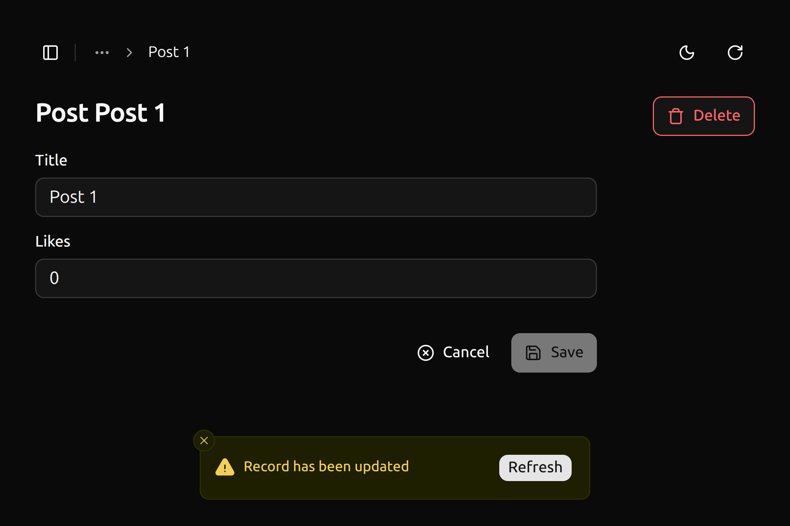

`<EditLiveUpdate>` is a component that warns user when a record has been updated in an [`<Edit>`](./Edit.md) view when a record is updated.

This feature requires a valid [Enterprise Edition](https://marmelab.com/ra-enterprise/) subscription.



## Creating the Component

```tsx
// src/components/admin/edit-live-update.tsx

import { useSubscribeToRecord } from '@react-admin/ra-core-ee';
import { useCloseNotification, useEditContext, useNotify } from 'ra-core';
import { useCallback, useMemo, useRef } from 'react';
import { Button } from './button';

export function EditLiveUpdate() {
    const hasNotifiedRef = useRef(false);
    const notify = useNotify();

    const { refetch } = useEditContext();

    const notificationContent = useMemo(() => {
        return (
            <RecordUpdatedNotification
                refetch={async () => {
                    await refetch();
                    hasNotifiedRef.current = false;
                }}
            />
        );
    }, [refetch]);

    const onLiveUpdate = useCallback(() => {
        if (hasNotifiedRef.current) {
            return;
        }

        hasNotifiedRef.current = true;
        notify(notificationContent, {
            type: 'warning',
            autoHideDuration: null,
        });
    }, [notify, notificationContent]);

    useSubscribeToRecord(onLiveUpdate);

    return null;
}

function RecordUpdatedNotification({
    refetch,
}: RecordUpdatedNotificationProps) {
    const close = useCloseNotification();
    const handleClick = async () => {
        await refetch();
        close();
    };

    return (
        <div className="h-6 inline-flex items-center">
            <span>Record has been updated</span>
            <Button
                onClick={handleClick}
                className="absolute top-50% right-4 h-6 px-2"
            >
                Refresh
            </Button>
        </div>
    );
}

type RecordUpdatedNotificationProps = {
    refetch(): Promise<void>;
};
```

## Usage

Add the `<EditLiveUpdate>` in your `<Edit>` children:

```tsx
import { Edit } from '@/components/admin/edit';
import { EditLiveUpdate } from '@/components/admin/edit-live-update';

const PostList = () => (
    <Edit>
        ...
        <EditLiveUpdate />
    </Edit>
);
```

To trigger warning with `<EditLiveUpdate>` with the record changes, the API has to publish events containing at least the followings:

```js
{
    topic : '/resource/{resource}/{id}',
    event: {
        type: 'updated',
        payload: { ids: [{listOfRecordIdentifiers}]},
    }
}
```
