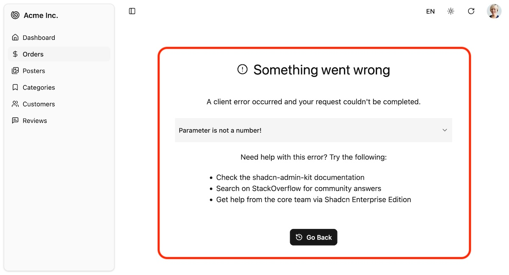

App-wide error component. It displays the error message and a back button. In development, it also shows the component stack trace.



## Usage

The default Shadcn Admin Kit [`<Layout>`](./Layout.md) renders `<Error>` as the [error boundary](https://react.dev/reference/react/Component#catching-rendering-errors-with-an-error-boundary) fallback component. This means that any time a React component throws an error, instead of crashing the entire application, users will see the `<Error>` component decorated by the layout instead. They'll be able to navigate to other parts of the app using the menu or the back button.

To customize it, edit the `@/components/admin/error.tsx` file and adapt the JSX to your needs.

For example, here is a simplified error component without the stack trace and help links:

```tsx
// in @/components/admin/error.tsx
import { useResetErrorBoundaryOnLocationChange, Translate } from "ra-core";
import { CircleAlert, History } from "lucide-react";
import { Button } from "@/components/ui/button";

export const Error = (props: InternalErrorProps & {}) => {
  const { error, errorInfo, resetErrorBoundary, ...rest } = props;
  useResetErrorBoundaryOnLocationChange(resetErrorBoundary);

  return (
    <div className="flex flex-col items-center md:p-16 gap-5" {...rest}>
      <h1 className="flex items-center text-3xl mt-5 mb-5 gap-3" role="alert">
        <CircleAlert className="w-2em h-2em" />
        <Translate i18nKey="ra.page.error" />
      </h1>
      <div>
        <Translate i18nKey="ra.message.error" />
      </div>
      <div className="mt-8">
        <Button onClick={goBack}>
          <History />
          <Translate i18nKey="ra.action.back" />
        </Button>
      </div>
    </div>
  );
};

function goBack() {
  window.history.go(-1);
}
```

If you want to create your own error boundary for a specific part of the app, you can use the `ErrorBoundary` component from the [`react-error-boundary`](https://github.com/bvaughn/react-error-boundary) package and pass `<Error>` as the `FallbackComponent` prop.

```tsx
import { ErrorBoundary } from "react-error-boundary";
import { Error } from "@/components/admin/error";

const MyComponent = ({ children }) => (
    <ErrorBoundary FallbackComponent={Error} >
        <div className="flex flex-1 flex-col px-4 ">
            {props.children}
        </div>
    </ErrorBoundary>
);
```
