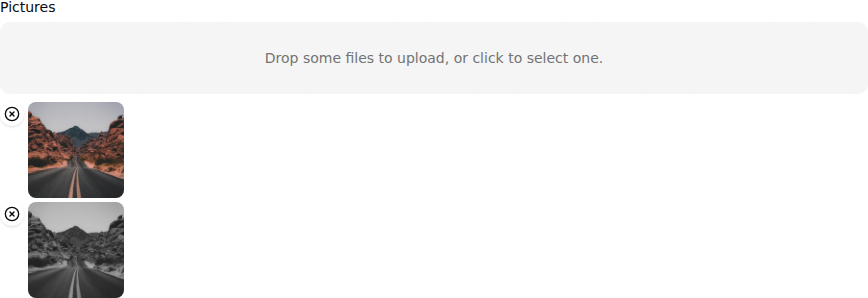

`<FileInput>` allows editing and uploading file attachments (pdfs, csv, images, etc.). It is powered by [react-dropzone](https://github.com/okonet/react-dropzone).

## Usage

```tsx
import { FileInput, FileField } from '@/components/admin';

<FileInput source="attachments" multiple accept={{ 'image/*': [] }}>
  <FileField source="src" title="title" />
</FileInput>
```

`<FileInput>` uses its child component to give a preview of the files. `<FileInput>` renders its child once per file, inside a `<RecordContext>`, so the child can be a Field component. The default [`<FileField>`](./FileField.md) renders the name of the file(s), with a hyperlink.

The input value must be an object or an array of objects with a `title` and a `src` property, e.g.:

```js
{
    id: 123,
    attachments: [
        {
            title: 'Invoice-2929-01-06.pdf',
            src: 'https://example.com/uploads/invoice-2929-01-06.pdf',
        },
        {
            title: 'export.pdf',
            src: 'https://example.com/uploads/export.pdf',
        },
    ],
}
```

After modification by the user, the value is stored as an array of objects with 3 properties:

* `title`: the file name with extension, e.g. 'Invoice-2929-01-06.pdf',
* `src`: An [object URL](https://developer.mozilla.org/en-US/docs/Web/API/URL/createObjectURL) for the `File`, e.g. 'blob:<https://example.com/1e67e00e-860d-40a5-89ae-6ab0cbee6273>'
* `rawFile`: [The `File` object](https://developer.mozilla.org/fr/docs/Web/API/File) itself

It is the responsibility of your `dataProvider` to send the file to the server (encoded in Base64, or using multipart upload) and to transform the `src` property. See [the Data Provider documentation](https://marmelab.com/ra-core/dataproviders/#handling-file-uploads) for an example.

Files are accepted or rejected based on the `accept`, `multiple`, `minSize` and `maxSize` props.

## Props

| Prop | Required | Type | Default | Description |
|------|----------|------|---------|-------------|
| `source` | Required | `string` | - | Field name |
| `accept` | Optional | `DropzoneOptions['accept']` | - | MIME / extension accept map |
| `children` | Optional | `ReactNode` | - | Preview element (single) |
| `className` | Optional | `string` | - | Wrapper classes |
| `helperText` | Optional | `ReactNode` | - | Help text |
| `labelMultiple` | Optional | `string` | `ra.input.file.upload_several` | i18n key multiple placeholder |
| `labelSingle` | Optional | `string` | `ra.input.file.upload_single` | i18n key for single placeholder |
| `maxSize` | Optional | `number` | - | Max bytes |
| `minSize` | Optional | `number` | - | Min bytes |
| `multiple` | Optional | `boolean` | `false` | Allow multiple files |
| `onRemove` | Optional | `(file:any)=>void` | - | Callback after removing a file |
| `options` | Optional | `DropzoneOptions` | - | Extra dropzone options |
| `placeholder` | Optional | `ReactNode` | - | Custom placeholder content |
| `validateFileRemoval` | Optional | `(file:any)=>boolean\|Promise<boolean>` | - | Throw/cancel to prevent removal |

## `multiple`

Set to `true` if the input should accept a list of files, `false` if it should only accept one file. Defaults to `false`.

If `multiple` is set to `false` and additional files are dropped, all files besides the first will be rejected. Any file which does not have a size in the [`minSize`, `maxSize`] range, will be rejected as well.

```jsx
<FileInput source="attachments" multiple>
    <FileField source="src" title="title" />
</FileInput>
```

## Image Input

You can use `<FileInput>` to upload images as well. Set the `accept` prop to accept only image files, and use [`<ImageField>`](./ImageField.md) as the child component to show image previews.



```tsx
import { FileInput, ImageField } from '@/components/admin';

<FileInput source="pictures" multiple accept={{ 'image/*': [] }}>
  <ImageField
    source="src"
    title="title"
    className="[&_img]:h-24 [&_img]:w-24 [&_img]:rounded-md [&_img]:object-cover"
  />
</FileInput>
```