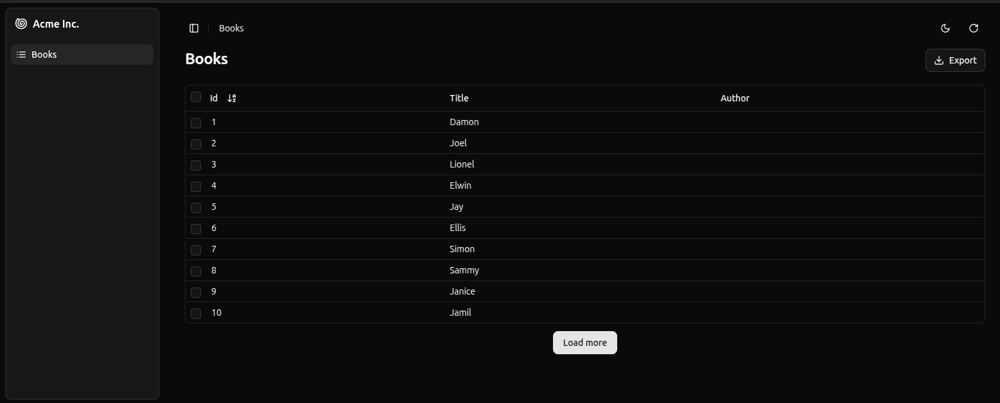

# `<InfiniteList>`

The `<InfiniteList>` component is an alternative to [the `<List>` component](./List.md) that allows user to load more records when they scroll to the bottom of the list. It's useful when you have a large number of records, or when users are using a mobile device.

<!-- video controls autoplay playsinline muted loop width="100%">
  <source src="./images/infinite-book-list.webm" poster="./images/infinite-book-list.webp" type="video/webm">
  Your browser does not support the video tag.
</video -->

`<InfiniteList>` fetches the list of records from the data provider, and renders the default list layout (title, buttons, filters). It delegates the rendering of the list of records to its child component. Usually, it's a [`<DataTable>`](./DataTable.md), responsible for displaying a table with one row for each record.

## Usage

Here is the minimal code necessary to display a list of books with infinite scroll:

```jsx
// in src/books.js
import { InfiniteList, DataTable, DateField } from '@/components/admin';

export const BookList = () => (
    <InfiniteList>
        <DataTable>
            <DataTable.Col source="id" />
            <DataTable.Col source="title" />
            <DataTable.Col source="author" field={DateField} />
        </DataTable>
    </InfiniteList>
);

// in src/App.js
import { Resource } from 'ra-core';
import { Admin } from '@/components/admin';
import jsonServerProvider from 'ra-data-json-server';

import { BookList } from './books';

const App = () => (
    <Admin dataProvider={jsonServerProvider('https://jsonplaceholder.typicode.com')}>
        <Resource name="books" list={BookList} />
    </Admin>
);

export default App;
```

That's enough to display a basic post list, that users can sort and filter, and load additional records when they reach the bottom of the list.

**Tip**: `<DataTable>` has a sticky header by default, so the user can always see the column names when they scroll down.

## Props

The props are the same as [the `<List>` component](./List.md):

| Prop                       | Required                | Type                            | Default                 | Description                                                                                  |
|----------------------------|-------------------------|---------------------------------|-------------------------|----------------------------------------------------------------------------------------------|
| `children`                 | Required if no render   | `ReactNode`                     | -                       | The component to use to render the list of records.                                          |
| `render`                   | Required if no children | `ReactNode`                     | -                       | A function that render the list of records, receives the list context as argument.           |
| `actions`                  | Optional                | `ReactElement`                  | -                       | The actions to display in the toolbar.                                                       |
| `aside`                    | Optional                | `(listContext) => ReactNode` | -                       | The component to display on the side of the list.                                            |
| `authLoading`              | Optional                | `ReactNode`                     | -                       | The component to render while checking for authentication and permissions.                   |
| `component`                | Optional                | `Component`                     | `Card`                  | The component to render as the root element.                                                 |
| `debounce`                 | Optional                | `number`                        | `500`                   | The debounce delay in milliseconds to apply when users change the sort or filter parameters. |
| `disable Authentication`   | Optional                | `boolean`                       | `false`                 | Set to `true` to disable the authentication check.                                           |
| `disable SyncWithLocation` | Optional                | `boolean`                       | `false`                 | Set to `true` to disable the synchronization of the list parameters with the URL.            |
| `empty`                    | Optional                | `ReactNode`                  | -                       | The component to display when the list is empty.                                             |
| `empty WhileLoading`       | Optional                | `boolean`                       | `false`                 | Set to `true` to return `null` while the list is loading.                                    |
| `error`                    | Optional                | `ReactNode`                     | -                       | The component to render when failing to load the list of records.                            |
| `exporter`                 | Optional                | `function`                      | -                       | The function to call to export the list.                                                     |
| `filters`                  | Optional                | `ReactElement`                  | -                       | The filters to display in the toolbar.                                                       |
| `filter`                   | Optional                | `object`                        | -                       | The permanent filter values.                                                                 |
| `filter DefaultValues`     | Optional                | `object`                        | -                       | The default filter values.                                                                   |
| `loading`                  | Optional                | `ReactNode`                     | -                       | The component to render while loading the list of records.                                   |
| `offline`                  | Optional                | `ReactNode`                     | `<Offline>`             | The component to render when there is no connectivity and there is no data in the cache      |
| `pagination`               | Optional                | `ReactNode`                  | `<Infinite Pagination>` | The pagination component to use.                                                             |
| `perPage`                  | Optional                | `number`                        | `10`                    | The number of records to fetch per page.                                                     |
| `queryOptions`             | Optional                | `object`                        | -                       | The options to pass to the `useQuery` hook.                                                  |
| `resource`                 | Optional                | `string`                        | -                       | The resource name, e.g. `posts`.                                                             |
| `sort`                     | Optional                | `object`                        | -                       | The initial sort parameters.                                                                 |
| `storeKey`                 | Optional                | `string`                        | -                       | The key to use to store the current filter & sort.                                           |
| `title`                    | Optional                | `ReactNode` / `string` / `false` | -                       | The title to display in the App Bar.                                                         |
| `sx`                       | Optional                | `object`                        | -                       | The CSS styles to apply to the component.                                                    |

Check the [`<List>` component](./List.md) for details about each prop.

Additional props are passed down to the root component (a MUI `<Card>` by default).

## `offline`

By default, `<InfiniteList>` renders the `<Offline>` component when there is no connectivity and there are no records in the cache yet for the current parameters (page, sort, etc.). You can provide your own component via the `offline` prop:

```jsx
import { InfiniteList, InfinitePagination } from '@/components/admin';
import { Alert } from '@/components/ui/alert';

const offline = <Alert severity="warning">No network. Could not load the posts.</Alert>;
// The offline component may be displayed at the bottom of the page if the network connectivity is lost
// when loading new pages. Make sure you pass your custom offline component here too
const pagination = <InfinitePagination offline={offline} />;

export const PostList = () => (
    <InfiniteList offline={offline} pagination={pagination}>
        ...
    </InfiniteList>
);
```

**Tip**: If the record is in the Tanstack Query cache but you want to warn the user that they may see an outdated version, you can use the `<IsOffline>` component:

```jsx
import { InfiniteList, InfinitePagination } from '@/components/admin';
import { IsOffline } from 'ra-core';
import { Alert } from '@/components/ui/alert';

const offline = <Alert severity="warning">No network. Could not load the posts.</Alert>;
// The offline component may be displayed at the bottom of the page if the network connectivity is lost
// when loading new pages. Make sure you pass your custom offline component here too
const pagination = <InfinitePagination offline={offline} />;

export const PostList = () => (
    <InfiniteList offline={offline} pagination={pagination}>
        <IsOffline>
           <Alert severity="warning">
                You are offline, the data may be outdated
            </Alert>
        </IsOffline>
        ...
    </InfiniteList>
);
```

## `pagination`

You can replace the default "load on scroll" pagination (triggered by a component named `<InfinitePagination>`) by a custom pagination component. To get the pagination state and callbacks, you'll need to read the `InfinitePaginationContext`.



For example, here is a custom infinite pagination component displaying a "Load More" button at the bottom of the list:

```jsx
import { InfiniteList, DataTable, Button } from '@/components/admin';
import { useInfinitePaginationContext } from 'ra-core';

const LoadMore = () => {
    const {
        hasNextPage,
        fetchNextPage,
        isFetchingNextPage,
    } = useInfinitePaginationContext();
    return hasNextPage ? (
        <div className="mt-1 text-center" >
            <Button
                disabled={isFetchingNextPage}
                onClick={() => fetchNextPage()}
            >
                Load more
            </Button>
        </div>
    ) : null;
};

export const BookList = () => (
    <InfiniteList pagination={<LoadMore />}>
        <DataTable>
            <DataTable.Col source="id" />
            <DataTable.Col source="title" />
            <DataTable.Col source="author" />
        </DataTable>
    </InfiniteList>
);
```

## Showing The Record Count

One drawback of the `<InfiniteList>` component is that it doesn't show the number of results. To fix this, you can use `useListContext` to access the `total` property of the list, and render the total number of results in a sticky footer:


```jsx
import { useListContext } from 'ra-core';
import { InfinitePagination, InfiniteList } from '@/components/admin';
import { Card } from '@/components/ui/card';

const CustomPagination = () => {
    const { total } = useListContext();
    return (
        <>
            <InfinitePagination />
            {total > 0 && (
                <div className="b-2 text-center" >
                    <Card className="px-2 py-1 mb-1 inline-block" >
                        {total} results
                    </Card>
                </div>
            )}
        </>
    );
};

export const BookList = () => (
    <InfiniteList pagination={<CustomPagination />}>
        // ...
    </InfiniteList>
);
```

If you don't need the `ListContext`, you can use the `useInfiniteListController` hook, which does the same data fetching as `<InfiniteListBase>` but lets you render the content.

```jsx
import { useInfiniteListController } from 'ra-core';
import { Card, CardContent } from '@/components/admin';

const ProductList = () => {
    const { isPending, data } = useInfiniteListController();
    return (
        <div className="container" >
            <h4>All products</h4>
                {!isPending && (
                    <div className="gap-1">
                        {data.map(product => (
                            <Card key={product.id}>
                                <CardContent>
                                    <Typography>{product.name}</Typography>
                                </CardContent>
                            </Card>
                        ))}
                    </div>
                )}
        </div>
    );
};
```

`useInfiniteListController` returns callbacks to sort, filter, and paginate the list, so you can build a complete List page.

## Security

The `<InfiniteList>` component requires authentication and will redirect anonymous users to the login page. If you want to allow anonymous access, use the [`disableAuthentication`](./List.md#disableauthentication) prop.

For instance, for the `<PostList>` page below:

```tsx
import { InfiniteList, DataTable } from '@/components/admin';

// Resource name is "posts"
const PostList = () => (
    <InfiniteList>
        <DataTable>
            <DataTable.Col source="title" />
            <DataTable.Col source="author" />
            <DataTable.Col source="published_at" />
        </DataTable>
    </InfiniteList>
);
```

`<InfiniteList>` will call `authProvider.canAccess()` using the following parameters:

```js
{ action: "list", resource: "posts" }
```

Users without access will be redirected to the [Access Denied page](./Admin.md#accessdenied).

**Note**: Access control is disabled when you use [the `disableAuthentication` prop](./List.md#disableauthentication).
