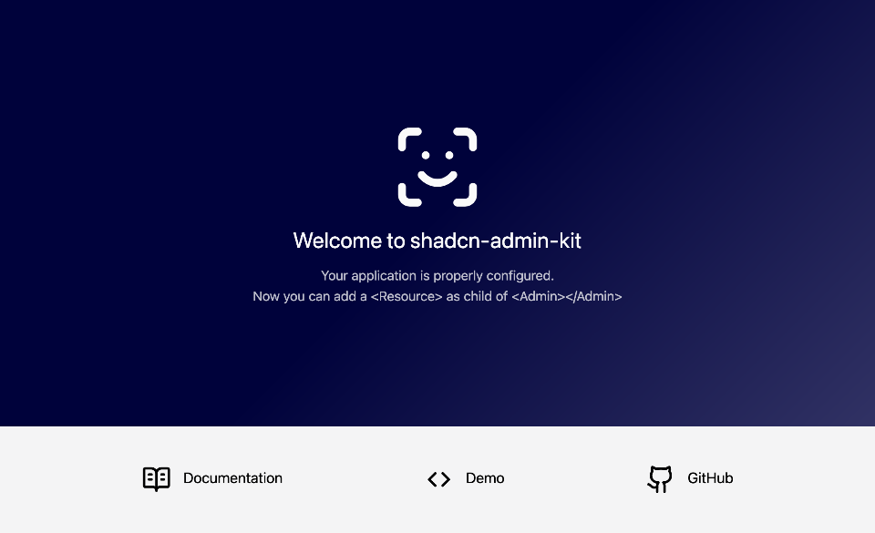

---

title: Installation

---

`shadcn-admin-kit` is a React library of components for admin apps. You can install it with any React framework:

- [Install with Next.js](#install-with-nextjs)
- [Install with Vite](#install-with-vitejs)
- [Install with React-Router](#install-with-react-router)

## Install with Next.js

The first step is to create a new Next.js project using the `create-next-app` command. Name your app 'e.g., `my-app`, and answer **Yes** to the question about recommended Next.js defaults:

```bash
npx create-next-app@latest
✔ What is your project named? … my-app
✔ Would you like to use the recommended Next.js defaults? › Yes, use recommended defaults
...
Success! Created my-app at /path/to/my-app
```

Next, go to your project directory and pull the `shadcn-admin-kit` components using the `shadcn` command:

```bash
cd my-app
npx shadcn@latest add https://marmelab.com/shadcn-admin-kit/r/admin.json
✔ You need to create a components.json file to add components. Proceed? … yes
✔ Which color would you like to use as the base color? › Neutral
✔ Writing components.json.
✔ Checking registry.
✔ Updating CSS variables in app/globals.css
✔ Installing dependencies.
✔ Created 114 files
```

This will add some components to the `components/admin` and `components/ui` directories, as well as some utilities inside the `hooks/` and `lib/` directories.

You're ready to bootstrap your app. Create an `app/admin` directory and an `app/admin/App.tsx` component file that will contain the admin app.

```tsx title="app/admin/App.tsx"
"use client";

import { Admin } from "@/components/admin";

const App = () => <Admin></Admin>;

export default App;
```

Expose that admin app at the `/admin` URL by adding a `app/admin/page.tsx` file. this page should dynamically import the admin component and render it with SSR disabled:

```tsx title="app/admin/page.tsx"
"use client";

import dynamic from "next/dynamic";

const App = dynamic(() => import("./App"), {
  ssr: false, // Required to avoid react-router related errors
});

export default function Page() {
  return <App />;
}
```

Finally, run `npm run dev` and go to `http://localhost:3000/admin` to access your admin app.



Next step: Read the [Quick Start Guide](./Quick-Start-Guide.mdx) to learn how to use the components in your admin app.

## Install with Vite.js

`shadcn-admin-kit` is built on React, so you need to create a Vite single-page app to use it.

```shell
npm create vite@latest my-app -- --template react-ts
or
yarn create vite my-app --template react-ts
```

Then, `cd` into your new project directory and [install shadcn/ui](https://ui.shadcn.com/docs/installation/vite). To do so, add Tailwind CSS.

```shell
npm install tailwindcss @tailwindcss/vite
# or
yarn add tailwindcss @tailwindcss/vite
```

Install node types as a development dependency:

```shell
npm install -D @types/node
# or
yarn add -D @types/node
```

Replace everything in `src/index.css` with the following:

```shell
// src/index.css
@import "tailwindcss";
```

Edit `tsconfig.json` file. Add the `baseUrl` and `paths` properties to the `compilerOptions` section of the `tsconfig.json` and `tsconfig.app.json` files:

```diff lang="json"
// tsconfig.json
{
  "files": [],
  "references": [
    { "path": "./tsconfig.app.json" },
    { "path": "./tsconfig.node.json" }
  ],
+  "compilerOptions": {
+    "baseUrl": ".",
+    "paths": {
+      "@/*": ["./src/*"]
+    }
+  }
}
```

```diff lang="json"
// tsconfig.app.json
{
  "compilerOptions": {
    // ...
-   "verbatimModuleSyntax": true,
+   "verbatimModuleSyntax": false,
+   "baseUrl": ".",
+   "paths": {
+     "@/*": [ "./src/*" ]
+   },
  }
}
```

Add the following code to the `vite.config.ts` so your app can resolve paths without error:

```diff lang="tsx" title="vite.config.ts"
+import path from "path"
+import tailwindcss from "@tailwindcss/vite"
import react from "@vitejs/plugin-react"
import { defineConfig } from "vite"
 
// https://vite.dev/config/
export default defineConfig({
-  plugins: [react()],
+  plugins: [react(), tailwindcss()],
+  resolve: {
+    alias: {
+      "@": path.resolve(__dirname, "./src"),
+    },
+  },
})
```

Now, run the `shadcn` init command to setup your project:

```shell
npx shadcn@latest init
# or
yarn shadcn init
```

You will be asked a few questions to configure `components.json`.

You can now start adding components to your project. Let's start with the `shadcn-admin-kit` components.

```shell
npx shadcn@latest add https://marmelab.com/shadcn-admin-kit/r/admin.json
```

The main entry point of your new application is `main.tsx`, which renders the `App` component into the DOM.

```tsx
// src/main.tsx
import { StrictMode } from "react";
import { createRoot } from "react-dom/client";
import "./index.css";
import App from "./App.tsx";

createRoot(document.getElementById("root")!).render(
    <StrictMode>
        <App />
    </StrictMode>,
);
```

The `<App>` component currently renders a default Vite application. You can replace all its content by the following to serve your new `shadcn-admin-kit` application.

```tsx
// src/App.tsx
import { Admin } from "@/components/admin";

const App = () => <Admin></Admin>;

export default App;
```

It's time to test! Run the following command to run your project.

```shell
npm run dev
# or
yarn dev
```

You should see this:


Next step: Read the [Quick Start Guide](./Quick-Start-Guide.mdx) to learn how to use the components in your admin app.

## Install with React-Router

You can setup a Shadcn Admin Kit application with React-Router v7 (a.k.a. Remix v3) as follows. First, creating a new React Router project with the following command:

```shell
npx create-react-router@latest 
```

This script will ask you for more details about your project. You can use the following options:

- The name you want to give to your project, e.g. `my-app`
- Initialize a new git repository? Choose Yes
- Install dependencies with npm? Choose Yes

Initialize shadcn in your new project:

```shell
cd my-app
npx shadcn@latest init
```

Next, install the Shadcn Admin Kit components:

```shell
npx shadcn@latest add https://marmelab.com/shadcn-admin-kit/r/admin.json
```

This will add some components to the `app/components/admin` and `app/components/ui` directories, as well as some utilities inside the `app/hooks/` and `app/lib/` directories.

Shadcn Admin Kit depends on the `react-router-dom` package. It used to be a direct dependency of `react-router`, but it's not anymore in v7 so you'll have to add it manually. Check the version of React Router that has been installed by `create-react-router` and **use the exact same version**. At the time of writing this tutorial, it is `7.10.1`.

```shell
npm add react-router-dom@7.10.1
```

Next, add a `/admin` route to your application by editing the `app/routes.ts` file and adding the following route:

```tsx title="app/routes.ts"
import { type RouteConfig, index, route } from "@react-router/dev/routes";

export default [
  index("routes/home.tsx"),
  route("/admin/*", "routes/admin.tsx"),
] satisfies RouteConfig;
```

Now create the `app/routes/admin.tsx` file:

```tsx title="app/routes/admin.tsx"
import AdminApp from "~/admin/App";

export default function App() {
  return <AdminApp />;
}
```

Then, create the `app/admin/App.tsx` file that will contain the admin app:

```tsx title="app/admin/App.tsx"
import { Admin } from "~/components/admin";

const App = () => <Admin basename="/admin"></Admin>;

export default App;
```

:::note
The convention for react-router applications is to use `~/` as prefix for imports, while other frameworks use `@/`. The Shadcn Admin Kit documentation uses `@/` everywhere, make sure to adapt the import paths accordingly.
:::

Edit the `tsconfig.json` file to avoid an [unsolved shadcn/ui bug](https://github.com/shadcn-ui/ui/issues/6618):

```diff lang="json"
// tsconfig.app.json
{
  "compilerOptions": {
    // ...
-   "verbatimModuleSyntax": true,
+   "verbatimModuleSyntax": false,
    },
}
```

It's time to test! Run the following command to run your project.

```shell
npm run dev
# or
yarn dev
```

Now go to `http://localhost:5173/admin` in your browser. You should see this:


:::tip
If you're getting a `ReferenceError: document is not defined`error at this stage, it's probably because the versions of `react-router` and `react-router-dom` are mismatched. Make sure to use the exact same version for both packages.
:::

Next step: Read the [Quick Start Guide](./Quick-Start-Guide.mdx) to learn how to use the components in your admin app. -
