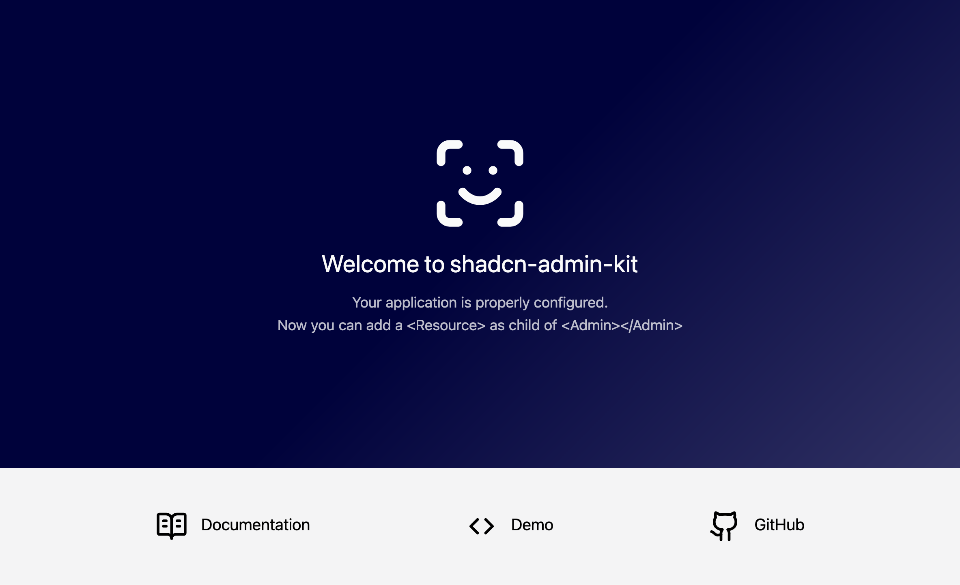
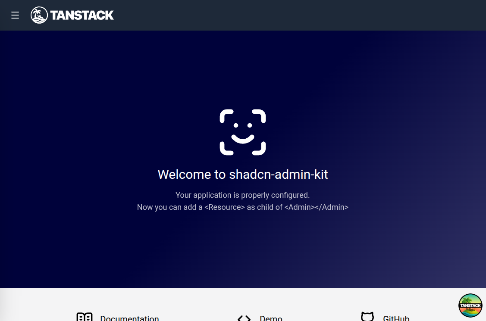

---

title: Installation

---

import nextLogo from './images/framework-logos/nextjs.svg';
import viteLogo from './images/framework-logos/vite.svg';
import reactRouterLogo from './images/framework-logos/react-router.svg';
import tanstackLogo from './images/framework-logos/tanstack.svg';
export const FrameworkCard = ({ href, logo, name, borderHover, bgHover, shadow }) => (
  <a
    href={href}
    class="group flex flex-col items-center gap-4 p-6 rounded-xl border border-gray-200 dark:border-gray-700 bg-white dark:bg-gray-800/50 hover:scale-[1.02] transition-all duration-200 no-underline"
    style={`--border-hover: ${borderHover}; --bg-hover: ${bgHover}; --shadow-color: ${shadow}`}
  >
    <div class="w-16 h-16 flex items-center justify-center rounded-lg bg-gray-50 dark:bg-gray-800 transition-colors framework-card-icon">
      
    </div>
    <span class="font-semibold text-gray-900 dark:text-gray-100">{name}</span>
  </a>
);

<style>{`
  .framework-card-icon { transition: background-color 0.2s; }
  a:has(.framework-card-icon):hover {
    border-color: var(--border-hover);
    box-shadow: 0 10px 15px -3px var(--shadow-color), 0 4px 6px -4px var(--shadow-color);
  }
  a:has(.framework-card-icon):hover .framework-card-icon { background-color: var(--bg-hover); }
`}</style>

`shadcn-admin-kit` is a React library of components for admin apps. You can install it with any React framework:

<div class="not-content grid grid-cols-2 md:grid-cols-4 gap-4 my-8">
  <FrameworkCard href="#install-with-nextjs" logo={nextLogo.src} name="Next.js" borderHover="#d1d5db" bgHover="#f3f4f6" shadow="rgba(156,163,175,0.2)" />
  <FrameworkCard href="#install-with-vitejs" logo={viteLogo.src} name="Vite" borderHover="#c4b5fd" bgHover="#f5f3ff" shadow="rgba(139,92,246,0.15)" />
  <FrameworkCard href="#install-with-react-router" logo={reactRouterLogo.src} name="React Router" borderHover="#fca5a5" bgHover="#fef2f2" shadow="rgba(239,68,68,0.15)" />
  <FrameworkCard href="#install-with-tanstack-start" logo={tanstackLogo.src} name="TanStack Start" borderHover="#fcd34d" bgHover="#fffbeb" shadow="rgba(245,158,11,0.15)" />
</div>

Every command below passes `--preset vega`. Keep it: it produces the `base-vega` style that the kit's own `components.json` declares. The shadcn CLI can generate its components on top of Base UI, React Aria or Radix primitives, and this version of `shadcn-admin-kit` is built on the Base UI ones; the preset name carries that choice, so there is no separate flag to pass. Drop it and the CLI stops twice, to ask which library and which preset. The command otherwise asks no questions, and signs off with a reminder to wrap your app in a `TooltipProvider` that you can ignore, since the components that use tooltips provide their own.

:::note
The `shadcn` CLI tool has [known issues](https://github.com/shadcn-ui/ui/issues/8778) with Windows. If you are using Windows and encounter problems, please switch to a WSL terminal or use a different OS.
:::

## Install with Next.js

Create the project and pull the `shadcn-admin-kit` components in one command:

```shell
npx shadcn@latest init \
  --template next \
  --preset vega \
  --name my-app \
  https://marmelab.com/shadcn-admin-kit/r/admin.json
```

This will add some components to the `components/admin` and `components/ui` directories, as well as some utilities inside the `hooks/` and `lib/` directories.

```shell
cd my-app
```

You're ready to bootstrap your app. Create an `app/admin` directory and an `app/admin/App.tsx` component file that will contain the admin app.

```tsx title="app/admin/App.tsx"
"use client";

import { Admin } from "@/components/admin";

const App = () => <Admin></Admin>;

export default App;
```

Expose that admin app at the `/admin` URL by adding a `app/admin/page.tsx` file. this page should dynamically import the admin component and render it with SSR disabled:

```tsx title="app/admin/page.tsx"
"use client";

import dynamic from "next/dynamic";

const App = dynamic(() => import("./App"), {
  ssr: false, // Required to avoid react-router related errors
});

export default function Page() {
  return <App />;
}
```

Finally, run `npm run dev` and go to `http://localhost:3000/admin` to access your admin app.



Next step: Read the [Quick Start Guide](./Quick-Start-Guide.mdx) to learn how to use the components in your admin app.

## Install with Vite.js

Create the project and pull the `shadcn-admin-kit` components in one command:

```shell
npx shadcn@latest init \
  --template vite \
  --preset vega \
  --name my-app \
  https://marmelab.com/shadcn-admin-kit/r/admin.json
```

This will add some components to the `src/components/admin` and `src/components/ui` directories, as well as some utilities inside the `src/hooks/` and `src/lib/` directories.

```shell
cd my-app
```

The template leaves `src/App.tsx` rendering a "Project ready!" placeholder page with a single button. Replace all its content by the following to serve your new `shadcn-admin-kit` application.

```tsx
// src/App.tsx
import { Admin } from "@/components/admin";

const App = () => <Admin></Admin>;

export default App;
```

Shadcn Admin Kit reads `process.env.NODE_ENV`, so `node` must be among the TypeScript types your app loads. The `types` array of `tsconfig.app.json` already contains `vite/client`; add `node` next to it, or `npm run build` fails with `Cannot find name 'process'`.

```json title="tsconfig.app.json"
{
  "compilerOptions": {
    "types": ["vite/client", "node"]
  }
}
```

It's time to test! Run the following command to run your project.

```shell
npm run dev
# or
yarn dev
```

You should see this:


Next step: Read the [Quick Start Guide](./Quick-Start-Guide.mdx) to learn how to use the components in your admin app.

## Install with React-Router

You can setup a Shadcn Admin Kit application with React-Router v7 (a.k.a. Remix v3). Create the project and pull the `shadcn-admin-kit` components in one command:

```shell
npx shadcn@latest init \
  --template react-router \
  --preset vega \
  --name my-app \
  https://marmelab.com/shadcn-admin-kit/r/admin.json
```

This will add some components to the `app/components/admin` and `app/components/ui` directories, as well as some utilities inside the `app/hooks/` and `app/lib/` directories.

```shell
cd my-app
```

The React Router framework pins `@react-router/dev`, `@react-router/node` and `@react-router/serve` to one exact `react-router` version, so the newer `react-router-dom` that the registry pulls in brings a second copy of `react-router` along, and the app then fails to render server side. Read the `@react-router/dev` version from your `package.json` and **use the exact same version** for `react-router-dom`. At the time of writing this tutorial, it is `7.15.1`.

```shell
npm add --save-exact react-router-dom@7.15.1
```

Next, add a `/admin` route to your application by editing the `app/routes.ts` file and adding the following route:

```tsx title="app/routes.ts"
import { type RouteConfig, index, route } from "@react-router/dev/routes";

export default [
  index("routes/home.tsx"),
  route("/admin/*", "routes/admin.tsx"),
] satisfies RouteConfig;
```

Now create the `app/routes/admin.tsx` file:

```tsx title="app/routes/admin.tsx"
import AdminApp from "~/admin/App";

export default function App() {
  return <AdminApp />;
}
```

Then, create the `app/admin/App.tsx` file that will contain the admin app:

```tsx title="app/admin/App.tsx"
import { Admin } from "~/components/admin";

const App = () => <Admin basename="/admin"></Admin>;

export default App;
```

:::note
The convention for react-router applications is to use `~/` as prefix for imports, while other frameworks use `@/`. The Shadcn Admin Kit documentation uses `@/` everywhere, make sure to adapt the import paths accordingly.
:::

It's time to test! Run the following command to run your project.

```shell
npm run dev
# or
yarn dev
```

Now go to `http://localhost:5173/admin` in your browser. You should see this:


:::tip
If you're getting a `ReferenceError: document is not defined`error at this stage, it's probably because the versions of `react-router` and `react-router-dom` are mismatched. Make sure to use the exact same version for both packages.
:::

Next step: Read the [Quick Start Guide](./Quick-Start-Guide.mdx) to learn how to use the components in your admin app.

## Install with Tanstack Start

You can setup a Shadcn Admin Kit application with Tanstack Start. Create the project and pull the `shadcn-admin-kit` components in one command:

```shell
npx shadcn@latest init \
  --template start \
  --preset vega \
  --name my-app \
  https://marmelab.com/shadcn-admin-kit/r/admin.json
```

This will add some components to the `src/components/admin` and `src/components/ui` directories, as well as some utilities inside the `src/hooks/` and `src/lib/` directories.

```shell
cd my-app
```

You need to add `ra-router-tanstack` to your project, so that your `shadcn-admin-kit` application can make use of the tanstack router:

```shell
npm install ra-router-tanstack
```

You're ready to bootstrap your app! The template already ships a `src/routes/index.tsx` route rendering a placeholder page. Replace all its content by the following:

```tsx title="src/routes/index.tsx"
import { createFileRoute } from "@tanstack/react-router";
import { tanStackRouterProvider } from "ra-router-tanstack";
import { Admin } from "@/components/admin";

export const Route = createFileRoute("/")({ component: App });

function App() {
  return <Admin routerProvider={tanStackRouterProvider}></Admin>;
}
```

:::note
Don't export the `App` component: TanStack Router can't code-split extra exports from a route file, and warns about it on every request.
:::

When you run `npm run dev` and visit [http://localhost:3000](http://localhost:3000/), you should see the Shadcn Admin Kit welcome screen:



Next step: Read the [Quick Start Guide](./Quick-Start-Guide.mdx) to learn how to use the components in your admin app.
