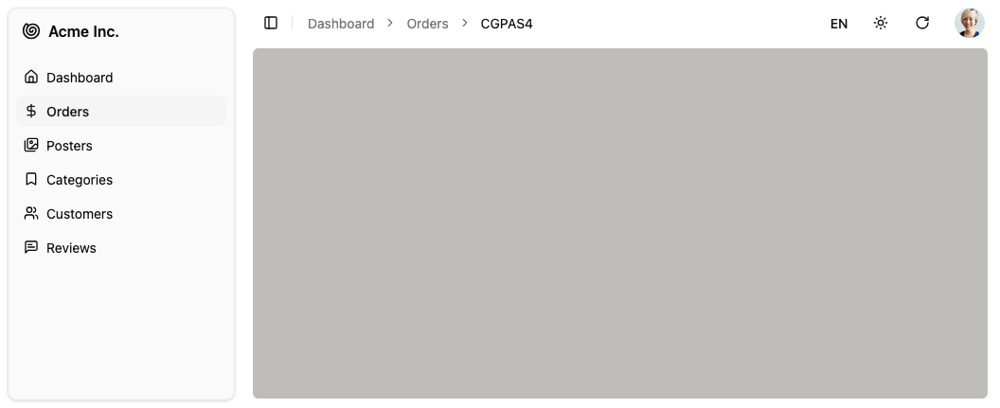

Application shell including sidebar, header (breadcrumb portal, locale & theme toggles, refresh, user menu) and notification area.



## Usage

`<Layout>` wraps the main content of the page. It includes:

- The [AppSidebar](./AppSidebar.md) component for navigation
- A header with a [breadcrumb](./Breadcrumb.md) portal, [locale](./LocalesMenuButton.md) and theme toggles, refresh button, and user menu
- An error boundary for error handling 
- A Suspense boundary for loading states
- A notification area for displaying toasts

To customize all these elements, edit the `@/components/admin/layout.tsx` file.

Here is a short version of the default layout component:

```tsx title="@/components/admin/layout.tsx"
import { Suspense, useState, type ErrorInfo } from "react";
import { cn } from "@/lib/utils";
import { CoreLayoutProps } from "ra-core";
import { ErrorBoundary } from "react-error-boundary";
import { SidebarProvider, SidebarTrigger } from "@/components/ui/sidebar";
import { UserMenu } from "@/components/admin/user-menu";
import { ThemeModeToggle } from "@/components/admin/theme-mode-toggle";
import { Notification } from "@/components/admin/notification";
import { AppSidebar } from "@/components/admin/app-sidebar";
import { RefreshButton } from "@/components/admin/refresh-button";
import { LocalesMenuButton } from "@/components/admin/locales-menu-button";
import { Error } from "@/components/admin/error";
import { Loading } from "@/components/admin/loading";

export const Layout = (props: CoreLayoutProps) => {
  const [errorInfo, setErrorInfo] = useState<ErrorInfo | undefined>(undefined);
  const handleError = (_: Error, info: ErrorInfo) => {
    setErrorInfo(info);
  };
  return (
    <SidebarProvider>
      <AppSidebar />
      <main className={/* ... */}>
        <header className="flex h-16 md:h-12 shrink-0 items-center gap-2 px-4">
          <SidebarTrigger className="scale-125 sm:scale-100" />
          <div className="flex-1 flex items-center" id="breadcrumb" />
          <LocalesMenuButton />
          <ThemeModeToggle />
          <RefreshButton />
          <UserMenu />
        </header>
        <ErrorBoundary
          onError={handleError}
          fallbackRender={({ error, resetErrorBoundary }) => (
            <Error
              error={error}
              errorInfo={errorInfo}
              resetErrorBoundary={resetErrorBoundary}
            />
          )}
        >
          <Suspense fallback={<Loading />}>
            <div className="flex flex-1 flex-col px-4 ">{props.children}</div>
          </Suspense>
        </ErrorBoundary>
      </main>
      <Notification />
    </SidebarProvider>
  );
};
```

Instead of customizing the Layout, you can also provide your own layout component by passing it to the `<Admin>` component:

```tsx
import { Admin } from "react-admin";
import { MyLayout } from "./layout";

const App = () => (
  <Admin layout={MyLayout} /* ... */>
    {/* ... */}
  </Admin>
);
```

A custom layout can be of any shape, but must render its children (the main content of the page). For example, here is a minimal layout:

```tsx
import { CoreLayoutProps } from "ra-core";

export const MyLayout = (props: CoreLayoutProps) => (
  <div>
    <header>My custom header</header>
    <main>{props.children}</main>
    <footer>My custom footer</footer>
  </div>
);