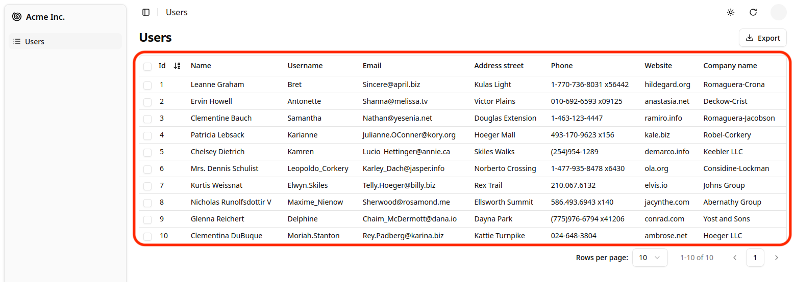
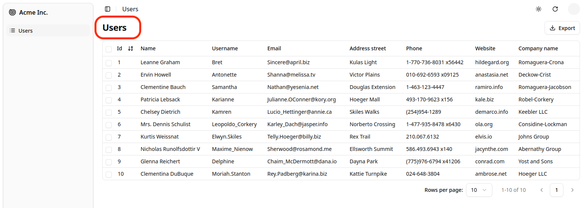
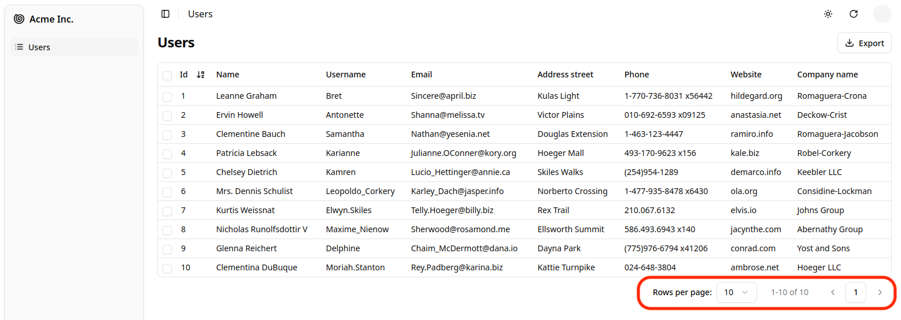
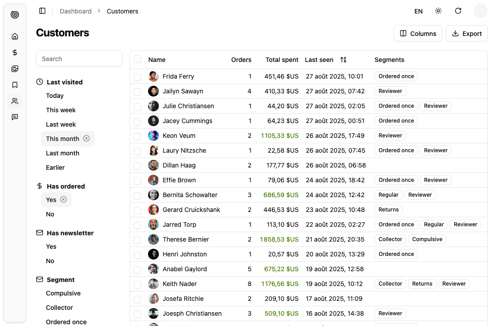
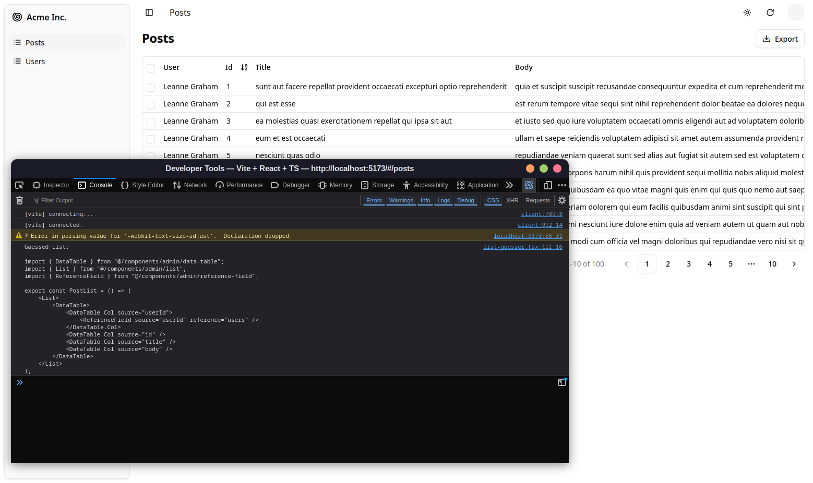

---

title: "List"

---

The `<List>` component is the root component for list pages. It fetches a list of records from the data provider (via `ra-core` hooks), puts them in a [`ListContext`](https://marmelab.com/react-admin/useListContext.html), renders a default layout (breadcrumb, title, action buttons, inline filters, pagination), then renders its children (usually a [`<DataTable>`](https://marmelab.com/react-admin/DataTable.html)).


## Usage

Here is a minimal example to display a list of users with a [`<DataTable>`](https://marmelab.com/react-admin/DataTable.html):

```jsx
// in src/users.jsx
import { DataTable, List } from "@/components/admin";

export const UserList = () => (
    <List>
        <DataTable>
            <DataTable.Col source="id" />
            <DataTable.Col source="name" />
            <DataTable.Col source="username" />
            <DataTable.Col source="email" />
            <DataTable.Col source="address.street" />
            <DataTable.Col source="phone" />
            <DataTable.Col source="website" />
            <DataTable.Col source="company.name" />
        </DataTable>
    </List>
);

// in src/App.jsx
import { Admin } from 'shadcn-admin-kit';
import { Resource } from 'ra-core';
import jsonServerProvider from 'ra-data-json-server';

import { UserList } from './users';

const App = () => (
    <Admin dataProvider={jsonServerProvider('https://jsonplaceholder.typicode.com')}>
        <Resource name="users" list={UserList} />
    </Admin>
);

export default App;
```

That's enough to display a basic list with sorting and pagination.

You can find more advanced examples of `<List>` usage in the [demo](https://marmelab.com/shadcn-admin-kit/demo/).

## Props

| Prop | Required | Type | Default | Description |
|------|----------|------|---------|-------------|
| `children` | Optional* | `ReactNode` | - | Component(s) that display the records (e.g. `<DataTable>`) |
| `render` | Optional* | `(ctx) => ReactNode` | - | Alternate render function receiving the list context |
| `actions` | Optional | `ReactNode` | default action bar | Custom actions area (right side of header) |
| `debounce` | Optional | `number` | `500` | Debounce (ms) for filter & sort changes |
| `disableAuthentication` | Optional | `boolean` | `false` | Skip auth check for this page |
| `disableSyncWithLocation` | Optional | `boolean` | `false` | Keep list params local (not in the URL) |
| `exporter` | Optional | `false | (records, fetchRelated, dataProvider) => void` | - | Custom export logic (set `false` to hide Export button) |
| `filters` | Optional | `ReactElement[]` | - | Array of filter input elements (displayed inline) |
| `filter` | Optional | `object` | - | Permanent filters always applied |
| `filterDefaultValues` | Optional | `object` | - | Initial filter form values |
| `pagination` | Optional | `ReactNode` | `<ListPagination />` | Custom pagination component |
| `perPage` | Optional | `number` | `10` | Records per page |
| `queryOptions` | Optional | `object` | - | Extra TanStack Query options |
| `resource` | Optional | `string` | inferred | Resource name, defaults to the current `<ResourceContext>` |
| `sort` | Optional | `{ field: string; order: 'ASC'|'DESC' }` | - | Initial sort |
| `storeKey` | Optional | `string | false` | derived | Storage key for persisted params; `false` disables persistence |
| `title` | Optional | `string | ReactNode | false` | resource plural label | Page title |

`*` Provide either `children` or `render`.

These props will soon be supported: `aside`, `empty`, `emptyWhileLoading`.

## Main Content Area

`<List>` itself doesn't render the list of records. It delegates this task to its children components. These children components grab the `data` from the [`ListContext`](https://marmelab.com/react-admin/useListContext.html) and render them on screen.



shadcn-admin-kit provides several components that can read and display a list of records from a `ListContext`, each with a different layout:

- [`<DataTable>`](https://marmelab.com/react-admin/DataTable.html) displays records in a table
- [`<SingleFieldList>`](https://marmelab.com/react-admin/SingleFieldList.html) displays records inline, showing one field per record

Alternatively to `children`, you can pass a `render` prop to `<List>`. It will receive the [`ListContext`](https://marmelab.com/react-admin/useListContext.html#return-value) as its argument, and should return a React node. This allows to inline the render logic for the list page.

```tsx
const PostList = () => (
    <List
        render={({ isPending, error, data }) => {
            if (isPending) {
                return <div>Loading...</div>;
            }
            if (error) {
                return <div>Error: {error.message}</div>;
            }
            return (
                <ul>
                    {data.map(post => (
                        <li key={post.id}>
                            <strong>{post.title}</strong> - {post.author}
                        </li>
                    ))}
                </ul>
            );
        }}
    />
);
```

:::note
When receiving a `render` prop, the `<List>` component will ignore the `children` prop.
:::

## Actions toolbar

By default the page header shows a toolbar with 2 buttons:

* `<CreateButton>` (if the resource has a create view)
* `<ExportButton>` (unless `exporter={false}`)

Provide an `actions` prop to completely replace that area:

```jsx
import { List, CreateButton, ExportButton, ColumnsButton } from 'shadcn-admin-kit';

const MyActions = () => (
    <div className="flex items-center gap-2">
        <ColumnsButton />
        <CreateButton />
        <ExportButton />
    </div>
);

export const PostList = () => (
    <List actions={<MyActions />}> 
        ...
    </List>
);
```

You can also build contextual actions using anything from the list context (`isPending`, `total`, `selectedIds`, etc.).

## Page Title

The default title for a list view is the translation key `ra.page.list` that translates to [the plural name of the resource](https://marmelab.com/react-admin/TranslationTranslating.html#translating-resource-and-field-names) (e.g. "Posts").



You can customize this title by providing a resource specific translation with the key `resources.RESOURCE.page.list` (e.g. `resources.posts.page.list`):

```js
// in src/i18n/en.js
import englishMessages from 'ra-language-english';

export const en = {
    ...englishMessages,
    resources: {
        posts: {
            name: 'Post |||| Posts',
            page: {
                list: 'Post list'
            }
        },
    },
    ...
};
```

You can also customize this title by specifying a custom `title` prop:

```jsx
export const PostList = () => (
    <List title="List of posts">
        ...
    </List>
);
```

The title can be a string, a React element, or `false` to disable the title.

## Pagination

By default, `<List>` displays a set of pagination controls at the bottom of the list.



The `pagination` prop allows to replace the default pagination controls by your own.

```jsx
// in src/MyPagination.js
import { TablePagination, List } from 'shadcn-admin-kit';

const PostPagination = () => <TablePagination rowsPerPageOptions={[10, 25, 50, 100]} />;

export const PostList = () => (
    <List pagination={<PostPagination />}>
        ...
    </List>
);
```

By default, the list paginates results by groups of 10. You can override this setting by specifying the `perPage` prop:

```jsx
// in src/posts.js
export const PostList = () => (
    <List perPage={25}>
        ...
    </List>
);
```

:::note
The default pagination component's `rowsPerPageOptions` includes options of 5, 10, 25 and 50. If you set your List `perPage` to a value not in that set, you must also customize the pagination so that it allows this value, or else there will be an error.

```diff
// in src/MyPagination.js
-import { List } from 'shadcn-admin-kit';
+import { List, Pagination } from 'shadcn-admin-kit';

export const PostList = () => (
-    <List perPage={6}>
+    <List perPage={6} pagination={<Pagination rowsPerPageOptions={[6, 12, 24, 36]} />}>
        ...
    </List>
);
```
:::

## Sort

Pass an object literal as the `sort` prop to determine the default `field` and `order` used for sorting:

```jsx
export const PostList = () => (
    <List sort={{ field: 'published_at', order: 'DESC' }}>
        ...
    </List>
);
```

`sort` defines the *default* sort order ; users can change the sort order, e.g. by clicking on column headers when using a `<DataTable>`, or by selecting another option in the `<SortButton>`.

## Permanent Filter

You can choose to always filter the list, without letting the user disable this filter - for instance to display only published posts. Write the filter to be passed to the data provider in the `filter` props:

```jsx
// in src/posts.js
export const PostList = () => (
    <List filter={{ is_published: true }}>
        ...
    </List>
);
```

The actual filter parameter sent to the data provider is the result of the combination of the *user* filters (the ones set through the `filters` component form), and the *permanent* filter. The user cannot override the permanent filters set by way of `filter`.

## Filter Button / Form Combo

<video controls autoplay playsinline muted loop>
    <source src="https://marmelab.com/react-admin/img/list_filter.mp4" type="video/mp4"/>
  Your browser does not support the video tag.
</video>

You can add an array of filter Inputs to the List using the `filters` prop:

```jsx
const postFilters = [
    <SearchInput source="q" alwaysOn />,
    <TextInput label="Title" source="title" defaultValue="Hello, World!" />,
];

export const PostList = () => (
    <List filters={postFilters}>
        ...
    </List>
);
```

:::tip
Don't mix up this `filters` prop, expecting an array of `<Input>` elements, with the `filter` props, which expects an object to define permanent filters (see below).
:::

:::tip
Filters will render as disabled inputs or menu items (depending on filter context) if passed the prop `disabled`.
:::

Filter Inputs are regular inputs. `<List>` hides them all by default, except those that have the `alwaysOn` prop. Note that inputs with `alwaysOn` don't accept `defaultValue`. You have to use the `filterDefaultValues` for those.

```jsx
// in src/posts.js
const postFilters = [
    <TextInput label="Search" source="q" alwaysOn />,
    <BooleanInput source="is_published" alwaysOn />,
    <TextInput source="title" defaultValue="Hello, World!" />,
];

export const PostList = () => (
    <List filters={postFilters} filterDefaultValues={{ is_published: true }}>
        ...
    </List>
);
```

:::tip
You can also display filters as a sidebar thanks to the [`<ToggleFilterButton>`](./ToggleFilterButton.md) component:


:::

For more details about customizing filters, see the [Filtering the List](https://marmelab.com/react-admin/FilteringTutorial.html#filtering-the-list) documentation.

## Exported Data

Among the default list actions, shadcn-admin-kit includes an `<ExportButton>`.

By default, clicking this button will:

1. Call the `dataProvider` with the current sort and filter (but without pagination),
2. Transform the result into a CSV string,
3. Download the CSV file.

The columns of the CSV file match all the fields of the records in the `dataProvider` response. That means that the export doesn't take into account the selection and ordering of fields in your `<List>` via `Field` components. If you want to customize the result, pass a custom `exporter` function to the `<List>`. This function will receive the data from the `dataProvider` (after step 1) and replace steps 2-3 (i.e. it's in charge of transforming, converting, and downloading the file).

:::tip
The `<ExportButton>` is disabled when there is no record in the current `<List>`.
:::

:::tip
For CSV conversion, you can import [jsonexport](https://github.com/kauegimenes/jsonexport#browser-import-examples), a JSON to CSV converter which is already a shadcn-admin-kit dependency. And for CSV download, take advantage of shadcn-admin-kit's `downloadCSV` function.

Here is an example for a Posts exporter, omitting, adding, and reordering fields:

```jsx
// in PostList.js
import { List } from 'shadcn-admin-kit';
import { downloadCSV } ffrom 'ra-core';
import jsonExport from 'jsonexport/dist';

const exporter = posts => {
    const postsForExport = posts.map(post => {
        const { backlinks, author, ...postForExport } = post; // omit backlinks and author
        postForExport.author_name = post.author.name; // add a field
        return postForExport;
    });
    jsonExport(postsForExport, {
        headers: ['id', 'title', 'author_name', 'body'] // order fields in the export
    }, (err, csv) => {
        downloadCSV(csv, 'posts'); // download as 'posts.csv` file
    });
};

const PostList = () => (
    <List exporter={exporter}>
        ...
    </List>
)
```
:::

In many cases, you'll need more than simple object manipulation. You'll need to *augment* your objects based on relationships. For instance, the export for comments should include the title of the related post - but the export only exposes a `post_id` by default. For that purpose, the exporter receives a `fetchRelatedRecords` function as the second parameter. It fetches related records using your `dataProvider.getMany()` method and returns a promise.

Here is an example for a Comments exporter, fetching related Posts:

```tsx
// in CommentList.js
import { List } from 'shadcn-admin-kit';
import { downloadCSV, type FetchRelatedRecords } from 'ra-core';
import jsonExport from 'jsonexport/dist';

const exporter = async (comments: Comments[], fetchRelatedRecords: FetchRelatedRecords) => {
    // will call dataProvider.getMany('posts', { ids: records.map(record => record.post_id) }),
    // ignoring duplicate and empty post_id
    const posts = await fetchRelatedRecords<Post>(comments, 'post_id', 'posts')
    const commentsWithPostTitle = comments.map(comment => ({
            ...comment,
            post_title: posts[comment.post_id].title,
    }));
    return jsonExport(commentsWithPostTitle, {
        headers: ['id', 'post_id', 'post_title', 'body'],
    }, (err, csv) => {
        downloadCSV(csv, 'comments');
    });
};

const CommentList = () => (
    <List exporter={exporter}>
        ...
    </List>
);
```

:::tip
If you need to call another verb in the exporter, take advantage of the third parameter passed to the function: it's the `dataProvider` function.
:::

:::tip
The `<ExportButton>` limits the main request to the `dataProvider` to 1,000 records. If you want to increase or decrease this limit, pass a `maxResults` prop to the `<ExportButton>` in a custom `<ListActions>` component.
:::

:::tip
shadcn-admin-kit also provides a `<BulkExportButton>` component that depends on the `exporter`, and that you can use in the `bulkActionButtons` prop of the `<DataTable>` component.
:::

:::tip
For complex (or large) exports, fetching all the related records and assembling them client-side can be slow. In that case, create the CSV on the server side, and replace the `<ExportButton>` component by a custom one, fetching the CSV route.
:::

:::tip
You may also remove the `<ExportButton>` by passing `false` to the `exporter` prop: `exporter={false}`.
:::

:::tip
If you need to use [RBAC](https://marmelab.com/react-admin/AuthRBAC.html) to hide some columns based on user permissions, you can use `useExporterWithAccessControl` to apply access control to the exported records:

```tsx
import { List, useExporterWithAccessControl } from '@ra-enterprise/ra-rbac';
import { myExporter } from './myExporter';

export const PostList = () => {
    const exporter = useExporterWithAccessControl({ exporter: myExporter })
    return (
        <List exporter={exporter}>
            {/*...*/}
        </List>
    );
}
```
:::

:::tip
Looking for an `<ImportButton>`? shadcn-admin-kit doesn't provide this feature, but the community has an excellent third-party module for CSV import: [benwinding/react-admin-import-csv](https://github.com/benwinding/react-admin-import-csv).
:::

## Data Fetching Options

`<List>` accepts a `queryOptions` prop to pass [query options](https://marmelab.com/react-admin/DataProviders.html#react-query-options) to the react-query client. Check react-query's [`useQuery` documentation](https://tanstack.com/query/v5/docs/react/reference/useQuery) for the list of available options.

This can be useful e.g. to pass [a custom `meta`](https://marmelab.com/react-admin/Actions.html#meta-parameter) to the `dataProvider.getList()` call.

```jsx
import { List } from 'shadcn-admin-kit';

const PostList = () => (
    <List queryOptions={{ meta: { foo: 'bar' } }}>
        ...
    </List>
);
```

With this option, shadcn-admin-kit will call `dataProvider.getList()` on mount with the `meta: { foo: 'bar' }` option.

You can also use the `queryOptions` prop to override the default error side effect. By default, when the `dataProvider.getList()` call fails, shadcn-admin-kit shows an error notification. Here is how to show a custom notification instead:

```jsx
import { useNotify, useRedirect, List } from 'shadcn-admin-kit';

const PostList = () => {
    const notify = useNotify();
    const redirect = useRedirect();

    const onError = (error) => {
        notify(`Could not load list: ${error.message}`, { type: 'error' });
        redirect('/dashboard');
    };

    return (
        <List queryOptions={{ onError }}>
            ...
        </List>
    );
}
```

The `onError` function receives the error from the dataProvider call (`dataProvider.getList()`), which is a JavaScript Error object (see [the dataProvider documentation for details](https://marmelab.com/react-admin/DataProviderWriting.html#error-format)).

If `dataProvider.getList()` returns additional metadata in the response under the `meta` key, you can access it in the list view using the `meta` property of the `ListContext`.


This is often used by APIs to return facets, aggregations, statistics, or other metadata about the list of records.

```tsx
// dataProvider.getLists('books') returns response like
// {
//     data: [ ... ],
//     total: 293,
//     meta: {
//         genres: [
//             { value: 'Fictions', count: 134 },
//             { value: 'Essays', count: 24 },
//         ],
//         centuries: [
//             { value: '18th', count: 23 },
//             { value: '19th', count: 78 },
//             { value: '20th', count: 57 },
//             { value: '21st', count: 34 },
//         ],
//     },
// }
const Facets = () => {
    const { isPending, error, meta } = useListContext();
    if (isPending || error) return null;
    return (
        <div className="space-y-4 rounded-md border p-4 bg-background">
            <div>
                <h4 className="text-sm font-semibold tracking-wide text-foreground/80 mb-2">Genres</h4>
                <ul className="space-y-1 text-sm">
                    {meta.genres.map(facet => (
                        <li key={facet.value}>
                            <Link href="#" className="hover:underline">
                                {facet.value} <span className="text-muted-foreground">({facet.count})</span>
                            </Link>
                        </li>
                    ))}
                </ul>
            </div>
            <div>
                <h4 className="text-sm font-semibold tracking-wide text-foreground/80 mb-2">Century</h4>
                <ul className="space-y-1 text-sm">
                    {meta.centuries.map(facet => (
                        <li key={facet.value}>
                            <Link href="#" className="hover:underline">
                                {facet.value} <span className="text-muted-foreground">({facet.count})</span>
                            </Link>
                        </li>
                    ))}
                </ul>
            </div>
        </div>
    );
};
```

You might want to allow data to be fetched only when at least some filters have been set. You can leverage TanStack react-query `enabled` option for that. It accepts a function that receives the query as its only parameter. As shadcn-admin-kit always format the `queryKey` as `[ResourceName, DataProviderMethod, DataProviderParams]`, you can check that there is at least a filter in this function:

```tsx
export const PostList = () => (
    <List
        filters={postFilter}
        queryOptions={{
            enabled: query => {
                const listParams = query.queryKey[2] as GetListParams;
                return listParams.filter.q?.length > 2;
            }
        }}
        render={context =>
            context.filterValues.q?.length > 2 ? (
                <CardContentInner>
                    Type a search term to fetch data
                </CardContentInner>
            ) : (
                <Datagrid>
                    {/* your fields */}
                </Datagrid>
            )
        }
    />)
```

:::note
Notice we display some custom UI when there is no filter. This is because otherwise, users would see the loading UI as Tanstack Query will set the `isPending` property of the underlying query to `true` if the query isn't enabled.
:::

## Parameters Persistence

By default, when users change the list parameters (sort, pagination, filters), shadcn-admin-kit stores them in localStorage so that users can come back to the list and find it in the same state as when they left it, using the internal [Store](https://marmelab.com/react-admin/Store.html). 

Shadcn-admin-kit uses the current resource as the identifier to store the list parameters (under the key `${resource}.listParams`).

If you want to display multiple lists of the same resource and keep distinct store states for each of them (filters, sorting and pagination), you must give each list a unique `storeKey` property. You can also disable the persistence of list parameters and selection in the store by setting the `storeKey` prop to `false`.

In the example below, both lists `NewerBooks` and `OlderBooks` use the same resource ('books'), but their list parameters are stored separately (under the store keys `'newerBooks'` and `'olderBooks'` respectively). This allows to use both components in the same app, each having its own state (filters, sorting and pagination).

```jsx
import {
    Admin,
    CustomRoutes,
    Resource,
    List,
    DataTable,
} from 'shadcn-admin-kit';
import { Route } from 'react-router-dom';

const NewerBooks = () => (
    <List
        resource="books"
        storeKey="newerBooks"
        sort={{ field: 'year', order: 'DESC' }}
    >
        <DataTable>
            <DataTable.Col source="id" />
            <DataTable.Col source="title" />
            <DataTable.Col source="author" />
            <DataTable.Col source="year" />
        </DataTable>
    </List>
);

const OlderBooks = () => (
    <List
        resource="books"
        storeKey="olderBooks"
        sort={{ field: 'year', order: 'ASC' }}
    >
        <DataTable>
            <DataTable source="id" />
            <DataTable source="title" />
            <DataTable source="author" />
            <DataTable source="year" />
        </DataTable>
    </List>
);

const Admin = () => {
    return (
        <Admin dataProvider={dataProvider}>
            <CustomRoutes>
                <Route path="/newerBooks" element={<NewerBooks />} />
                <Route path="/olderBooks" element={<OlderBooks />} />
            </CustomRoutes>
            <Resource name="books" />
        </Admin>
    );
};
```

**Tip:** The `storeKey` is actually passed to the underlying `useListController` hook, which you can use directly for more complex scenarios. See the [`useListController` doc](https://marmelab.com/react-admin/useListController.html#storekey) for more info.

**Note:** *Selection state* will remain linked to a resource-based key regardless of the specified `storeKey` string. This is a design choice because if row selection is not tied to a resource, then when a user deletes a record it may remain selected without any ability to unselect it. If you want to allow custom `storeKey`'s for managing selection state, you will have to implement your own `useListController` hook and pass a custom key to the `useRecordSelection` hook. You will then need to implement your own `DeleteButton` and `BulkDeleteButton` to manually unselect rows when deleting records. You can still opt out of all store interactions including selection if you set it to `false`.

## Scaffolding a List page

You can use [`<ListGuesser>`](https://marmelab.com/react-admin/ListGuesser.html) to quickly bootstrap a List view on top of an existing API, without adding the fields one by one.

```jsx
// in src/App.js
import { Admin, ListGuesser } from 'shadcn-admin-kit';
import { Resource } from 'ra-core';
import { dataProvider } from './dataProvider';

const App = () => (
    <Admin dataProvider={dataProvider}>
        {/* ... */}
        <Resource name="posts" list={ListGuesser} />
    </Admin>
);
```

Just like `<List>`, `<ListGuesser>` fetches the data. It then analyzes the response, and guesses the fields it should use to display a basic `<DataTable>` with the data. It also dumps the components it has guessed in the console, so you can copy it into your own code.



## Rendering An Empty List

When there is no data, shadcn-admin-kit displays a special page inviting the user to create the first record. This page can be customized using [the `empty` prop](#empty).

You can set the `empty` props value to `false` to render an empty list instead.

```tsx
import { List } from 'shadcn-admin-kit';

const ProductList = () => (
    <List empty={false}>
        ...
    </List>
)
```

## Controlled Mode

`<List>` deduces the resource and the list parameters from the URL. This is fine for a page showing a single list of records, but if you need to display more than one list in a page, you probably want to define the list parameters yourself.

In that case, use the [`resource`](#resource), [`sort`](#sort), [`filter`](#filter-permanent-filter), and [`perPage`](#perpage) props to set the list parameters.

```jsx
import { List, DataTable, DateField } from 'shadcn-admin-kit';

const Dashboard = () => (
    <div className="space-y-10">
        <section>
            <h2 className="text-lg font-semibold mb-3">Latest posts</h2>
            <List 
                resource="posts"
                sort={{ field: 'published_at', order: 'DESC' }}
                filter={{ is_published: true }}
                perPage={10}
            >
                <DataTable bulkActionButtons={false} size="sm">
                    <DataTable.Col source="title" />
                    <DataTable.NumberCol source="views" />
                    <DataTable.Col source="published_at" field={DateField} />
                </DataTable>
            </List>
        </section>
        <section>
            <h2 className="text-lg font-semibold mb-3">Latest comments</h2>
            <List
                resource="comments"
                sort={{ field: 'published_at', order: 'DESC' }}
                perPage={10}
            >
                <DataTable bulkActionButtons={false} size="sm">
                    <DataTable.Col source="author.name" />
                    <DataTable.Col source="body" />
                    <DataTable.Col source="published_at" field={DateField} />
                </DataTable>
            </List>
        </section>
    </div>
)
```

:::note
If you need to set the list parameters to render a list of records *related to another record*, there are better components than `<List>` for that. Check out the following components, specialized in fetching and displaying a list of related records:

- [`<ReferenceArrayField>`](https://marmelab.com/react-admin/ReferenceArrayField.html),
- [`<ReferenceManyField>`](https://marmelab.com/react-admin/ReferenceManyField.html),
- [`<ReferenceManyToManyField>`](https://marmelab.com/react-admin/ReferenceManyToManyField.html).
:::

If the `<List>` children allow to *modify* the list state (i.e. if they let users change the sort order, the filters, the selection, or the pagination), then you should also use the [`disableSyncWithLocation`](#disablesyncwithlocation) prop to prevent shadcn-admin-kit from changing the URL. This is the case e.g. if you use a `<DataTable>`, which lets users sort the list by clicking on column headers.

```jsx
import { List, DataTable, DateField } from 'shadcn-admin-kit';

const Dashboard = () => (
    <div className="space-y-10">
        <section>
            <h2 className="text-lg font-semibold mb-3">Latest posts</h2>
            <List 
                resource="posts"
                sort={{ field: 'published_at', order: 'DESC' }}
                filter={{ is_published: true }}
                perPage={10}
                disableSyncWithLocation
            >
                <DataTable bulkActionButtons={false} size="sm">
                    <DataTable.Col source="title" />
                    <DataTable.NumberCol source="views" />
                </DataTable>
            </List>
        </section>
        <section>
            <h2 className="text-lg font-semibold mb-3">Latest comments</h2>
            <List
                resource="comments"
                sort={{ field: 'published_at', order: 'DESC' }}
                perPage={10}
                disableSyncWithLocation
            >
                <DataTable bulkActionButtons={false} size="sm">
                    <DataTable.Col source="author.name" />
                    <DataTable.Col source="body" />
                    <DataTable.Col source="published_at" field={DateField} />
                </DataTable>
            </List>
        </section>
    </div>
)
```


:::note
If you render more than one `<DataTable>` for the same resource in the same page, they will share the selection state (i.e. the checked checkboxes). This is a design choice because if row selection is not tied to a resource, then when a user deletes a record it may remain selected without any ability to unselect it. You can get rid of the checkboxes by setting `<DataTable bulkActionButtons={false}>`.
:::

## Headless Version

Besides fetching a list of records from the data provider, `<List>` renders the default list page layout (title, buttons, filters, a `<Card>`, pagination) and its children. If you need a custom list layout, you may prefer [the `<ListBase>` component](https://marmelab.com/react-admin/ListBase.html), which only renders its children in a [`ListContext`](https://marmelab.com/react-admin/useListContext.html).

```jsx
import { ListBase, WithListContext } from 'ra-core';

const ProductList = () => (
    <ListBase>
        <div className="space-y-6">
            <h2 className="text-xl font-semibold tracking-tight">All products</h2>
            <WithListContext
                render={({ isPending, data }) => (
                    !isPending && (
                        <ul className="space-y-2">
                            {data.map(product => (
                                <li
                                    key={product.id}
                                    className="rounded-md border p-3 bg-background"
                                >
                                    <span className="font-medium">{product.name}</span>
                                </li>
                            ))}
                        </ul>
                    )
                )}
            />
            <WithListContext
                render={({ isPending, total }) => (
                    !isPending && (
                        <p className="text-sm text-muted-foreground">{total} results</p>
                    )
                )}
            />
        </div>
    </ListBase>
);
```

The previous example leverages [`<WithListContext>`](https://marmelab.com/react-admin/WithListContext.html) to grab the data that `<ListBase>` stores in the `ListContext`.

If you don't need the `ListContext`, you can use [the `useListController` hook](https://marmelab.com/react-admin/useListController.html), which does the same data fetching as `<ListBase>` but lets you render the content.

```jsx
import { useListController } from 'shadcn-admin-kit';
import { Card, CardContent, Container, Stack, Typography } from '@mui/material';

const ProductList = () => {
    const { isPending, data, total } = useListController();
    return (
        <Container>
            <Typography variant="h4">All products</Typography>
                {!isPending && (
                    <Stack spacing={1}>
                        {data.map(product => (
                            <Card key={product.id}>
                                <CardContent>
                                    <Typography>{product.name}</Typography>
                                </CardContent>
                            </Card>
                        ))}
                    </Stack>
                )}
            {!isPending && <Typography>{total} results</Typography>}
        </Container>
    );
};
```

`useListController` returns callbacks to sort, filter, and paginate the list, so you can build a complete List page. Check [the `useListController`hook documentation](https://marmelab.com/react-admin/useListController.html) for details.

## Access Control

If your `authProvider` implements [Access Control](https://marmelab.com/react-admin/Permissions.html#access-control), `<List>`  will only render if the user can access the resource with the "list" action.

For instance, to render the `<PostList>` page below:

```tsx
import { List, DataTable } from 'shadcn-admin-kit';

// Resource name is "posts"
const PostList = () => (
    <List>
        <DataTable>
            <DataTable.Col source="title" />
            <DataTable.Col source="author" />
            <DataTable.Col source="published_at" />
        </DataTable>
    </List>
);
```

`<List>` will call `authProvider.canAccess()` using the following parameters:

```jsx
{ action: "list", resource: "posts" }
```

Users without access will be redirected to the [Access Denied page](https://marmelab.com/react-admin/Admin.html#accessdenied).

**Note**: Access control is disabled when you use [the `disableAuthentication` prop](#disableauthentication).
