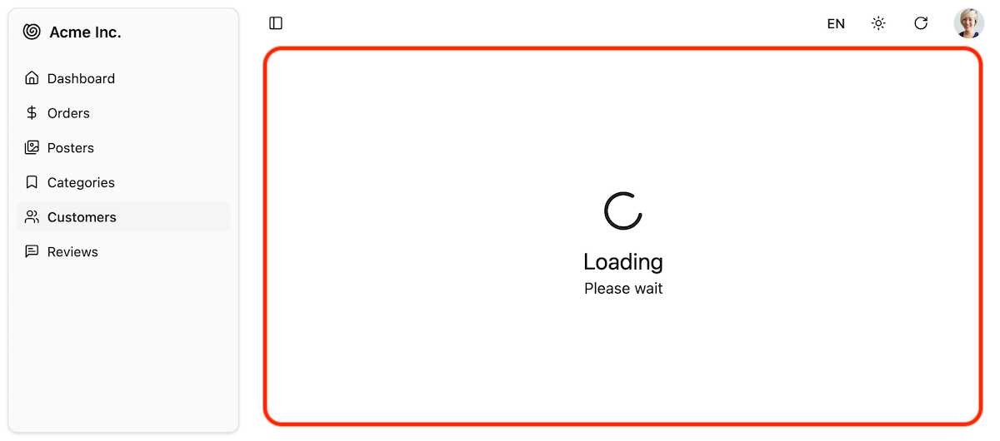

Loading indicator used for slow element or page loads. It displays a spinner and a loading message.



## Usage

The default Shadcn Admin Kit [`<Layout>`](./Layout.md) displays the Loading component in the main content area when a page component is loading and the loading takes more than 1 second. This is done automatically using React Suspense and requires no special setup.

For example, if you [use code splitting to lazy load your resource views](./Resource.md#lazy-loading), the `<Loading>` component will be displayed while the component is being loaded:

```tsx
import * as React from 'react';
import { Admin } from "@/components/admin";
import { Resource } from "ra-core";

import { dataProvider } from './dataProvider';

const OrderList = React.lazy(() => import('./orders/OrderList'));
const OrderEdit = React.lazy(() => import('./orders/OrderEdit'));

const App = () => (
    <Admin dataProvider={dataProvider}>
        <Resource name="orders" list={OrderList} edit={OrderEdit} />
        ...
    </Admin>
);
```

You can customize the loading component by editing the `@/components/admin/loading.tsx` file.

## Props

| Prop | Required | Type | Default | Description |
|------|----------|------|---------|-------------|
| `loadingPrimary` | | `string` | `ra.page.loading` | Main heading i18n key |
| `loadingSecondary` | | `string` | `ra.message.loading` | Secondary text key |
| `delay` | | `number` | `1000` | Delay before showing (ms) |

## Usage in Custom Components

You can also use the `<Loading>` component inside your custom pages or components to display a loading indicator while waiting for some data to load. It works perfectly as a fallback for React's [`Suspense`](https://react.dev/reference/react/Suspense) component:

```tsx
import { Loading } from "@/components/admin/loading";
import { Suspense } from "react";

export const MyComponent = () => (
  <Suspense fallback={<Loading loadingPrimary="Loading data..." />}>
    <div>
      {/* Your component content that may take time to load */}
    </div>
  </Suspense>
);
```
