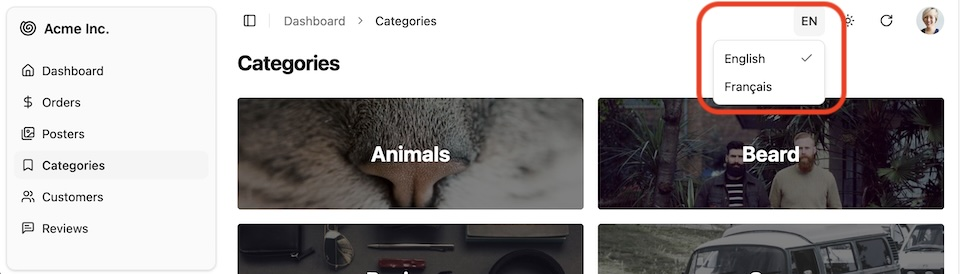

Also known as the "language switcher", it displays a menu allowing users to select the language of the interface.



It leverages the [store](https://marmelab.com/shadcn-admin-kit/Store.html) so that their selection is persisted.

## Usage

For most users, this component will be automatically added to the header of shadcn-admin-kit's default [`<Layout>`](./Layout.md) if the `i18nProvider.getLocales()` method returns more than one locale. Check the [`i18nProvider` setup documentation](https://marmelab.com/ra-core/translationsetup/) for details.

If you use the `ra-i18n-polyglot` package, you can pass the list of available locales as the third parameter of `polyglotI18nProvider`:

```jsx
// in src/App.js
import polyglotI18nProvider from 'ra-i18n-polyglot';
import englishMessages from 'ra-language-english';
import frenchMessages from 'ra-language-french';
import { Admin } from '@/components/admin';
import { Resource } from 'ra-core';

const availableLocales = [
    { locale: 'en', name: 'English' }, 
    { locale: 'fr', name: 'Français' }
];
const i18nProvider = polyglotI18nProvider(
    locale => (locale === 'fr' ? frenchMessages : englishMessages),
    'en', // Default locale
    availableLocales
);

const App = () => (
    <Admin i18nProvider={i18nProvider} dataProvider={dataProvider}>
        ...
    </Admin>
);
```

For custom layouts, or to put the language switcher in a settings menu, simply render the component without props:

```jsx
import { LocalesMenuButton } from '@/components/admin';

<LocalesMenuButton />
```

If you want to customize the button, you can edit the `@/components/admin/locales-menu-button.tsx` file directly. It leverages the [`useLocaleState`](https://marmelab.com/ra-core/uselocalestate/) hook from `ra-core`, as well as the [`<Dropdown>`](https://ui.shadcn.com/docs/components/dropdown-menu) component from shadcn/ui.
