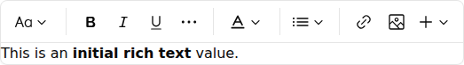

Use `<RichTextInput>` to edit rich text content in a WYSIWYG editor (TipTap) and store it as HTML.
This is an optional component and is not included in the `admin` registry block by default.



Install it with:

```bash
npx shadcn@latest add https://marmelab.com/shadcn-admin-kit/r/rich-text-input.json
```

## Usage

```tsx
import { Edit, SimpleForm } from '@/components/admin';
import { RichTextInput } from '@/components/rich-text-input';

const PostEdit = () => (
    <Edit>
        <SimpleForm>
            <RichTextInput source="body" />
        </SimpleForm>
    </Edit>
);
```

## Props

| Prop | Required | Type | Default | Description |
|------|----------|------|---------|-------------|
| `source` | Required | `string` | - | Field name |
| `className` | Optional | `string` | - | CSS classes applied to the field wrapper |
| `defaultValue` | Optional | `string` | - | Default editor value |
| `disabled` | Optional | `boolean` | - | Disable the editor |
| `editorOptions` | Optional | `Object` | - | Options object passed to the underlying TipTap editor |
| `format` | Optional | `function` | - | Callback taking the value from the form state and returning the input value |
| `helperText` | Optional | `ReactNode` | - | Help text displayed below the input |
| `label` | Optional | `string \| false` | Inferred from `source` | Custom label, or `false` to hide it |
| `parse` | Optional | `function` | - | Callback taking the editor value and returning the stored form value |
| `readOnly` | Optional | `boolean` | - | Make the editor read-only |
| `toolbar` | Optional | `ReactNode` | default toolbar | Toolbar to render above the editor |
| `validate` | Optional | `Validator \| Validator[]` | - | Validation rules |

## `editorOptions`

Use `editorOptions` to pass TipTap configuration.

```tsx
import { DefaultEditorOptions, RichTextInput } from '@/components/rich-text-input';
import type { Editor } from '@tiptap/react';

<RichTextInput
    source="body"
    editorOptions={{
        ...DefaultEditorOptions,
        onCreate: ({ editor }: { editor: Editor }) => {
            console.log(editor);
        },
    }}
/>
```

## `toolbar`

By default, `<RichTextInput>` renders the kit toolbar. The default toolbar includes:

- Undo / Redo
- Bold / Italic / Underline / Strikethrough / Code
- Heading 1 / Heading 2
- Text color
- Bulleted / Numbered lists
- Blockquote
- Add link / Remove link
- Clear formatting
- Image actions

You can also provide custom toolbar children:

```tsx
import {
    RichTextInput,
    RichTextInputToolbar,
    useRichTextInputEditor,
} from '@/components/rich-text-input';
import { Button } from '@/components/ui/button';

const BoldOnlyButton = () => {
    const editor = useRichTextInputEditor();
    if (!editor) return null;

    return (
        <Button
            type="button"
            onClick={() => {
                editor.chain().focus().toggleBold().run();
            }}
        >
            Bold
        </Button>
    );
};

<RichTextInput
    source="body"
    toolbar={
        <RichTextInputToolbar>
            <BoldOnlyButton />
        </RichTextInputToolbar>
    }
/>
```

## Accessing The Editor Instance

To call editor commands outside the toolbar, keep a ref in `editorOptions.onCreate`:

```tsx
import React from 'react';
import type { Editor } from '@tiptap/react';
import {
    FormToolbar,
    SaveButton,
    SimpleForm,
} from '@/components/admin';
import { DefaultEditorOptions, RichTextInput } from '@/components/rich-text-input';
import { Button } from '@/components/ui/button';

const PostForm = () => {
    const editorRef = React.useRef<Editor | null>(null);

    return (
        <SimpleForm
            toolbar={
                <FormToolbar>
                    <SaveButton />
                    <Button
                        type="button"
                        onClick={() => {
                            editorRef.current?.commands.setContent('<h3>Template content</h3>');
                        }}
                    >
                        Use template
                    </Button>
                </FormToolbar>
            }
        >
            <RichTextInput
                source="body"
                editorOptions={{
                    ...DefaultEditorOptions,
                    onCreate: ({ editor }: { editor: Editor }) => {
                        editorRef.current = editor;
                    },
                }}
            />
        </SimpleForm>
    );
};
```

## Lazy Loading

`<RichTextInput>` depends on TipTap/ProseMirror and adds noticeable JavaScript size.
If you don't need it on every screen, lazy-load it:

```tsx
const RichTextInput = React.lazy(() =>
    import('@/components/rich-text-input').then((module) => ({
        default: module.RichTextInput,
    })),
);
```
