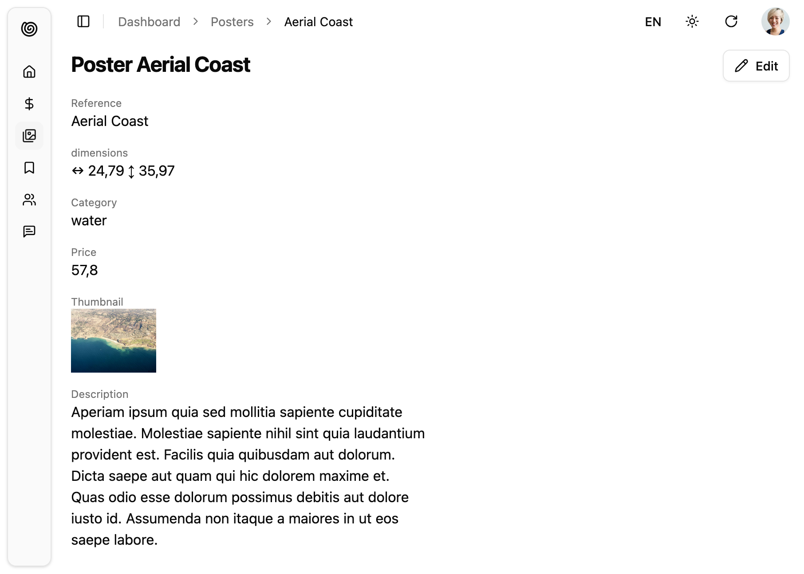

The `<Show>` component is a page component that renders a single record.



`<Show>` handles the logic of the Show page:

- it calls `useShowController` to fetch the record from the dataProvider via `dataProvider.getOne()`,
- it computes the default page title
- it creates a `ShowContext` and a [`RecordContext`](https://marmelab.com/ra-core/userecordcontext/),
- it renders the page layout with the correct title and actions
- it renders its child component in a `<Card>`

## Usage

Here is the minimal code necessary to display a view to show a post:

```jsx
// in src/products.jsx
import { RecordField } from "@/components/admin/record-field";
import { NumberField } from "@/components/admin";
import { ReferenceField } from "@/components/admin/reference-field";
import { Show } from "@/components/admin/show";

export const ProductShow = () => (
  <Show>
    <div className="flex flex-col gap-4">
      <RecordField source="reference" />
      <RecordField label="dimensions">
        <div className="flex items-center gap-1">
          ↔<NumberField source="width" />
          ↕<NumberField source="height" />
        </div>
      </RecordField>
      <RecordField source="category_id">
        <ReferenceField source="category_id" reference="categories" />
      </RecordField>
      <RecordField
        source="price"
        render={(record) => Intl.NumberFormat().format(record.price)}
      />
      <RecordField
        source="thumbnail"
        render={(record) => }
      />
      <RecordField source="description" className="max-w-100" />
    </div>
  </Show>
);
```

`<RecordField>` is a flexible wrapper to display a label and a value (field component, render function, or children) with optional layout variants. See [RecordField documentation](./RecordField.md) for details.

Components using `<Show>` can be used as the `show` prop of a `<Resource>` component:

```jsx
// in src/App.jsx
import { Admin } from '@/copmponents/admin';
import { Resource } from 'ra-core';

import { dataProvider } from './dataProvider';
import { ProductShow } from './products';

const App = () => (
    <Admin dataProvider={dataProvider}>
        <Resource name="products" show={ProductShow} />
    </Admin>
);
```

That's enough to display the post show view above.

## Scaffolding A Show Page

You can use `<ShowGuesser>` to quickly bootstrap a Show view on top of an existing API, without adding the fields one by one.

```tsx
// in src/App.js
import { Admin, ShowGuesser } from "@/components/admin";
import { Resource } from "ra-core";
import { dataProvider } from "./dataProvider";

const App = () => (
  <Admin dataProvider={dataProvider}>
    {/* ... */}
    <Resource name="products" show={ShowGuesser} />
  </Admin>
);
```

Just like `<Show>`, `<ShowGuesser>` fetches the data. It then analyzes the response, and guesses the fields it should use to display a basic layout with the data. It also dumps the components it has guessed in the console, so you can copy it into your own code.

When the data provider returns no record, `<ShowGuesser>` renders an empty state by default. You can override it using the `empty` prop (including `empty={false}` to render nothing).

## Props

| Prop             | Required | Type              | Default | Description
|------------------|----------|-------------------|---------|--------------------------------------------------------
| `children`       | Optional&nbsp;* | `ReactNode`       |         | The components rendering the record fields
| `render`       | Optional&nbsp;* | `(showContext) => ReactNode`       |         | A function rendering the record fields, receive the show context as its argument
| `actions`        | Optional | `ReactElement`    |         | The actions to display in the toolbar
| `className`      | Optional | `string`          |         | passed to the root component
| `disableAuthentication` | Optional | `boolean` |         | Set to `true` to disable the authentication check
| `disableBreadcrumb`  | Optional  | `boolean` | `false` | Set to `true` to define a custom breadcrumb for the page, instead of the default one
| `emptyWhileLoading` | Optional | `boolean`     |         | Set to `true` to return `null` while the show is loading
| `id`             | Optional | `string | number` |         | The record id. If not provided, it will be deduced from the URL
| `queryOptions`   | Optional | `object`          |         | The options to pass to the `useQuery` hook
| `resource`       | Optional | `string`          |         | The resource name, e.g. `posts`
| `title`          | Optional | `string | ReactElement | false` |   | The title to display in the App Bar

`*` You must provide either `children` or `render`.

## Live Updates

Shadcn Admin Kit offers [Realtime features](./RealtimeFeatures.md) to automatically refresh the data on screen when it has been changed by another user.

If you want to subscribe to live updates the record, you can rely on the [`useSubscribeToRecord`](https://marmelab.com/ra-core/usesubscribetorecord/) hook. 

A sample use case would be to refresh the `<Show>` view when the record has been updated by another user.

:::note
This feature requires a valid [Enterprise Edition](https://marmelab.com/ra-enterprise/) subscription. 
:::

First, create a `<RecordLiveUpdate>` component that uses the `useSubscribeToRecord` hook to subscribe to updates on the current record. When an update is received, it calls the `refetch` function from the `ShowContext` to refresh the record.

```tsx
// src/components/admin/record-live-update.tsx

import { useSubscribeToRecord } from '@react-admin/ra-core-ee';
import { Identifier, useShowContext } from 'ra-core';
import { useCallback } from 'react';

export const RecordLiveUpdate = (props: RecordLiveUpdateProps) => {
    const { refetch } = useShowContext();
    const handleUpdate = useCallback(() => {
        refetch();
    }, [refetch]);

    useSubscribeToRecord(handleUpdate, props.resource, props.id);

    return null;
};

type RecordLiveUpdateProps = {
    resource?: string;
    id?: Identifier;
};
```

Then, add the `<RecordLiveUpdate>` in your `<Show>` children:

```tsx
import { TextField } from '@/components/admin/data-table';
import { RecordLiveUpdate } from '@/components/admin/record-live-update';
import { Show } from '@/components/admin/show';

const PostList = () => (
    <Show>
        <TextField source="title" />
        <RecordLiveUpdate />
    </Show>
);
```

To trigger refreshes of `<RecordLiveUpdate>`, the API has to publish events containing at least the followings:

```js
{
    topic : '/resource/{resource}/{id}',
    event: {
        type: 'updated',
        payload: { ids: [{listOfRecordIdentifiers}]},
    }
}
```
