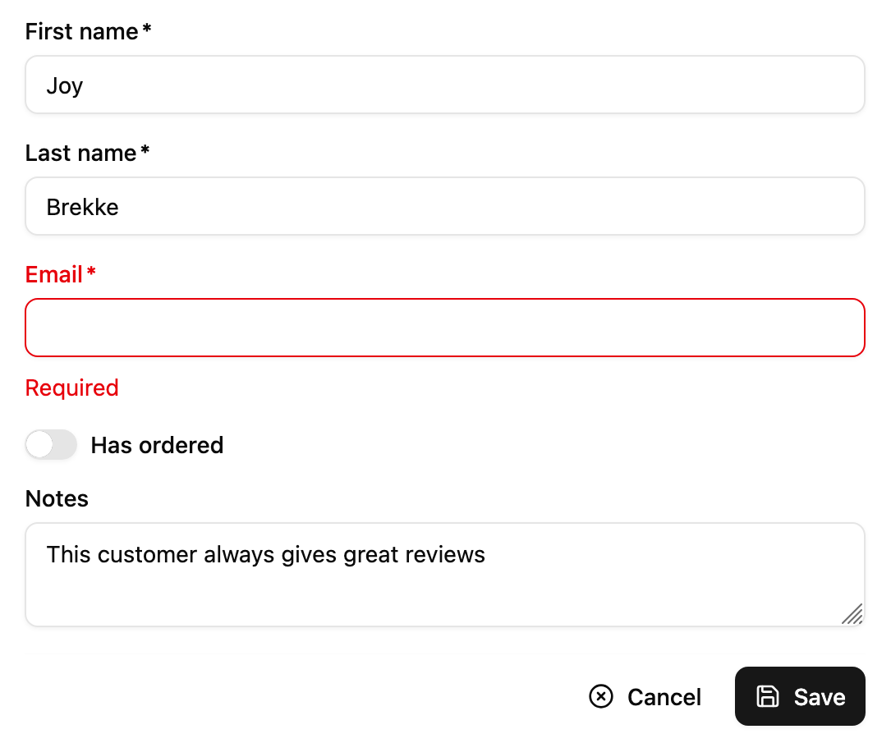

`<SimpleForm>` creates a `<form>` to edit a record, and renders its children (usually Input components) in a simple layout, one child per row, and a toolbar at the bottom (Cancel + Save buttons).



## Usage

`<SimpleForm>` is often used as child of [`<Create>`](./Create.md) or [`<Edit>`](./Edit.md). It accepts Input components as children. It requires no prop by default.


```tsx
import { Edit, SimpleForm, TextInput, BooleanInput } from '@/components/admin';

export const ProductEdit = () => (
  <Edit>
    <SimpleForm>
      <TextInput source="name" />
      <BooleanInput source="available" />
    </SimpleForm>
  </Edit>
);
```

`<SimpleForm>` reads the `record` from the `RecordContext`, uses it to initialize the form default values, renders its children and a toolbar with a `<SaveButton>` that calls the `save` callback prepared by the edit or the create controller when pressed.

It relies on [react-hook-form](https://react-hook-form.com/) for form handling. It calls react-hook-form's `useForm` hook, and places the result in a `FormProvider` component. This means you can take advantage of the [`useFormContext`](https://react-hook-form.com/docs/useformcontext) and [`useFormState`](https://react-hook-form.com/docs/useformstate) hooks to access the form state.

## Props

| Prop | Required | Type | Default | Description |
|------|----------|------|---------|-------------|
| `children` | Required | `ReactNode` | - | The form content (usually Input elements). |
| `className` | Optional | `string` | - | Extra classes appended to base layout |
| `defaultValues` | Optional | `object| function` | - | The default values of the record. |
| `id` | Optional | `string` | - | The id of the underlying `<form>` tag. |
| `noValidate` | Optional | `boolean` | - | Set to `true` to disable the browser's default validation. |
| `onSubmit` | Optional | `function` | `save` | A callback to call when the form is submitted. |
| `sanitizeEmptyValues` | Optional | `boolean` | - | Set to `true` to remove empty values from the form state. |
| `toolbar` | Optional | `element` | - | The toolbar component. |
| `validate` | Optional | `function` | - | A function to validate the form values.     |
| `warnWhenUnsavedChanges` | Optional | `boolean` | - | Set to `true` to warn the user when leaving the form with unsaved changes. |

Additional props are passed to [the `useForm` hook](https://react-hook-form.com/docs/useform) and to the underlying `<div>` wrapping the form.

## Validation

To validate the form values, provide a `validate` function taking the record as input, and returning an object with error messages indexed by field. For instance:

```jsx
const validateUserCreation = (values) => {
    const errors = {};
    if (!values.firstName) {
        errors.firstName = 'The firstName is required';
    }
    if (!values.age) {
        // You can return translation keys
        errors.age = 'ra.validation.required';
    } else if (values.age < 18) {
        // Or an object if the translation messages need parameters
        errors.age = {
            message: 'ra.validation.minValue',
            args: { min: 18 }
        };
    }
    return errors
};

export const UserCreate = () => (
    <Create>
        <SimpleForm validate={validateUserCreation}>
            <TextInput label="First Name" source="firstName" />
            <TextInput label="Age" source="age" />
        </SimpleForm>
    </Create>
);
```

:::tip
The `validate` function can return a promise for asynchronous validation. See [the Server-Side Validation section](https://marmelab.com/ra-core/validation/#server-side-validation) in the Validation documentation.
::: 

Alternatively, you can specify a `validate` prop directly in `<Input>` components, taking either a function or an array of functions. Ra-core already bundles a few validator functions, that you can just require, and use as input-level validators:

* `required(message)` if the field is mandatory,
* `minValue(min, message)` to specify a minimum value for integers,
* `maxValue(max, message)` to specify a maximum value for integers,
* `minLength(min, message)` to specify a minimum length for strings,
* `maxLength(max, message)` to specify a maximum length for strings,
* `number(message)` to check that the input is a valid number,
* `email(message)` to check that the input is a valid email address,
* `regex(pattern, message)` to validate that the input matches a regex,
* `choices(list, message)` to validate that the input is within a given list,
* `unique()` to validate that the input is unique (see [`useUnique`](./useUnique.md)),

Example usage:

```jsx
import {
    required,
    minLength,
    maxLength,
    minValue,
    maxValue,
    number,
    regex,
    email,
    choices
} from 'ra-core';

const validateFirstName = [required(), minLength(2), maxLength(15)];
const validateEmail = email();
const validateAge = [number(), minValue(18)];
const validateZipCode = regex(/^\d{5}$/, 'Must be a valid Zip Code');
const validateGender = choices(['m', 'f', 'nc'], 'Please choose one of the values');

export const UserCreate = () => (
    <Create>
        <SimpleForm>
            <TextInput label="First Name" source="firstName" validate={validateFirstName} />
            <TextInput label="Email" source="email" validate={validateEmail} />
            <TextInput label="Age" source="age" validate={validateAge}/>
            <TextInput label="Zip Code" source="zip" validate={validateZipCode}/>
            <SelectInput label="Gender" source="gender" choices={[
                { id: 'm', name: 'Male' },
                { id: 'f', name: 'Female' },
                { id: 'nc', name: 'Prefer not say' },
            ]} validate={validateGender}/>
        </SimpleForm>
    </Create>
);
```

:::tip
If you pass a function as a message, Shadcn Admin Kit calls this function with `{ args, value, values,translate, ...props }` as argument. For instance:

```jsx
const message = ({ translate }) => translate('myroot.validation.email_invalid');
const validateEmail = email(message);
```
:::

You can also define your own validator functions. These functions should return `undefined` when there is no error, or an error string.

```jsx
const required = (message = 'Required') =>
    value => value ? undefined : message;
const maxLength = (max, message = 'Too short') =>
    value => value && value.length > max ? message : undefined;
const number = (message = 'Must be a number') =>
    value => value && isNaN(Number(value)) ? message : undefined;
const minValue = (min, message = 'Too small') =>
    value => value && value < min ? message : undefined;

const ageValidation = (value, allValues) => {
    if (!value) {
        return 'The age is required';
    }
    if (value < 18) {
        return 'Must be over 18';
    }
    return undefined;
};

const validateFirstName = [required(), maxLength(15)];
const validateAge = [required(), number(), ageValidation];

export const UserCreate = () => (
    <Create>
        <SimpleForm>
            <TextInput label="First Name" source="firstName" validate={validateFirstName} />
            <TextInput label="Age" source="age" validate={validateAge}/>
        </SimpleForm>
    </Create>
);
```

Input validation functions receive the current field value and the values of all fields of the current record. This allows for complex validation scenarios (e.g. validate that two passwords are the same).

:::tip
If your admin has multi-language support, validator functions should return message *identifiers* rather than messages themselves. Shadcn Admin Kit automatically passes these identifiers to the translation function: 

```jsx
// in validators/required.js
const required = () => (value, allValues, props) =>
    value
        ? undefined
        : 'myroot.validation.required';

// in i18n/en.json
export default {
    myroot: {
        validation: {
            required: 'Required field',
        }
    }
}
```

If the translation depends on a variable, the validator can return an object rather than a translation identifier:

```jsx
// in validators/minLength.js
const minLength = (min) => (value, allValues, props) => 
    value.length >= min
        ? undefined
        : { message: 'myroot.validation.minLength', args: { min } };

// in i18n/en.js
export default {
    myroot: {
        validation: {
            minLength: 'Must be %{min} characters at least',
        }
    }
}
```
:::

:::tip
Make sure to define validation functions or array of functions in a variable outside your component, instead of defining them directly in JSX. This can result in a new function or array at every render, and trigger infinite rerender.

```jsx
const validateStock = [required(), number(), minValue(0)];

export const ProductEdit = () => (
    <Edit>
        <SimpleForm defaultValues={{ stock: 0 }}>
            ...
            {/* do this */}
            <NumberInput source="stock" validate={validateStock} />
            {/* don't do that */}
            <NumberInput source="stock" validate={[required(), number(), minValue(0)]} />
            ...
        </SimpleForm>
    </Edit>
);
```
::: 

:::tip
The custom validator function can return a promise, e.g. to use server-side validation. See next section for details.
:::

## Default Values

The form is prepopulated based on the current `RecordContext`. For new records, or for empty fields, you can define the default values using the `defaultValues` prop. It must be an object, or a function returning an object, specifying default values for the created record. For instance:

```jsx
const postDefaultValue = () => ({ id: uuid(), created_at: new Date(), nb_views: 0 });

export const PostCreate = () => (
    <Create>
        <SimpleForm defaultValues={postDefaultValue}>
            <TextInput source="title" />
            <TextInput source="body" />
            <NumberInput source="nb_views" />
        </SimpleForm>
    </Create>
);
```

:::tip
You can include properties in the form `defaultValues` that are not listed as input components, like the `created_at` property in the previous example.
:::

You can also define default values at the input level using the `<Input defaultValue>` prop:

```jsx
export const PostCreate = () => (
    <Create>
        <SimpleForm>
            <TextInput source="title" />
            <TextInput source="body" />
            <NumberInput source="nb_views" defaultValue={0} />
        </SimpleForm>
    </Create>
);
```

Shadcn-admin-kit will ignore the Input default values if the Form already defines a global `defaultValues` (form > input).

:::tip
Per-input default values cannot be functions. For default values computed at render time, set the `defaultValues` at the form level.
:::

## Warn On Unsaved Changes

Shadcn Admin Kit keeps track of the form state, so it can detect when the user leaves an `Edit` or `Create` page with unsaved changes. To avoid data loss, you can use this ability to ask the user to confirm before leaving a page with unsaved changes.

Warning about unsaved changes is an opt-in feature: you must set the `warnWhenUnsavedChanges` prop in the form component to enable it:

```tsx
export const TagEdit = () => (
    <Edit>
        <SimpleForm warnWhenUnsavedChanges>
            <TextInput source="id" />
            <TextInput source="name" />
            ...
        </SimpleForm>
    </Edit>
);
```

:::note
Due to limitations in react-router, this feature only works if you use the default router provided by Shadcn Admin Kit, or if you use a [Data Router](https://reactrouter.com/en/6.22.3/routers/picking-a-router).
:::

## Toolbar

The default `<FormToolbar>` renders two buttons:

```tsx
<div className="flex flex-row gap-2 justify-end">
  <CancelButton />
  <SaveButton />
</div>
```

You can provide a custom toolbar to override the form buttons:

```tsx
const FormToolbar = () => (
  <div className="flex flex-row gap-2 justify-end">
    <DeleteButton />
    <SaveButton variant="outline"/>
  </div>
);

const PostEdit = () => (
  <Edit>
    <SimpleForm toolbar={<FormToolbar />}>
      ...
    </SimpleForm>
  </Edit>
);
```

:::note
`<SimpleForm>` doesn't include a `<DeleteButton>` by default, but `<Edit>` does provide one in its default page actions. 
:::

## Using Fields As Children

The basic usage of `<SimpleForm>` is to pass Input components as children. For non-editable fields, you can pass `readOnly` inputs, or even a [`<RecordField>`](./RecordField.md) component.

```jsx
import { Edit, SimpleForm, TextInput, RecordField, TextField } from '@/components/admin';

const PostEdit = () => (
    <Edit>
        <SimpleForm>
            <TextInput source="id" />
            <RecordField source="title" />
            <TextInput source="body" />
        </SimpleForm>
    </Edit>
);
```

## Subscribing To Form Changes

You can grab the current form values using react-hook-form's [useWatch](https://react-hook-form.com/docs/usewatch) hook. This allows to link two inputs, e.g., a country and a city input:


```jsx
import { Edit, SimpleForm, SelectInput } from '@/components/admin';
import { useWatch } from 'react-hook-form';

const countries = ['USA', 'UK', 'France'];
const cities = {
    USA: ['New York', 'Los Angeles', 'Chicago', 'Houston', 'Phoenix'],
    UK: ['London', 'Birmingham', 'Glasgow', 'Liverpool', 'Bristol'],
    France: ['Paris', 'Marseille', 'Lyon', 'Toulouse', 'Nice'],
};
const toChoices = items => items.map(item => ({ id: item, name: item }));

const CityInput = () => {
    const country = useWatch({ name: 'country' });
    return (
        <SelectInput
            choices={country ? toChoices(cities[country]) : []}
            source="cities"
        />
    );
};

const OrderEdit = () => (
    <Edit>
        <SimpleForm>
            <SelectInput source="country" choices={toChoices(countries)} />
            <CityInput />
        </SimpleForm>
    </Edit>
);
```

## Headless Version

To render a form without wrapping div and without toolbar, use ra-core's [`<Form>`](https://marmelab.com/ra-core/form/) component directly. It accepts the same props as `<SimpleForm>`, except `className` and `toolbar`.

This lets you implement custom layouts and submit behaviors.

```tsx
import { Form } from 'ra-core';
import { Edit, SaveButton, TextInput } from '@/components/admin';

const PostEdit = () => (
    <Edit>
        <Form>
          <div className="grid gap-4 md:grid-cols-2">
              <TextInput source="title" />
              <TextInput source="author" />
              <TextInput source="body" />
          </div>
          <SaveButton />
        </Form>
    </Edit>
);
```

## Access Control

If you need to hide some columns based on a set of permissions, wrap these columns with `<CanAccess>`.

```tsx
import { CanAccess } from 'ra-core';
import { Edit, SimpleForm, TextInput } from '@/components/admin';

const PostEdit = () => (
    <Edit>
        <SimpleForm>
            <TextInput source="id" />
            <TextInput source="title" />
            <CanAccess action="write" resource="posts.author">
                <TextInput source="author" />
            </CanAccess>
            <TextInput source="body" />
        </SimpleForm>
    </Edit>
);
```
