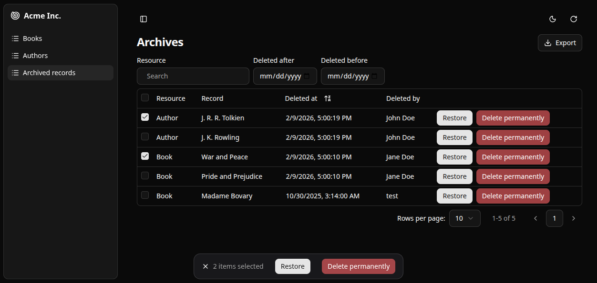

Shadcn Admin Kit provides hooks and components to let users "delete" records without actually removing them from your database.

Use it to:

- Archive records safely instead of permanent deletion
- Require a second confirmation step before permanent deletion ("four-eyes" principle)
- Browse and filter all deleted records in a dedicated interface
- Restore archived items individually or in bulk
- Track who deleted what and when

## Installation

The soft delete features require a valid [Enterprise Edition](https://marmelab.com/ra-enterprise/) subscription. Once subscribed, follow the [instructions to get access to the private npm repository](https://react-admin-ee.marmelab.com/setup).

You can then install the npm package providing the realtime features using your favorite package manager:

```bash
npm install --save @react-admin/ra-core-ee
# or
yarn add @react-admin/ra-core-ee
```

## Usage

`ra-core-ee` contains base components and hooks to implement soft deletion in your application.

At minimum, you will need to leverage [`useSoftDelete`](https://marmelab.com/ra-core/usesoftdelete/) to implement your own [`<SoftDeleteButton>`](#soft-delete-button), and replace the standard `<DeleteButton>` in your list and show views with it.

This will call `dataProvider.softDelete()` instead of `dataProvider.delete()` for the selected record.

If you also want the users to be able to restore the soft-deleted records, or to permanently delete them, you can implement the following components:

- [`<RestoreButton>`](#restore-button): calls [`useRestoreOne`](https://marmelab.com/ra-core/userestoreone/) to restore a soft deleted record.
- [`<DeletePermanentlyButton>`](#delete-permanently-button): calls [`useHardDelete`](https://marmelab.com/ra-core/useharddelete/) to permanently delete a soft deleted record.

You can also implement bulk variants for all three actions:

- [`<BulkSoftDeleteButton>`](#bulk-soft-delete-button): [`useSoftDeleteMany`](https://marmelab.com/ra-core/usesoftdeletemany/)
- [`<BulkRestoreButton>`](#bulk-restore-button): [`useRestoreMany`](https://marmelab.com/ra-core/userestoremany/)
- [`<BulkDeletePermanentlyButton>`](#bulk-delete-permanently-button): [`useHardDeleteMany`](https://marmelab.com/ra-core/useharddeletemany/)

To build a trash view, use [`<DeletedRecordsListBase>`](https://marmelab.com/ra-core/deletedrecordslistbase/) to build your own [`<DeletedRecordsList>`](#deleted-records-list). This component fetches deleted records with `dataProvider.getListDeleted()` and allows to restore or permanently delete them with the buttons mentioned above.



## Data Provider Requirements

In order to use the Soft Delete features, your data provider must implement a few new methods.

### Methods

The Soft Delete features of `ra-core-ee` rely on the `dataProvider` to soft-delete, restore or view deleted records.
In order to use those features, you must add a few new methods to your data provider:

- `softDelete` performs the soft deletion of the provided record.
- `softDeleteMany` performs the soft deletion of the provided records.
- `getOneDeleted` gets one deleted record by its ID.
- `getListDeleted` gets a list of deleted records with filters and sort.
- `restoreOne` restores a deleted record.
- `restoreMany` restores deleted records.
- `hardDelete` permanently deletes a record.
- `hardDeleteMany` permanently deletes many records.
- (OPTIONAL) [`createMany`](#createmany) creates multiple records at once. This method is used internally by some data provider implementations to delete or restore multiple records at once. As it is optional, a default implementation is provided that simply calls `create` multiple times.

### Signature

Here is the full `SoftDeleteDataProvider` interface:

```tsx
const dataProviderWithSoftDelete: SoftDeleteDataProvider = {
    ...dataProvider,

    softDelete: (resource, params: SoftDeleteParams): SoftDeleteResult => {
        const { id, authorId } = params;
        // ...
        return { data: deletedRecord };
    },
    softDeleteMany: (
        resource,
        params: SoftDeleteManyParams,
    ): SoftDeleteManyResult => {
        const { ids, authorId } = params;
        // ...
        return { data: deletedRecords };
    },

    getOneDeleted: (params: GetOneDeletedParams): GetOneDeletedResult => {
        const { id } = params;
        // ...
        return { data: deletedRecord };
    },
    getListDeleted: (params: GetListDeletedParams): GetListDeletedResult => {
        const { filter, sort, pagination } = params;
        // ...
        return { data: deletedRecords, total: deletedRecords.length };
    },

    restoreOne: (params: RestoreOneParams): RestoreOneResult => {
        const { id } = params;
        // ...
        return { data: deletedRecord };
    },
    restoreMany: (params: RestoreManyParams): RestoreManyResult => {
        const { ids } = params;
        // ...
        return { data: deletedRecords };
    },

    hardDelete: (params: HardDeleteParams): HardDeleteResult => {
        const { id } = params;
        // ...
        return { data: deletedRecordId };
    },
    hardDeleteMany: (params: HardDeleteManyParams): HardDeleteManyResult => {
        const { ids } = params;
        // ...
        return { data: deletedRecordsIds };
    },
};
```

:::tip
`ra-core-ee` automatically populates the `authorId` parameter using `authProvider.getIdentity()` if it is implemented. It will use the `id` field of the returned identity object. Otherwise this field will be left blank.
:::

:::tip
Deleted records are immutable, so you don't need to implement an `updateDeleted` method.
:::

Once your provider has all soft-delete methods, pass it to the [`<Admin>`](./Admin.md) component and you're ready to start using the Soft Delete feature.

```tsx
// in src/App.tsx
import { Admin } from '@/components/admin/admin';
import { dataProvider } from './dataProvider';

const App = () => <Admin dataProvider={dataProvider}>{/* ... */}</Admin>;
```

### Deleted Record Structure

A _deleted record_ is an object with the following properties:

- `id`: The identifier of the deleted record.
- `resource`: The resource name of the deleted record.
- `deleted_at`: The date and time when the record was deleted, in ISO 8601 format.
- `deleted_by`: (optional) The identifier of the user who deleted the record.
- `data`: The original record data before deletion.

Here is an example of a deleted record:

```js
{
    id: 123,
    resource: "products",
    deleted_at: "2025-06-06T15:32:22Z",
    deleted_by: "johndoe",
    data: {
        id: 456,
        title: "Lorem ipsum",
        teaser: "Lorem ipsum dolor sit amet",
        body: 'Lorem ipsum dolor sit amet, consectetur adipiscing elit',
    },
}
```

### Builders

`ra-core-ee` comes with two built-in implementations that will add soft delete capabilities to your data provider without any specific backend requirements. You can choose the one that best fits your needs:

- [`addSoftDeleteBasedOnResource`](https://marmelab.com/ra-core/addsoftdeletebasedonresource/) stores the deleted records for all resources in a single resource. This resource is named `deleted_records` by default.

    With this builder, all deleted records disappear from their original resource when soft-deleted, and are recreated in the `deleted_records` resource.

```tsx
// in src/dataProvider.ts
import { addSoftDeleteBasedOnResource } from '@react-admin/ra-core-ee';
import baseDataProvider from './baseDataProvider';

export const dataProvider = addSoftDeleteBasedOnResource(baseDataProvider, {
    deletedRecordsResourceName: 'deleted_records',
});
```

- [`addSoftDeleteInPlace`](https://marmelab.com/ra-core/addsoftdeleteinplace/) keeps the deleted records in the same resource, but marks them as deleted.

    With this builder, all deleted records remain in their original resource when soft-deleted, but are marked with the `deleted_at` and `deleted_by` fields. The query methods (`getList`, `getOne`, etc.) automatically filter out deleted records.

    You'll need to pass a configuration object with all soft deletable resources as key so that `getListDeleted` knows where to look for deleted records.

```tsx
// in src/dataProvider.ts
import { addSoftDeleteInPlace } from '@react-admin/ra-core-ee';
import baseDataProvider from './baseDataProvider';

export const dataProvider = addSoftDeleteInPlace(baseDataProvider, {
    posts: {},
    comments: {
        deletedAtFieldName: 'deletion_date',
    },
    accounts: {
        deletedAtFieldName: 'disabled_at',
        deletedByFieldName: 'disabled_by',
    },
});
```

:::note
When using `addSoftDeleteInPlace`, avoid calling `getListDeleted` without a `resource` filter, as it uses a naive implementation combining multiple `getList` calls, which can lead to bad performance. It is recommended to use one list per resource in this case (see [`<DeletedRecordsListBase resource>` property](https://marmelab.com/ra-core/deletedrecordslistbase/#resource)).
:::

You can also write your own implementation. Feel free to look at these builders source code for inspiration. You can find it under your `node_modules` folder, e.g. at `node_modules/@react-admin/ra-core-ee/src/soft-delete/dataProvider/addSoftDeleteBasedOnResource.ts`.

### Query and Mutation Hooks 

Each data provider verb has its own hook so you can use them in custom components:

- `softDelete`: [`useSoftDelete`](https://marmelab.com/ra-core/usesoftdelete/)
- `softDeleteMany`: [`useSoftDeleteMany`](https://marmelab.com/ra-core/usesoftdeletemany/)
- `getListDeleted`: [`useGetListDeleted`](https://marmelab.com/ra-core/usegetlistdeleted/)
- `getOneDeleted`: [`useGetOneDeleted`](https://marmelab.com/ra-core/usegetonedeleted/)
- `restoreOne`: [`useRestoreOne`](https://marmelab.com/ra-core/userestoreone/)
- `restoreMany`: [`useRestoreMany`](https://marmelab.com/ra-core/userestoremany/)
- `hardDelete`: [`useHardDelete`](https://marmelab.com/ra-core/useharddelete/)
- `hardDeleteMany`: [`useHardDeleteMany`](https://marmelab.com/ra-core/useharddeletemany/)

### `createMany`

The [`<BulkSoftDeleteButton>`](./BulkDeleteButton.md#soft-delete) has to create or update several records at once. If your data provider supports the `createMany` method to create multiple records at once, it will use it instead of calling `create` multiple times for performance reasons.

```tsx
const dataProviderWithCreateMany = {
    ...dataProvider,
    createMany: (resource, params: CreateManyParams): CreateManyResult => {
        const { data } = params; // data is an array of records.
        // ...
        return { data: createdRecords };
    },
};
```

## Deleted Records List

Here is an example implementation of a trash view using the [`<DeletedRecordsListBase>`](https://marmelab.com/ra-core/deletedrecordslistbase/) component.


```tsx
import { AutocompleteArrayInput } from "@/components/admin/autocomplete-array-input";
import { DataTable } from "@/components/admin/data-table";
import { DateField } from "@/components/admin/date-field";
import { DateInput } from "@/components/admin/date-input";
import { ExportButton } from "@/components/admin/export-button";
import { FilterForm } from "@/components/admin/filter-form";
import { type ListViewProps } from "@/components/admin/list";
import { ListPagination } from "@/components/admin/list-pagination";
import { cn } from "@/lib/utils";
import {
  DeletedRecordRepresentation,
  DeletedRecordsListBase,
  type DeletedRecordsListBaseProps,
} from "@react-admin/ra-core-ee";
import { humanize, inflect } from "inflection";
import {
  FilterContext,
  type RaRecord,
  useListContext,
  useResourceDefinitions,
  useTranslate,
} from "ra-core";

import {
  BulkDeletePermanentlyButton,
  BulkRestoreButton,
  DeletePermanentlyButton,
  RestoreButton,
} from "@/components/soft-delete";

export function DeletedRecordsList<RecordType extends RaRecord = RaRecord>({
  children = <DeletedRecordsTable />,
  filters,
  ...props
}: ListViewProps<RecordType> & DeletedRecordsListBaseProps<RecordType>) {
  const resources = Object.keys(useResourceDefinitions()).map((resource) => ({
    id: resource,
    name: resource,
  }));

  return (
    <DeletedRecordsListBase {...props}>
      <DeletedRecordsListView<RecordType>
        {...props}
        filters={
          filters ?? [
            ...(props.resource === undefined
              ? [
                  <AutocompleteArrayInput
                    key="resource"
                    source="resource"
                    label="Resource"
                    choices={resources}
                    alwaysOn
                  />,
                ]
              : []),
            <DateInput
              key="deleted_at_gte"
              source="deleted_at_gte"
              label="Deleted after"
              alwaysOn
            />,
            <DateInput
              key="deleted_at_lte"
              source="deleted_at_lte"
              label="Deleted before"
              alwaysOn
            />,
          ]
        }
      >
        {children}
      </DeletedRecordsListView>
    </DeletedRecordsListBase>
  );
}

function DeletedRecordsListView<RecordType extends RaRecord = RaRecord>(
  props: ListViewProps<RecordType>,
) {
  const {
    filters,
    pagination = defaultPagination,
    title,
    children,
    actions,
  } = props;

  const translate = useTranslate();

  const { defaultTitle } = useListContext();

  return (
    <>
      <FilterContext.Provider value={filters}>
        <div className="flex justify-between items-start flex-wrap gap-2 my-2">
          <h2 className="text-2xl font-bold tracking-tight mb-2">
            {title ??
              defaultTitle ??
              translate("ra-soft-delete.deleted_records_list.title", {
                _: "Deleted Records",
              })}
          </h2>
          {actions ?? (
            <div className="flex items-center gap-2">{<ExportButton />}</div>
          )}
        </div>
        <FilterForm />

        <div className={cn("my-2", props.className)}>{children}</div>

        {pagination}
      </FilterContext.Provider>
    </>
  );
}

const defaultPagination = <ListPagination />;

export const DeletedRecordsTable = () => {
  const translate = useTranslate();

  return (
    <DataTable
      bulkActionButtons={
        <>
          <BulkRestoreButton />
          <BulkDeletePermanentlyButton />
        </>
      }
    >
      <DataTable.Col
        source="resource"
        render={(record) => {
          const { resource } = record;
          return humanize(
            translate(`resources.${resource}.name`, {
              smart_count: 1,
              _: resource ? inflect(resource, 1) : undefined,
            }),
          );
        }}
      />
      <DataTable.Col
        source="data"
        label={translate("ra-soft-delete.list.record", {
          _: "Record",
        })}
      >
        <DeletedRecordRepresentation />
      </DataTable.Col>
      <DataTable.Col source="deleted_at">
        <DateField source="deleted_at" showTime />
      </DataTable.Col>
      <DataTable.Col source="deleted_by" />

      <DataTable.Col>
        <div className="flex gap-2">
          <RestoreButton />
          <DeletePermanentlyButton />
        </div>
      </DataTable.Col>
    </DataTable>
  );
};
```

:::tip
This component also leverages the **Soft Delete buttons** implemented in the next sections. You can find their implementation below.
:::

## Soft Delete Button

Here is an example implementation of a `SoftDeleteButton` component using the [`useSoftDeleteWithUndoController`](https://marmelab.com/ra-core/usesoftdeletewithundocontroller/) hook:

```tsx
import { ReactNode } from "react";
import { Button } from "@/components/ui/button";
import { useSoftDeleteWithUndoController } from "@react-admin/ra-core-ee";
import {
  type RaRecord,
  useRecordContext,
  useResourceContext,
} from "ra-core";

export function SoftDeleteButton(props: SoftDeleteButtonProps) {
  const resource = useResourceContext(props);
  const record = useRecordContext(props);

  const { isPending, handleSoftDelete } = useSoftDeleteWithUndoController({
    record,
    resource,
  });

  return (
    <Button
      type="button"
      variant="destructive"
      onClick={handleSoftDelete}
      disabled={isPending}
    >
      Delete
    </Button>
  );
}

type SoftDeleteButtonProps = {
  resource?: string;
  record?: RaRecord;
};
```

You can then replace `DeleteButton` with `SoftDeleteButton` in your edit views:

```tsx
import { Edit } from '@/components/admin';
import { SoftDeleteButton } from './SoftDeleteButton';

const PostEdit = () => (
    <Edit actions={<SoftDeleteButton />}>
        ...
    </Edit>
);
```

## Restore Button

For restoring soft-deleted records, you can create a `RestoreButton` component similar to the `SoftDeleteButton`, but using the [`useRestoreWithUndoController`](https://marmelab.com/ra-core/userestorewithundocontroller/) hook from `ra-core-ee`.

```tsx
import { ReactNode } from "react";
import { Button } from "@/components/ui/button";
import {
  type DeletedRecordType,
  useRestoreWithUndoController,
} from "@react-admin/ra-core-ee";
import { useRecordContext } from "ra-core";

export function RestoreButton(props: RestoreButtonProps) {
  const record = useRecordContext(props);
  if (!record) {
    throw new Error(
      "<RestoreButton> component should be used inside a <DeletedRecordsListBase> component or provided with a record prop.",
    );
  }

  const { isPending, handleRestore } = useRestoreWithUndoController({
    record,
  });

  return (
    <Button
      type="button"
      onClick={handleRestore}
      disabled={isPending}
      size="sm"
    >
      Restore
    </Button>
  );
}

type RestoreButtonProps = {
  record?: DeletedRecordType;
};
```

## Delete Permanently Button

For permanently deleting archived records, you can create a `DeletePermanentlyButton` component similar to the `RestoreButton`, but using the [`useDeletePermanentlyWithUndoController`](https://marmelab.com/ra-core/usedeletepermanentlywithundocontroller/) hook from `ra-core-ee`.

```tsx
import { ReactNode } from "react";
import { Button } from "@/components/ui/button";
import {
  type DeletedRecordType,
  useDeletePermanentlyWithUndoController,
} from "@react-admin/ra-core-ee";
import { useRecordContext } from "ra-core";

export function DeletePermanentlyButton(props: DeletePermanentlyButtonProps) {
  const record = useRecordContext(props);
  if (!record) {
    throw new Error(
      "<DeletePermanentlyButton> component should be used inside a <DeletedRecordsListBase> component or provided with a record prop.",
    );
  }

  const { isPending, handleDeletePermanently } =
    useDeletePermanentlyWithUndoController({
      record,
    });

  return (
    <Button
      type="button"
      variant="destructive"
      onClick={handleDeletePermanently}
      disabled={isPending}
      size="sm"
    >
      Delete Permanently
    </Button>
  );
}

type DeletePermanentlyButtonProps = {
  record?: DeletedRecordType;
};
```

## Bulk Soft Delete Button

Here is an example implementation of a `BulkSoftDeleteButton` component using the [`useBulkSoftDeleteWithUndoController`](https://marmelab.com/ra-core/usebulksoftdeletewithundocontroller/) hook:

```tsx
import { ReactNode } from "react";
import { Button } from "@/components/ui/button";
import { useBulkSoftDeleteWithUndoController } from "@react-admin/ra-core-ee";
import { useResourceContext } from "ra-core";

export function BulkSoftDeleteButton(props: BulkSoftDeleteButtonProps) {
  const resource = useResourceContext(props);

  const { ids, isPending, handleSoftDeleteMany } =
    useBulkSoftDeleteWithUndoController({
      resource,
    });

  return (
    <Button
      type="button"
      variant="destructive"
      onClick={handleSoftDeleteMany}
      disabled={isPending}
    >
      Delete
    </Button>
  );
}

type BulkSoftDeleteButtonProps = {
  resource?: string;
};
```

## Bulk Restore Button

For restoring soft-deleted records, you can create a `BulkRestoreButton` component similar to `BulkSoftDeleteButton`, but using [`useBulkRestoreWithUndoController`](https://marmelab.com/ra-core/usebulkrestorewithundocontroller/) hook from `ra-core-ee`:

```tsx
import { ReactNode } from "react";
import { Button } from "@/components/ui/button";
import { useBulkRestoreWithUndoController } from "@react-admin/ra-core-ee";

export function BulkRestoreButton() {
  const { ids, isPending, handleBulkRestore } =
    useBulkRestoreWithUndoController({});

  return (
    <Button
      type="button"
      onClick={handleBulkRestore}
      disabled={isPending}
      size="sm"
    >
      Restore
    </Button>
  );
}
```

## Bulk Delete Permanently Button

For deleting archived records permanently, you can create a `BulkDeletePermanentlyButton` component similar to `BulkRestoreButton`, but using [`useBulkDeletePermanentlyWithUndoController`](https://marmelab.com/ra-core/usebulkdeletepermanentlywithundocontroller/) hook from `ra-core-ee`:

```tsx
import { ReactNode } from "react";
import { Button } from "@/components/ui/button";
import { useBulkDeletePermanentlyWithUndoController } from "@react-admin/ra-core-ee";

export function BulkDeletePermanentlyButton() {
  const { ids, isPending, handleDeleteManyPermanently } =
    useBulkDeletePermanentlyWithUndoController({});

  return (
    <Button
      type="button"
      variant="destructive"
      onClick={handleDeleteManyPermanently}
      disabled={isPending}
      size="sm"
    >
        Delete Permanently
    </Button>
  );
}
```
