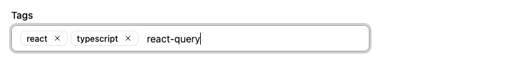

Lets users enter multiple free-text values (like tags or email addresses) displayed as removable badges.



This input allows editing values that are arrays of strings, e.g. `["tag1", "tag2"]`.

## Usage

```jsx
import { TextArrayInput } from '@/components/admin';

<TextArrayInput source="tags" />
```

Users type text and press Enter to add items. Items appear as removable badges. Press Backspace when the input is empty to remove the last item.

**Tip:** If you need to let users choose values from a predefined list instead, use [`<AutocompleteArrayInput>`](./AutocompleteArrayInput.md).

## Props

| Prop | Required | Type | Default | Description |
|------|----------|------|---------|-------------|
| `source` | Required | `string` | - | Field name |
| `className` | Optional | `string` | - | CSS classes |
| `defaultValue` | Optional | `string[]` | - | Default value |
| `disabled` | Optional | `boolean` | - | Disable the input |
| `format` | Optional | `function` | - | Callback to convert API value to form value |
| `helperText` | Optional | `ReactNode` | - | Help text displayed below the input |
| `label` | Optional | `string \| false` | Inferred from `source` | Custom label, or `false` to hide it |
| `parse` | Optional | `function` | - | Callback to convert form value to API value |
| `placeholder` | Optional | `string` | - | Input placeholder (shown when no values exist) |
| `readOnly` | Optional | `boolean` | - | Make the input read-only |
| `validate` | Optional | `Validator \| Validator[]` | - | Validation rules |

## Keyboard Shortcuts

| Key | Action |
|-----|--------|
| Enter | Add the typed text as a new value |
| Backspace | Remove the last value (when input is empty) |
| Escape | Blur the input |

### Format and Parse

```jsx
<TextArrayInput
  source="tags"
  format={v => v?.map(tag => tag.toLowerCase())}
  parse={v => v?.map(tag => tag.trim().toLowerCase())}
/>
```
