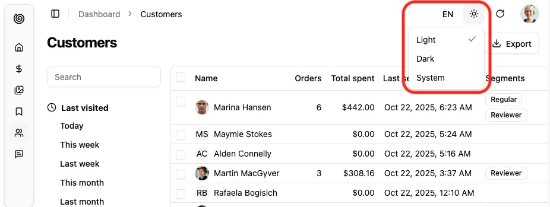

Lets users switch between light and dark UI themes.



It leverages the [store](https://marmelab.com/shadcn-admin-kit/Store.html) so that their selection is persisted.

## Usage

For most users, this component will be automatically added to the header of shadcn-admin-kit's default [`<Layout>`](./Layout.md).

For custom layouts, or to put the theme switcher in a settings menu, simply render the component without props:

```tsx
import { ThemeModeToggle } from '@/components/admin';

<ThemeModeToggle />
```

## Setting The Preferred Theme

Shadcn Admin Kit defaults to the system theme mode. You can force another default theme by passing the `defaultThemeMode` prop to the [`<Admin>`](./Admin.md) component:

```tsx
import { Admin } from '@/components/admin';

const App = () => (
    <Admin defaultThemeMode="dark" dataProvider={dataProvider}>
        ...
    </Admin>
);
```

## Customizing the Themes

Shadcn Admin Kit leverages [Shadcn/ui Theming](https://ui.shadcn.com/docs/theming) to provide light and dark themes out of the box using CSS variables. You can customize these themes by editing the `src/index.css` file in your project.

```css
:root {
  /* Light theme overrides */
  --primary: oklch(0.205 0 0);
  --primary-foreground: oklch(0.985 0 0);
  /* Add more CSS variable overrides as needed */
}

.dark {
  /* Dark theme overrides */
  --primary: oklch(0.615 0.2 0);
  --primary-foreground: oklch(0.215 0 0);
  /* Add more CSS variable overrides as needed */
}
```

Check out the [list of CSS variables](https://ui.shadcn.com/docs/theming#list-of-variables) provided by Shadcn/ui for more customization options.