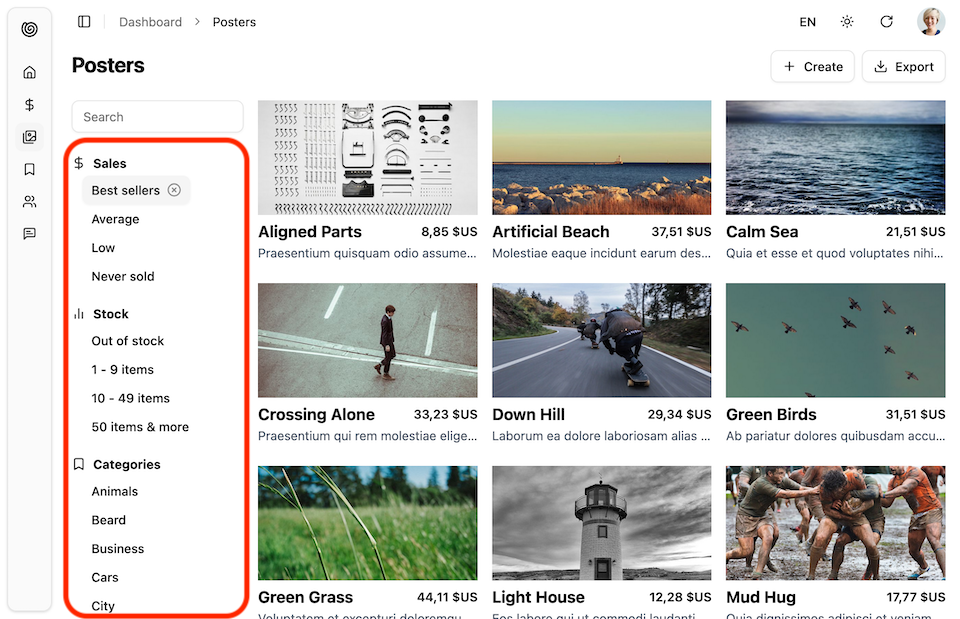

Enables or disable a particular filter in a list view.



## Usage

Use it in the sidebar of a `<List>` view to toggle predefined filters:

```tsx {10-13}
import { ToggleFilterButton, SearchInput } from '@/components/admin';
import { FilterLiveForm, Translate } from 'ra-core';

const ProductFilters = () => (
    <div className="min-w-48 hidden md:block">
        <FilterLiveForm>
            <SearchInput />
        </FilterLiveForm>
        <FilterCategory label="Sales" icon={<DollarSign />}>
            <ToggleFilterButton
                label="Best Sellers"
                value={{ sales_lte: undefined, sales_gt: 25, sales: undefined }}
            />
            <ToggleFilterButton
                label="Average Sellers"
                value={{ sales_lte: 25, sales_gt: 10, sales: undefined }}
            />
            <ToggleFilterButton
                label="Low Sellers"
                value={{ sales_lte: 10, sales_gt: 0,
                sales: undefined }}
            />
            <ToggleFilterButton
                label="Never Sold"
                value={{ sales_lte: undefined, sales_gt: undefined, sales: 0 }}
            />
        </FilterCategory>
        <FilterCategory label="Stock" icon={<ChartNoAxesColumn/>}>
            <ToggleFilterButton
                label="No Stock"
                value={{ stock_lt: undefined, stock_gt: undefined, stock: 0 }}
            />
            <ToggleFilterButton
                label="Low Stock"
                value={{ stock_lt: 10, stock_gt: 0, stock: undefined }}
            />
            <ToggleFilterButton
                label="Average Stock"
                value={{ stock_lt: 50, stock_gt: 9, stock: undefined }}
            />
            <ToggleFilterButton
                label="Enough Stock"
                value={{ stock_lt: undefined, stock_gt: 49, stock: undefined }}
            />
        </FilterCategory>
    </div>
);

const FilterCategory = ({
  icon,
  label,
  children,
}: {
  icon: ReactNode;
  label: string;
  children?: ReactNode;
}) => (
  <>
    <h3 className="flex flex-row items-center gap-2 mb-1 font-bold text-sm">
      {icon}
      <Translate i18nKey={label} />
    </h3>
    <div className="flex flex-col items-start ml-3 mb-4">{children}</div>
  </>
);
```

## Props

| Prop | Required | Type | Default | Description |
|------|----------|------|---------|-------------|
| `value` | Required | `object` | - | Filter values to toggle |
| `label` | Required | `string` | `ra.action.filters` | i18n key |
| `className` | Optional | `string` | - | CSS classes |
| `size` | Optional | `string` | `small` | Button size |
