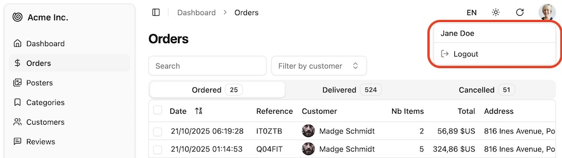

A user menu component displayed in the top right corner of the admin layout. It provides access to user-related actions such as profile, settings, and logout.



It only displays in application using [Authentication](./Authentication.md).

## Usage

The [default `<Layout>` component](./Layout.md) includes the `<UserMenu>` in the header.

You can add more items to this menu by editing the Layout and passing additional menu items as `<UserMenu>` children.

```tsx {1-2,16-20} title="@/components/admin/layout.tsx"
import { NavLink } from 'react-router';
import { DropdownMenuItem } from '@/components/ui/dropdown-menu';

export const Layout = (props: { children: ReactNode }) => {
  /** ... **/
  return (
    <SidebarProvider>
      <AppSidebar />
      <main className={/* ... */}>
        <header className={/* ... */}>
          <SidebarTrigger className="scale-125 sm:scale-100" />
          <div className="flex-1 flex items-center" id="breadcrumb" />
          <LocalesMenuButton />
          <ThemeModeToggle />
          <RefreshButton />
          <UserMenu>
            <DropdownMenuItem>
                <NavLink to="/profile">Profile</NavLink>
            </DropdownMenuItem>
          </UserMenu>
        </header>
        ...
      </main>
      <Notification />
    </SidebarProvider>
  );
};
```

Alternatively, you can customize the UserMEnu component by editing the `@/components/admin/user-menu.tsx` file.

You can use the [`useGetIdentity`](https://marmelab.com/ra-core/usegetidentity/) hook from `ra-core` to fetch and display user information such as name and avatar.

You can use the [`useLogout`](https://marmelab.com/ra-core/uselogout/) hook to handle user logout when the logout menu item is clicked.
