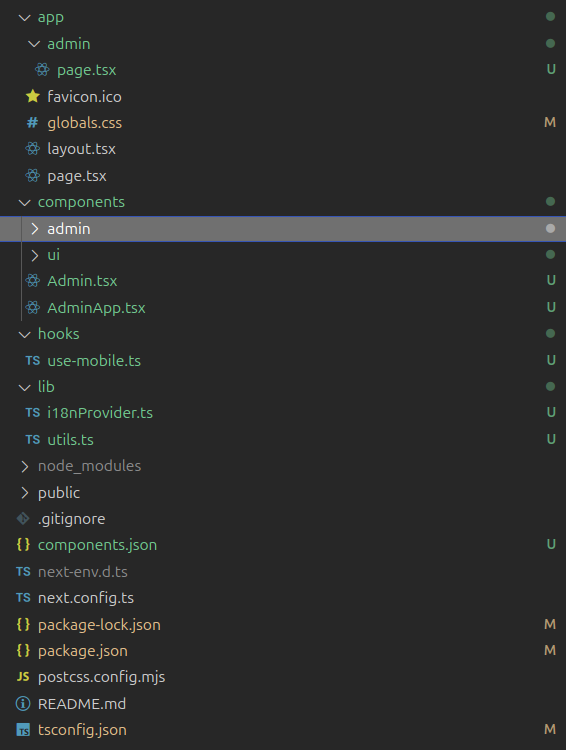
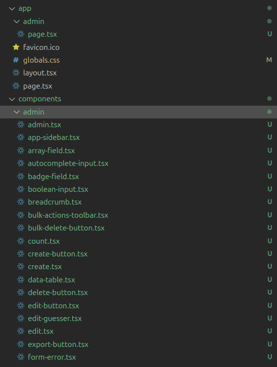
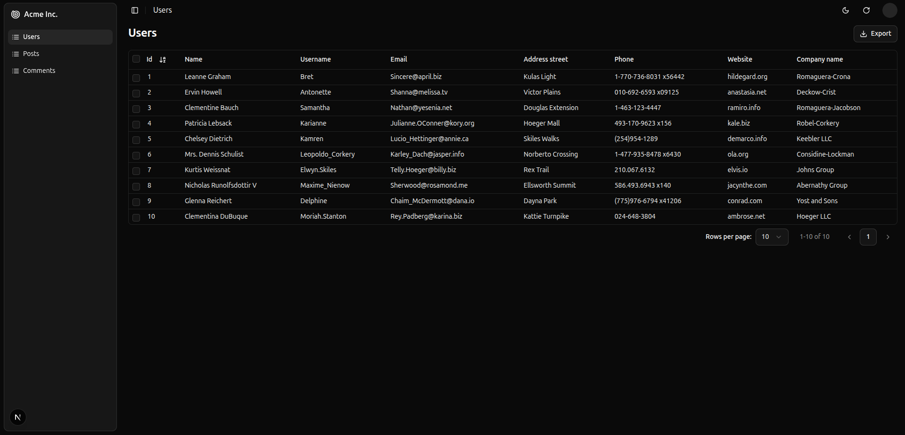

# Using Shadcn Admin Kit with Next.js

Shadcn Admin Kit runs seamlessly on Next.js, and requires minimal configuration.

## Create a New Next.js Project

The first step is to create a new Next.js project using the `create-next-app` command.

```bash
npx create-next-app@latest
```

A prompt will asks you some questions, it is important that you answer:

- `Yes` to `Would you like to use TypeScript?`
- `Yes` to `Would you like to use Tailwind CSS?`
- `No` to ` Would you like your code inside a ``src/`` directory? `
- `Yes` to ` Would you like to customize the import alias (``@/*`` by default) `
- `@/*` to `What import alias would you like configured?`

Feel free to choose answers according to your needs for the other quetions. As for the App Router, this tutorial assumes that you are using it.

```bash
npx create-next-app@latest
Need to install the following packages:
create-next-app@15.3.3
Ok to proceed? (y) y

✔ What is your project named? … shadcn-admin-next
✔ Would you like to use TypeScript? Yes
✔ Would you like to use ESLint? Yes
✔ Would you like to use Tailwind CSS? Yes
✔ Would you like your code inside a `src/` directory? No
✔ Would you like to use App Router? (recommended) Yes
✔ Would you like to use Turbopack for `next dev`? Yes
✔ Would you like to customize the import alias (`@/*` by default)? Yes
✔ What import alias would you like configured? … @/*
```

## Configure Typescript

Once the new project has been created, we have to update the `tsconfig.app.json` as described in this repository's [`README.md`](../README.md).

```json
{
  "compilerOptions": {
    // ...
    "verbatimModuleSyntax": false
  }
}
```

## Install Shadcn Admin Kit Components

Once our project has been initialized, we can pull the `shadcn-admin-kit` components using the `shadcn` command:

```bash
npx shadcn@latest add https://marmelab.com/shadcn-admin-kit/r/shadcn-admin-kit-base.json
```

This will create install the `Shadcn` components inside the `components/ui` directory, the `Shadcn Admin Kit` insite the `components/admin` directory, and utilities inside the `hooks` and `lib` directories.

| Admin components                                               | Utilities                                                     |
| -------------------------------------------------------------- | ------------------------------------------------------------- |
|  |  |

## Configure the Admin App

The `components/admin/admin.tsx` component supports the same data providers as the traditional [React Admin version](https://marmelab.com/react-admin/DataProviders.html). The list of [supported backends](https://marmelab.com/react-admin/DataProviderList.html) is available on the React Admin documentation. In this example, we will use the `ra-data-json-server` with fake data for the admin.

First, we will create the `components/AdminApp.tsx` file that will contain our admin app. we use the installed `ListGuesser` and `EditGuessers` from `Shadcn Admin Kit` in our two resources.

```tsx
// components/AdminApp.tsx

"use client"; // remove this line if you choose Pages Router
import { Resource } from "ra-core";
import jsonServerProvider from "ra-data-json-server";
import { Admin, EditGuesser, ListGuesser } from "./admin";

const dataProvider = jsonServerProvider("https://jsonplaceholder.typicode.com");

const AdminApp = () => (
  <Admin dataProvider={dataProvider}>
    <Resource
      name="users"
      list={ListGuesser}
      edit={EditGuesser}
      recordRepresentation="name"
    />
    <Resource
      name="posts"
      list={ListGuesser}
      edit={EditGuesser}
      recordRepresentation="title"
    />
    <Resource name="comments" list={ListGuesser} edit={EditGuesser} />
  </Admin>
);

export default AdminApp;
```

Then we can create the `components/Admin.tsx` by using the same code as the [React Admin Next.js](https://marmelab.com/react-admin/NextJs.html) integration tutorial.

```tsx
// components/Admin.tsx

"use client";
import dynamic from "next/dynamic";

const Admin = dynamic(() => import("./AdminApp"), {
  ssr: false, // Required to avoid react-router related errors
});

export default Admin;
```

## Create the Admin Page

Once the components have been configured, you can create the admin page at `app/admin/page.tsx`:

```tsx
// app/admin/page.tsx

import Admin from "@/components/Admin";

export default function Page() {
  return <Admin />;
}
```

Then, run `npm run dev` and go to `http://localhost:3000/admin` to access your admin app!


